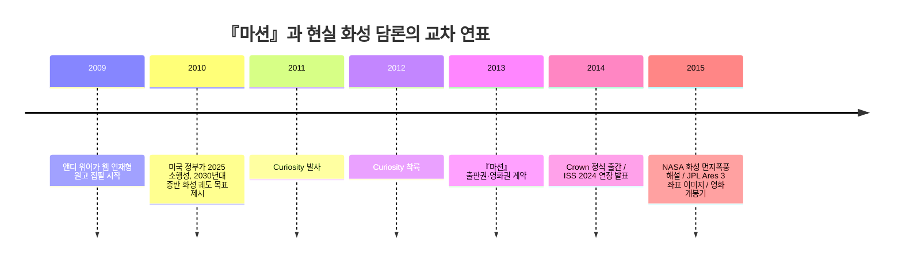

# 앤디 위어의 『마션』을 깊이 이해하기 위한 사전 리서치

## Executive Summary

- 『마션』은 “한 우주비행사가 화성에 홀로 남겨졌을 때”라는 단순한 전제를, 실제 물리·화학·궤도역학·식물학 문제로 잘게 쪼개어 푸는 하드 SF다. 이 작품을 읽기 전에 가장 먼저 잡아야 할 핵심은, 이 소설이 **개인의 생존담**인 동시에 **과학적 절차와 제도적 협업의 서사**라는 점이다. 위어 자신은 자신이 “하드코어 과학 덕후를 위한” 이야기를 썼다고 말했고, 나중에는 『마션』을 “영화 〈Apollo 13〉의 공기 필터 문제 해결 장면 전체를 한 권짜리 책으로 늘여놓은 것”에 가깝다고 설명했다. citeturn24view0turn8view0turn10view0

- 작가 앤디 위어는 두 세대 가까운 소프트웨어 엔지니어 경력, 어린 시절부터의 우주 덕후 성향, 물리·상대론·궤도역학 취미, 그리고 온라인 독자 공동체와의 상호작용을 바탕으로 『마션』을 만들었다. 즉 이 작품은 “천재적 영감”보다 **엔지니어링 습관, 인터넷 연재 문화, 독자 피드백, 2010년대 화성 탐사 낙관론**이 결합해 나온 산물로 보는 편이 정확하다. citeturn33view0turn30view0turn8view0turn23view0

- 시대 배경도 중요하다. 『마션』이 성장하던 2009~2015년은 NASA가 2030년대 화성 유인 탐사를 공공 담론으로 밀어 올리고, 2012년 Curiosity 착륙이 화성 탐사를 대중문화 한복판으로 끌어올리며, 동시에 SpaceX 같은 민간 우주기업이 “국가 독점 우주개발” 구도를 흔들던 시기였다. 『마션』은 바로 이 전환기의 낙관주의와 현실성을 압축한 소설이다. citeturn22search6turn22search2turn14search0turn18search3turn19search3

- 읽기 전 가장 유용한 경계선도 있다. 이 작품은 전체적으로 과학적 정확성을 강하게 추구하지만, **이야기를 시작시키는 대형 화성 폭풍의 물리적 위력**은 NASA도 “현실적으로 주요 장비를 넘어뜨리거나 찢어버릴 가능성은 낮다”고 설명한 대표적 허구 장치다. 반대로, 먼지로 인한 태양광 효율 저하, 통신 지연, 자원 계산 중심의 생존 논리는 현실 화성 탐사와 높은 친연성을 가진다. citeturn16view0turn23view0turn24view0

- 특정 미지정: 문장 단위 대표 인용문 선정, 한국어 번역본 간 비교, 영화판과의 장면별 대조는 별도 지정이 없어 본 보고서에서는 원서·공식 자료·주요 인터뷰 중심으로 처리했다.

## 리서치 체크리스트

- 작가의 생애와 직업적 기반을 먼저 본다.  
  - 왜 중요한가: 『마션』의 과학성과 문제 해결 방식은 위어의 “작가 이전의 직업”과 거의 분리되지 않기 때문이다. 소프트웨어 엔지니어링, 우주사 취미, 물리·궤도역학 집착이 작품 구조 자체를 만들었다. citeturn33view0turn23view0turn24view0

- 『마션』을 하드 SF와 생존 서사의 교차점으로 읽는다.  
  - 왜 중요한가: 위어는 자신의 이야기를 『로빈슨 크루소』형 “인간 대 자연” 서사라고 직접 설명했고, 동시에 과학이 줄거리 자체가 되도록 설계했다. citeturn8view0turn10view0turn28search1

- 어떤 작가·사조의 영향권에 있는지 구체 작품 단위로 잡는다.  
  - 왜 중요한가: 아시모프, 하인라인, 클라크, 〈Apollo 13〉 같은 영향원을 알고 읽으면 『마션』의 문체·주제·리듬이 훨씬 선명해진다. citeturn10view0turn32view0

- 2010년대 화성 담론과 우주정책을 함께 본다.  
  - 왜 중요한가: 『마션』은 추상적 미래소설이 아니라, 오바마 행정부의 화성 비전, ISS 연장, Curiosity 착륙, 민간 우주기업 부상과 거의 동시대적으로 호흡한 텍스트다. citeturn22search6turn22search2turn14search0turn18search3

- 현실 화성 탐사의 제약과 윤리도 같이 본다.  
  - 왜 중요한가: 통신 지연, 먼지, 전력, 방사선, 행성보호 같은 실제 제약을 알수록 소설의 “극적 과장”과 “놀라운 정밀성”을 구분할 수 있다. citeturn15search0turn16view0turn17search0turn17search6turn21search0

## 작품 기본 정보

- 『마션』은 앤디 위어의 데뷔 장편으로, 2009년 말부터 개인 웹사이트에 장별 연재가 시작되었고, 독자 요청으로 99센트 Kindle 전자책이 되었으며, 2013년 출판권과 영화권 계약을 거쳐 2014년 Crown 인쇄본으로 널리 유통되었다. 위어는 초기에 문단 진입에 실패했지만, 이 작품으로 정반대의 경로를 밟았다. citeturn30view0turn8view0turn23view0turn25search1

- 출간 뒤 영향력은 빠르게 확장됐다. 『마션』은 2014년 『뉴욕타임스』 베스트셀러 목록에 올랐고, Penguin Random House는 2017년 기준 북미 300만 부 이상 판매와 40개 언어 출간을 알렸다. 즉 이 작품은 “인터넷 자가출판 성공담”을 넘어, 2010년대 SF 시장 전체를 대표하는 대중적 사건이 되었다. citeturn30view0turn25search2

- 작품의 기본 서사는 “화성 임무—사고—고립—문제 해결—구조”라는 구조를 갖지만, 중요한 것은 사건의 규모보다 **문제 해결의 연쇄 방식**이다. 위어는 과학적 오류가 몰입을 깨는 것을 싫어했고, 궤도, 식량, 물, 작물, 통신, 전력 같은 문제를 하나씩 계산 가능한 형태로 바꾸어 전개했다. citeturn24view0turn23view0turn8view0

- 작품의 가장 유명한 장르적 특징은 “과학이 배경이 아니라 줄거리 그 자체”라는 점이다. GQ 인터뷰에서 위어는 “수학은 줄거리의 방해물이 아니라 줄거리 그 자체”라는 취지로 설명되고, Science & Film 인터뷰에서는 자신이 과학자라기보다 엔지니어의 사고를 갖고 있다고 말했다. 『마션』을 읽을 때는 이 소설을 감정 서사보다 **엔지니어링 프로세스 서사**로 잡는 편이 맞다. citeturn10view0turn24view0

- 작품의 리얼리즘은 매우 높지만 완전하지는 않다. NASA는 『마션』의 시작점인 초대형 화성 폭풍이 주요 장비를 찢거나 넘어뜨릴 정도로 강력할 가능성은 낮다고 설명했다. 그러나 같은 NASA 글은 먼지가 기계와 태양광 패널을 오염시키고, 대형 먼지폭풍이 햇빛을 줄여 전력 문제를 유발하는 묘사는 꽤 정확하다고 본다. 따라서 『마션』은 “대전제 하나의 허구 위에 세운 고정밀 하드 SF”라고 보는 것이 가장 공정하다. citeturn16view0turn32view0

- 이 소설의 가상 공간은 NASA/JPL과도 일종의 상호작용을 낳았다. JPL은 2015년 위어가 보낸 정확한 좌표를 바탕으로 화성 정찰궤도선(MRO)으로 “Ares 3 착륙지점” 이미지를 실제로 다시 촬영했다. 이는 『마션』이 단지 “과학을 빌린 소설”이 아니라, 실제 화성 탐사 기관이 놀이와 교육의 매개로 받아들인 문화 텍스트였음을 보여준다. citeturn34view0

- 위 연표의 연도 배열은 위어의 인터뷰, White House 아카이브, NASA Curiosity 미션 페이지, JPL 자료를 바탕으로 재구성했다. citeturn30view0turn22search6turn22search2turn14search0turn34view0

## 저자 소개

- 앤디 위어는 Penguin Random House 기준으로 “두 세대 가까운 소프트웨어 엔지니어 경력”을 가진 뒤 『마션』의 성공으로 전업 작가가 되었고, 스스로를 “lifelong space nerd”라고 소개한다. 상대론, 궤도역학, 유인 우주비행 역사를 오래 파온 취미가 작가 이력만큼 중요하다. citeturn33view0

- 성장 배경도 직접적이다. Lawrence Livermore National Laboratory 기사에 따르면 그는 캘리포니아 리버모어에서 자랐고, 부친은 Lawrence Livermore Lab의 입자물리학자, 모친은 전기 엔지니어였다. 이 과학기술적 가정환경은 『마션』의 “공학적 자연스러움”을 이해하는 데 유의미하다. citeturn32view0turn30view0

- 위어는 15세에 샌디아 국립연구소에서 컴퓨터 프로그래머로 일했고, UC San Diego에서 컴퓨터과학을 공부하다가 학업을 마치지 않고 기술 업계로 들어갔다. 이후 AOL, Blizzard, MobileIron 등에서 일했다. 그는 안정적 수입을 선호하는 “risk-averse” 성향 때문에 오랫동안 글쓰기를 전면 직업으로 삼지 않았다. 이 점은 『마션』의 주인공이 보이는 계산적·위험관리형 사고와도 잘 이어진다. citeturn32view0turn30view0

- 초기 창작 이력도 중요하다. 그는 장르 웹코믹 **Casey and Andy**를 2000년대 초중반 운영했고, 자신의 웹사이트에 단편과 팬픽션을 지속적으로 올리며 독자층을 천천히 모았다. 이 “오랜 온라인 축적”이 훗날 『마션』을 퍼뜨릴 토대를 만들었다. citeturn8view0turn30view0turn38search0

- 『마션』 관련 개인 배경은 특히 분명하다. Science & Film 인터뷰에서 위어는 “평생 우주와 우주여행의 팬”이었다고 말했고, 당시 항공우주 분야 인맥이 없어 구글 검색으로 수년간 조사했다고 회고했다. Creative Life 인터뷰에서는 화학이 약점이어서 화학자·전기공학자·원자로 기술자 등 독자들의 피드백을 받아 수정했다고 설명한다. 이 작품은 한 명의 작가가 쓴 소설이면서도, 부분적으로는 **온라인 과학 공동체의 집단 교정** 산물이었다. citeturn24view0turn8view0

- 또한 위어는 작품 밖에서도 자신과 주인공의 유사성을 인정했다. PRH Q&A에서 그는 “Mark Watney is based on my own personality”라고 답하며, 와트니를 “자기 좋은 면만 남긴 이상화된 버전”이라고 설명했다. 낙관성, 분석적 문제 해결, 다시 일어서는 태도를 자신의 성향으로 본다는 말이다. 『마션』을 이해할 때 와트니는 단순한 허구 인물이 아니라 위어 자신의 인격적 자기투영이라는 점을 감안해야 한다. citeturn33view0

| 시기 | 주요 이력 | 『마션』 이해에 주는 의미 |
|---|---|---|
| 청소년기 | 15세에 샌디아에서 프로그래밍 일을 시작했다. citeturn32view0 | 문제를 작은 단위로 분해하는 엔지니어링 습관의 시작점이다. |
| 기술 업계 시기 | AOL, Blizzard, MobileIron 등에서 일했고, 오랫동안 안정적 직업을 유지했다. citeturn30view0turn32view0 | 『마션』의 서술은 “예술가의 영감”보다 “현업 엔지니어의 루틴”에 가깝다. |
| 웹코믹·웹소설 시기 | Casey and Andy와 웹사이트 연재로 독자층을 축적했다. citeturn8view0turn38search0 | 『마션』의 성공은 갑작스러운 바이럴보다 축적된 온라인 팬덤의 결과다. |
| 『마션』 제작기 | 수년간 조사했고, 독자 피드백으로 화학·공학 설정을 보완했다. citeturn24view0turn8view0 | 작품의 “과학적 신뢰감”은 갇힌 천재가 아니라 공개형 검증 과정에서 나왔다. |
| 작가 전업 이후 | 『마션』 이후 전업 작가가 되었고, 후속작으로 『Artemis』와 『Project Hail Mary』를 발표했다. citeturn33view0 | 그의 작품 세계가 우주 생존·기술 문제 해결 축으로 계속 이어진다는 점을 확인할 수 있다. |

## 작품 세계와 영향 관계

- 『마션』의 가장 안정된 분류는 **하드 SF**다. 『The Encyclopedia of Science Fiction』는 하드 SF를 “확립된 과학 혹은 신중하게 외삽된 과학을 등뼈로 쓰는 상상문학”으로 설명한다. 여기에 브리태니커가 설명하는 미국 SF의 “골든 에이지”가 강조했던 기술 모험·문제 해결·우주 개척의 계보를 겹치면, 『마션』의 장르적 혈통이 거의 드러난다. citeturn28search1turn28search4

- 다만 『마션』은 고전 하드 SF의 단순 복고가 아니라, 그 전통을 2010년대식으로 재배치한 작품이다. GQ 인터뷰에서 위어는 “SF는 장르가 아니라 설정”이라고 말했고, 자신이 쓰는 이야기는 낙관적이며 “everyone cooperating and collaborating against a common problem”을 좋아한다고 설명했다. 그래서 『마션』은 냉전형 우주경쟁 서사보다 **협업형 문제 해결 서사**에 가깝다. citeturn10view0

- 문체 면에서 위어의 특징은 세 가지로 압축된다.  
  - 첫째, **수학과 절차의 가시화**: 그는 “show your work”를 의식했고, 실제로 궤도 계산 앱까지 만들어 서사를 뒷받침했다. citeturn8view0turn23view0  
  - 둘째, **유머와 스나키한 1인칭 보이스**: 초기 팬층은 과학 덕후였지만 대중 독자는 와트니의 비꼬는 유머에 끌렸다고 위어 자신이 말했다. citeturn8view0turn30view0  
  - 셋째, **낙관적 기술 인문주의**: 위어는 자신을 인간과 기술에 대해 낙관적인 사람으로 보며, 그 성향이 와트니에게도 반영됐다고 했다. citeturn33view0

- 주류 해석은 『마션』을 “과학적 절차와 협업의 찬가”로 읽는다. 그 근거는 위어가 과학을 지식 수집보다 “목표를 향한 해결”로 보는 엔지니어적 사고를 강조했다는 점, 그리고 영향작으로 〈Apollo 13〉를 가장 직접적인 대응물로 꼽았다는 점이다. citeturn24view0turn10view0

- 소수·비판적 해석은 두 가지다.  
  - 하나는 심리 묘사 비판이다. GQ 인터뷰에서 위어 자신도 “character depth and complexity”가 자기 약점이라고 인정했다. 즉 『마션』은 의도적으로 캐릭터보다 구조와 문제 풀이에 무게를 둔 소설로 볼 수 있다. citeturn10view0  
  - 다른 하나는 과학 낙관주의 비판이다. NASA가 시작 폭풍 설정을 비현실적이라고 짚었듯, 작품 전체가 현실 우주개발의 비용·정치·제도 갈등을 상대적으로 밝게 처리한다는 해석도 가능하다. citeturn16view0turn21search0

- 추정적 해석으로는, 『마션』을 “포스트-아폴로 공백기 이후 과학 대중문화의 재낙관화”의 상징으로 보는 관점이 가능하다. 이는 Curiosity 착륙, NASA의 화성 비전, 민간 우주기업의 부상, 그리고 인터넷 자가출판 성공담이 같은 시기에 맞물렸다는 역사적 정황에서 나온 추론이다. 이 해석은 직접 진술이라기보다, 아래의 자료들을 연결한 분석적 독해다. citeturn14search0turn22search6turn18search3turn30view0

| 영향원 | 위어의 직접 언급 또는 근거 | 『마션』에 남은 흔적 |
|---|---|---|
| 아이작 아시모프 | 위어는 GQ에서 “Asimov is my favorite author”라고 말하며 『I, Robot』와 『The Caves of Steel』를 특히 중요하게 언급했다. citeturn10view0 | 규칙을 세우고, 그 규칙 내부의 모순을 푸는 방식. 『마션』의 “과학 규칙 기반 문제 풀이”와 닮아 있다. |
| 로버트 A. 하인라인 | 위어는 어릴 때 하인라인 초기작을 사랑했다고 했고, 『Tunnel in the Sky』를 생존 서사로, 『Red Planet』를 자신이 화성에 빠지게 한 계기로 들었다. citeturn10view0 | hostile planet survival, 식민/개척 상상, 청년 엔지니어적 모험의 정서가 『마션』에 이어진다. |
| 아서 C. 클라크 | LLNL 기사에서 위어가 어린 시절 숭배한 SF 거장으로 클라크를 직접 거명한다. 구체 작품 예시는 이번 조사 범위에서 특정 미지정이다. citeturn32view0 | 장엄한 우주공간과 기술적 숭고함을 과장 없이 다루는 태도에서 클라크 계보를 읽을 수 있다. |
| 『로빈슨 크루소』 계보 | 위어는 Creative Life 인터뷰에서 『마션』을 “기본적으로 man versus nature … Robinson Crusoe”라고 설명했다. citeturn8view0 | 고립, 자급자족, 도구화된 환경, 일지 형식의 생존 서사가 핵심 구조다. |
| 〈Apollo 13〉 | 위어는 GQ에서 『마션』을 〈Apollo 13〉의 공기 필터 해결 장면 전체를 책으로 늘인 것에 비유했다. citeturn10view0 | 개인 영웅주의보다 팀·절차·즉흥 공학의 미학이 전면에 나온다. |
| 아이언 M. 뱅크스 | 위어는 『The Player of Games』를 통해 “post-scarcity society에도 갈등이 가능하다”는 점을 배웠다고 했다. citeturn10view0 | 『마션』 자체는 포스트희소 사회 소설은 아니지만, 기술이 문제를 지우는 대신 다른 문제를 낳는다는 시각과 맞닿는다. |

## 시대·사회·문화적 배경

- 『마션』을 낳은 공적 배경의 핵심은, 2010년 미국 정부가 우주탐사 목표를 다시 “화성”으로 또렷하게 재배치했다는 점이다. 오바마는 2010년 연설에서 2025년 소행성 유인 임무, 2030년대 중반 인간의 화성 궤도 진입, 그 뒤 화성 착륙을 전망했다. 2014년에는 ISS 운용을 적어도 2024년까지 연장한다고 발표했다. 『마션』은 이런 정책 수사의 낙관성과 거의 나란히 대중에게 자리 잡았다. citeturn22search11turn22search6turn22search2

- 과학기술 담론 측면에서 2011년 발사, 2012년 착륙한 Curiosity는 대단히 중요하다. NASA는 Curiosity의 목표를 “Mars was ever able to support microbial life” 판단으로 제시했고, 이는 화성을 “막연한 SF 배경”이 아니라 실제로 생명 가능성과 인간 탐사 준비를 논할 수 있는 장소로 만들었다. 『마션』이 대중적으로 읽히기 좋은 환경이 마련된 것이다. citeturn14search0turn15search5

- 대중문화와 출판 문화의 변화도 결정적이었다. 위어는 오래 글을 올리며 약 10년에 걸쳐 핵심 독자층을 모았고, 독자들이 컴퓨터 화면보다 Kindle에서 읽고 싶어 하자 99센트 전자책으로 내놓았다. 이는 『마션』이 “전통 출판 이전에 이미 시장을 검증받은 작품”이었음을 뜻한다. 이 지점에서 『마션』은 소설이면서 동시에 **웹 연재·독자 커뮤니티·플랫폼 출판** 시대의 상징적 사례다. citeturn8view0turn30view0

- 2010년대 초는 민간 우주기업과 민간 화성 담론이 본격적으로 가시화된 시기이기도 했다. NASA는 Commercial Crew Program을 “American private industry와의 partnership”으로 설명하고, SpaceX Dragon은 2012년 ISS 방문 차량 역사에서 최초의 SpaceX 화물선으로 기록된다. 같은 시기 민간 주도의 화성 비행·정착 구상인 Inspiration Mars, Mars One 같은 프로젝트도 큰 화제를 모았다. 『마션』의 “NASA 중심 서사”는 이런 민관 혼합 우주 생태계가 대중화되던 시대에 읽혔다. citeturn18search3turn19search3turn20news32turn20search14

- NASA 내부 문화와 대중문화의 접점도 소설 이해에 중요하다. Wired는 NASA 내부에서 『마션』이 사실상 “required reading”으로 불릴 정도였다고 전했고, JPL은 아예 가상의 Ares 3 좌표를 실제 영상으로 재현했다. 이는 『마션』이 “전문가들이 비웃는 과장된 오락물”이 아니라, 우주기술 공동체가 대중과 소통할 때 활용한 매개였음을 뜻한다. citeturn6news24turn34view0

- 현재의 장기 흐름도 흥미롭다. NASA는 지금도 Moon to Mars Architecture를 “long-term, human-led scientific discovery”의 틀로 설명하고, Humans to Mars 페이지에서는 2030년대 초반을 향한 기술 개발을 계속 강조한다. 반면 National Academies는 첫 인간 화성 착륙의 최우선 과학 목표를 “생명 탐색”으로 제시했다. 즉 오늘의 화성 담론은 예전보다 더 구체적이지만, 동시에 더 윤리적·과학적 검증 중심으로 재구성되고 있다. citeturn13search0turn15search0turn21search4turn21search0

## 현실 쟁점과 읽기 포인트

- 『마션』의 주요 배경은 “가까운 미래의 NASA 중심 유인 화성 탐사”다. 현실의 화성은 NASA 표현대로 “오직 로봇만이 사는 행성”이고, 현재도 인간이 가 본 적은 없다. NASA는 화성이 지구에서 대략 3,300만~2억4,900만 마일 떨어지며 왕복 거리는 10억 마일 이상일 수 있다고 설명한다. 그러므로 『마션』의 드라마는 단지 “고립”이 아니라 **지연, 자율성, 구조 불확실성**의 현실적 문제를 전제로 한다. citeturn35search26turn15search0

- 통신 지연 역시 핵심 읽기 포인트다. ESA는 지구-화성 간 전자기 신호 편도 지연이 약 4.3분에서 21분까지 달라질 수 있다고 설명한다. 따라서 『마션』의 고립감은 감정적 장치가 아니라 물리적 사실의 문학적 활용이다. citeturn37search0

- 먼지와 전력 문제는 이 소설의 현실성을 떠받치는 축이다. NASA는 화성 대형 먼지폭풍이 대형 장비를 넘어뜨릴 가능성은 낮다고 보면서도, 먼지가 기계와 태양광 패널의 효율을 떨어뜨려 실제 엔지니어링 난제를 만든다고 설명한다. 즉 독자는 “폭풍으로 시작되는 허구”보다, 그 뒤 이어지는 **전력·오염·자원 관리**를 더 현실적인 층위로 읽는 편이 좋다. citeturn16view0

- 행성보호는 『마션』을 읽을 때 쉽게 놓치지만 실제로는 매우 중요한 윤리 쟁점이다. NASA는 planetary protection을 다른 천체를 지구 생명으로 오염시키지 않고, 반대로 외계 생명 가능성을 지구로 해를 끼치지 않게 다루는 실천으로 정의한다. 또 National Academies는 인간의 화성 표면 임무에 대해서는 아직 상당한 정책 개발과 사전 시험이 필요하다고 지적했다. 작품이 강조하는 “살아남기 위해 뭐든 한다”는 논리는, 현실 정책에서는 “어디까지 해도 되는가?”라는 질문과 반드시 충돌한다. citeturn17search0turn17search6

- 유인 화성 탐사를 둘러싼 논쟁은 『마션』을 이해하는 데 직접 도움이 된다.  
  - **주류 찬성 논리**: 인간의 화성 탐사는 생명 탐색, 행성 진화 이해, 장기적 심우주 기술 검증, 인류에게 영감을 주는 상징적 가치가 크다. NASA와 National Academies 모두 화성 탐사를 단순한 모험이 아니라 과학·기술·장기 탐사의 결절점으로 본다. citeturn15search5turn15search16turn21search0turn21search4  
  - **비판 논리**: 예산, 방사선·지연·구조 불가능성, 행성보호 미비, 그리고 로봇 탐사와의 자원 배분 문제가 크다. NASA의 planetary protection 자료와 인간 화성 탐사 전략 보고서는 이 갈등을 여전히 해결 중인 과제로 보여 준다. citeturn17search0turn17search3turn17search6turn21search0  
  - **민간기업 확대의 장점**: NASA는 Commercial Crew를 통해 민간 산업과의 파트너십이 안전하고 비용 효율적인 수송이라는 목표를 가진다고 설명한다. 『마션』 이후의 실제 우주개발은 점점 이런 방식으로 움직였다. citeturn18search3  
  - **민간기업 확대의 우려**: 2010년대 화성 담론에는 과도한 홍보와 실현 가능성 논란도 컸다. Mars One과 Inspiration Mars가 대표적이다. 『마션』의 효과 중 하나는 “현실적 화성 탐사”와 “마케팅형 화성 판타지”를 구분하는 눈을 대중에게 준 데 있다. citeturn20news32turn20search14

- 독서용 핵심 프레임을 한 줄로 정리하면 이렇다.  
  - 『마션』은 **하드 SF의 과학 정확성**, **로빈슨 크루소형 생존 서사**, **미국 우주정책의 화성 낙관론**, **인터넷 시대의 독자 공동창작성**이 한 점에서 만난 소설이다. citeturn28search1turn8view0turn22search6turn8view0

- 더 깊이 들어가기 위한 비판적 질문은 다음 세 가지가 특히 유효하다.  
  - 와트니의 유머와 낙관은 인간 정신의 회복력인가, 아니면 위어가 의도적으로 택한 “심리 현실성보다 기능적 서사”인가.  
  - 『마션』의 NASA는 협력적이고 유능한 조직으로 그려지는데, 이 묘사는 현실 우주정책의 예산·정치 갈등을 얼마나 생략하고 있는가.  
  - 이 소설을 오늘 다시 읽을 때, 우리는 그것을 “화성에 대한 낙관의 기록”으로 읽어야 하는가, 아니면 “인류가 우주 윤리를 본격 고민하기 직전의 문학적 문서”로 읽어야 하는가.

- GPT 의견: 나는 『마션』을 “가장 정확한 화성 생존 소설”이라기보다, **과학적 절차와 협업의 낙관주의를 가장 세련되게 서사화한 현대 하드 SF**로 읽는 편이 가장 생산적이라고 본다. 내 판단의 강도는 **높음**이다.

## 검증과 마무리

- 주요 정보 누락 점검: 요청한 항목들인 **작가의 생애, 주요 이력, 작품 세계, 영향받은 사조·작가, 저자의 개인 경험과 직업적 배경, 출간 시기의 시대·사회·문화 맥락, 화성 탐사의 현실적 배경, 우주정책·민간기업·과학윤리 이슈**는 모두 포함했다. 다만 **번역본 비교, 영화와의 장면별 차이, 세부 과학 오류 목록의 완전한 카탈로그**는 이번 범위에서 축약했다.

- 간단 보완: 특히 “영향 관계”는 아시모프·하인라인·클라크·로빈슨 크루소·〈Apollo 13〉를 중심축으로 잡으면 충분하며, 클라크의 경우 이번 조사에서는 **구체 작품 예시가 특정 미지정** 상태라는 점만 유념하면 된다. citeturn10view0turn32view0turn8view0

[2026-06-11] #앤디위어 #마션 #하드SF #화성탐사 #우주정책

자기 점검: 체크리스트, 세 개 이상 주요 섹션, 요청된 연구 항목, 다양한 관점, 비판적 질문, GPT 의견, 날짜와 해시태그, 누락 검증까지 모두 포함했다.