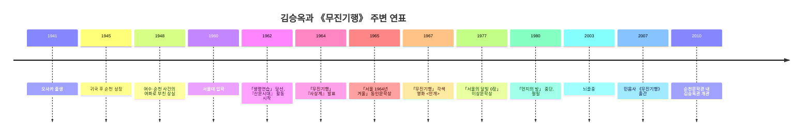

# 김승옥 단편집 《무진기행》 사전 리서치 보고서

**Executive Summary**  
2007년 8월 3일 발행된 민음사 세계문학전집 149권 《무진기행》은 1964년 발표된 동명 단편 한 편의 재출간이 아니라, 1962년 등단작부터 1977년 이상문학상 수상작까지를 묶어 김승옥의 문학적 궤적을 회고적으로 정전화한 선집이다. 따라서 연구의 1차 단위는 **개별 원전으로서의 「무진기행」**, 2차 단위는 **그 원전을 포함해 작가상을 재구성하는 2007년 선집 판본**으로 나뉘며, 해석의 핵심 배경은 4·19와 5·16 사이의 정치적 좌절, 산업화·도시화, 그리고 작가의 순천/여순사건 체험이다. citeturn0search1turn1view1turn25view0turn9view0turn30view0turn35view0turn35view1turn35view3

## 개념적 체크리스트

- **원전과 선집을 분리할 것**  
  「무진기행」(1964) 자체의 해석과, 2007년 민음사 선집이 구성하는 ‘김승옥 정전’은 같은 문제가 아니다.

- **서지 정보와 물성을 먼저 고정할 것**  
  발행일, 시리즈 번호, ISBN, 페이지 수, 수록 편수, 해설·연보 유무를 우선 확정해야 이후 인용·비교가 흔들리지 않는다.

- **작가 생애를 작품 주제와 연결하되, 환원하지 않을 것**  
  오사카 출생, 순천 성장, 여순사건 체험, 서울 유학생 시절의 곤궁은 중요하지만, 작품 전체를 자전소설로 환원하면 해석이 좁아진다.

- **1960년대 한국 사회의 정치·경제 변동을 병치할 것**  
  4·19혁명, 5·16군사쿠데타, 국가주도 산업화, 이촌향도는 작품의 공간 구조와 정서 구조를 읽는 핵심 좌표다.

- **해석 프레임을 복수로 둘 것**  
  실존주의·내면심리 독해, 사회사·근대성 독해, 젠더·정치성 독해는 서로 배타적이기보다 상호보완적이다.

## 작품 기본 정보

### 서지 식별

| 항목 | 확인 결과 |
|---|---|
| 대상 판본 | 민음사 발행, 2007-08-03, 세계문학전집 149. citeturn0search1turn13search4turn13search10 |
| ISBN | 9788937461491. citeturn0search0turn13search4turn13search10 |
| 분량·판형 | 405쪽, 23cm, 약 132×224mm. citeturn13search4turn13search10turn25view0 |
| 수록 범위 | 「무진기행」 외 9편을 포함한 대표 단편 10편, 그리고 「서울의 우울-김승옥론」, 작가 연보 수록. citeturn1view1turn25view0 |
| 선집의 시간 범위 | 1962년 등단작 「생명연습」부터 1977년 「서울의 달빛 0장」까지를 포괄. citeturn1view1 |
| 세부 미지정 사항 | 편집 책임자명, 작품별 주석 유무, 색인 유무, 초간 인쇄부수는 공개 접근 가능한 공식·공공 서지에서 확인되지 않아 **미지정**. citeturn13search4turn25view0turn1view1 |

- **핵심 사실**: 이 판본은 특정 단편 하나를 독립적으로 재간행한 책이 아니라, 대표작 10편과 해설·연보를 묶은 “작가 선집” 성격의 책이다. 따라서 이후 연구에서는 “작품 자체”와 “민음사 선집의 편집 행위”를 동시에 분석해야 한다. citeturn1view1turn25view0
- **근거**: 출판사 메타데이터, 대학도서관 서지, 판매 서지 모두가 같은 ISBN·분량·총서 번호를 교차 확인해 준다. citeturn0search1turn13search4turn13search10
- **관련 인용**:  
  > “그의 대표 단편 10편을 모아 민음사 세계문학전집 149번으로 『무진기행』이 출간되었다.” citeturn1view1
- **해석**: 이 문구의 요점은 2007년 판본이 ‘동명 대표작의 재출간’보다 ‘대표 단편 10편의 선집화’에 방점이 있다는 데 있다. 즉 이 판본의 연구 가치는 **텍스트 선별과 배열을 통한 작가상 구성**에 있다. citeturn1view1turn25view0

### 판본 계보와 차이

| 층위 | 확인 정보 | 판본상 의미 |
|---|---|---|
| 개별 원전 | 「무진기행」은 1964년 10월 『사상계』에 발표되었다. citeturn9view0 | 해석의 1차 기준 텍스트 |
| 초기 단행본 맥락 | 1966년 2월 5일 초판 소설집 『서울 1964년 겨울』(창우사, 377쪽)에 「무진기행」이 수록되었다. citeturn12view0 | 동시대 작가 자신의 초기 자기배치 |
| 요청 판본 | 2007년 민음사판은 「무진기행」부터 「서울의 달빛 0장」까지를 한 권으로 묶는다. citeturn0search1turn1view1turn13search4 | 회고적 정전화·교재화에 가까운 편집 |
| 후속 동일계열 판본 | 일부 도서관은 2017년 개정판(c2007)으로 동일 총서·동일 목차를 기록한다. 세부 수정 사항은 **미지정**. citeturn25view0 | 인쇄·편집 변화 가능성은 있으나 공개 정보만으로는 확정 불가 |

- **핵심 사실**: 2007년 민음사판은 **개별 단편의 초출본**도 아니고 **김승옥의 최초 단행본**도 아니다. 오히려 1960년대와 1970년대 작품을 한데 묶어, 김승옥을 ‘한국 현대문학의 대표 단편 작가’로 배열한 후대적 편집본이다. citeturn12view0turn1view1turn25view0
- **근거**: 원전 발표 시점(1964), 초기 소설집 물성(1966), 2007년 판본의 수록 범위(1962~1977), 2017 개정판 서지 기록을 연결하면 이 결론이 나온다. citeturn9view0turn12view0turn1view1turn25view0
- **관련 인용**:  
  > “이 작품은 1964년 10월 『사상계』에 발표된 김승옥의 대표작”이다. citeturn9view0
- **해석**: 연구자가 2007년 판본을 곧장 ‘원전’으로 취급하면, 1964년의 역사적 맥락과 2007년의 정전화 맥락이 섞이게 된다. 이 점이 사전 리서치에서 가장 먼저 분리되어야 한다. citeturn9view0turn1view1

## 저자 소개

### 생애와 주요 이력

- 김승옥은 1941년 일본 entity["city","오사카","osaka, japan"]에서 태어나 해방 뒤 전남 entity["city","순천","suncheon, jeonnam, south korea"]에서 성장했고, 1960년 entity["organization","서울대학교","seoul, south korea"] 불어불문학과에 입학했다. 1962년 entity["organization","한국일보","newspaper, seoul, south korea"] 신춘문예 당선작 「생명연습」으로 등단했고, 같은 해 동인지 『산문시대』를 통해 본격적인 문단 활동을 시작했다. citeturn22view0turn22view1turn26view1
- 어린 시절 여수·순천 10·19사건의 여파 속에서 부친을 잃은 경험은 그의 작품들에서 반복되는 **아버지 부재**와 **지방 출신 남성의 서울 고투기**라는 서사적 패턴과 밀접하게 연관된다고 학계는 본다. citeturn8view0turn35view3
- 1980년 entity["organization","동아일보","newspaper, seoul, south korea"] 연재작 「먼지의 방」을 광주민주화운동 이후 중단했고, 이후 사실상 절필의 길로 들어섰다. 1999년 entity["organization","세종대학교","seoul, south korea"] 교수로 부임했으나 2003년 뇌졸중으로 교수직을 사임했다. citeturn22view0turn22view1turn8view0

아래 연표는 출생, 귀국, 여순사건 체험, 등단, 「무진기행」 발표, 영화화, 절필, 뇌졸중, 2007년 민음사판 간행, 문학관 개관까지의 핵심 시점을 정리한 것이다. citeturn22view0turn22view1turn35view3turn9view0turn24search14turn1view1turn26view1

### 문학적 특징

- 김승옥은 흔히 ‘한글세대’의 대표 작가로 규정된다. 서영채는 그의 문학 언어가 “일상 언어와 구분되는 문학 언어 고유의 힘”을 보여준다고 정리하며, 이것을 “언어의 물질성”이라는 틀로 설명한다. citeturn32view0
- 문학사적으로는 ‘감수성의 혁명’이라는 표상 아래, 전후문학의 엄숙주의와 도덕주의를 뒤흔든 작가로 평가된다. 그의 문체는 감각적 묘사, 내적 독백, 불투명한 정조, 그리고 내면과 외부 세계의 미세한 어긋남을 서사화하는 데 강점이 있다. citeturn22view0turn8view1turn32view0
- 작품 경향은 대체로 초기의 **낭만적 일탈·아웃사이더 지향**에서, 「무진기행」 이후의 **환멸·허무·산업사회적 상실감**으로 이동하는 것으로 정리된다. 이 구분은 2007년 선집의 수록 배열을 읽을 때도 중요하다. citeturn22view0turn1view1

- **관련 인용**:  
  > “문학 언어 고유의 힘”을 보여주었다. citeturn32view0  
  > “이 의미 없는 삶에 의미의 조명을 비춰 보는 일.” citeturn1view1
- **해석**: 앞의 문장은 형식적·언어적 차원의 특질을, 뒤의 문장은 작가의 존재론적 태도를 압축한다. 둘을 함께 놓으면, 김승옥은 단지 ‘문장을 잘 쓰는’ 작가가 아니라 **언어 형식으로 존재의 공허와 윤리적 곤혹을 드러내는 작가**로 읽힌다. citeturn32view0turn1view1

### 영향받은 사조와 작가

- **확인 강도 높음**: 1930년대 한국 모더니즘, 특히 entity["people","이상","korean writer"]의 글쓰기 계보와의 연관성은 학술적으로 많이 논의된다. 한 연구는 이상의 반복·점층·시적 생략·모던한 감각이 김승옥에게 직간접적으로 수용되었다고 본다. 또 한국민족문화대백과사전은 「무진기행」이 “1930년대의 모더니즘을 성공적으로 계승”했다고 서술한다. citeturn33search0turn33search1turn9view0
- **확인 강도 높음**: ‘작가 영향’과는 결이 다르지만, 4·19세대의 역사적 자기의식은 김승옥 문학 형성의 핵심 조건이다. 학계는 그의 문학 언어와 정조를 4·19와 5·16이 교차하는 세대적 자기의식과 연결해 읽는다. citeturn30view0turn32view0
- **확인 강도 중간**: 프랑스 실존철학, 특히 entity["people","장폴 사르트르","french philosopher"]의 맥락은 김승옥 독해의 보조 축으로 자주 활용된다. 다만 본 보고서가 우선한 공식·학술 1차 접근 자료에서는 이를 **직접 영향**으로 단정하기보다, 후대 비평이 작품을 해석하는 철학적 틀로 제시하는 수준이 더 분명하다. citeturn34search0turn34search9
- **보류**: 개별 외국 작가에 대한 직접 독서 편력과 영향 관계는 공개 접근 가능한 우선 자료에서 충분히 입증되지 않은 부분이 있어, 본 보고서에서는 추가 자료 확보 전까지 **미지정 또는 보류**로 두는 편이 엄밀하다. citeturn32view0turn34search0

## 시대·사회·문화적 배경

### 정치·사회적 배경

- 작품의 핵심 시대는 1964년 전후 대한민국이다. 4·19혁명은 학생 중심의 민주주의 혁명이었으나, 준비되지 못한 혁명은 완결되지 못한 채 군사쿠데타의 길을 열었다. 이어 5·16은 entity["politician","박정희","south korean president"] 등을 중심으로 한 군사쿠데타였고, 이후 장기 권위주의 체제의 출발점이 되었다. citeturn35view0turn35view1
- 같은 시기 산업화와 도시화는 급격하게 진행되었다. 농촌 인구는 일자리를 찾아 대도시와 신흥 공업도시로 이동했고, 그 결과 지역 불균형과 도시의 각종 사회문제가 심화되었다. 작품에서 entity["city","서울","seoul, south korea"]과 무진이 날카롭게 대립하는 것은 이런 사회 구조와 무관하지 않다. citeturn35view2turn29view0turn29view2
- 홍재범은 「무진기행」과 각색 시나리오를 분석하며, 작품의 핵심을 “서울과 시골의 대립/갈등 구조를 만들어내는 근대성에 대한 양가적 감정”이라고 요약한다. citeturn29view2

- **관련 인용**:  
  > “서울과 시골의 대립/갈등 구조를 만들어내는 근대성에 대한 양가적 감정.” citeturn29view2
- **해석**: 이 문장은 작품의 공간 구도를 단순한 향수/귀향의 문제가 아니라, **근대성에 대한 유혹과 환멸의 동시 체험**으로 읽게 한다. 즉 무진은 목가적 고향이기보다 서울의 반대편에서 주체의 균열을 드러내는 실험실에 가깝다. citeturn29view0turn29view2

### 작가 개인의 삶과 작품의 관련성

- 학계에서 특히 자주 지적되는 것은 **아버지 부재**와 **지방 출신 남성의 도시 경험**이다. 이는 여순사건의 여파로 부친을 잃고, 가난 속에서 서울의 대학 생활을 거쳐야 했던 작가 개인사와 연결된다. citeturn8view0
- 여수·순천 10·19사건은 1948년 10월 여수 주둔군 일부가 제주4·3 진압 명령을 거부하며 시작된 사건으로, 진압 과정에서 다수의 민간인 희생을 낳았다. 이 사건은 김승옥 문학의 ‘역사적 무의식’ 혹은 ‘사적 역사’의 층위를 이해하는 데 중요하다. citeturn35view3turn30view0
- 순천 공식 소개 자료는 김승옥이 순천만의 안개를 소재로 한 《무진기행》의 저자라고 명시하고, 지역문화 자료는 그가 고향 순천을 모델로 ‘무진’을 만들어냈다고 정리한다. 직접 대응을 지나치게 기계화할 필요는 없지만, 지역 기억과 작품 공간의 연관성은 분명한 연구 단서다. citeturn26view1turn27search1

- **관련 인용**:  
  > “아버지 부재와 서울에 상경한 지방출신 남성의 서울 고투기.” citeturn8view0
- **해석**: 이 요약은 김승옥 작품세계를 가장 압축적으로 잡아낸다. 「무진기행」의 문제는 단순한 외도나 회귀가 아니라, **부재와 이동의 경험을 지닌 남성 주체가 근대 사회에 편입되면서 느끼는 부끄러움과 자기분열**에 있다. citeturn8view0turn29view1

### 문화적 파급과 매체 전환

- 1967년 영화 entity["movie","안개","1967 korean film"]는 원작 「무진기행」을 바탕으로 한 작품으로, 감독은 entity["people","김수용","korean film director"]이다. KMDb는 원작을 김승옥으로 명시하고, 한국영상자료원 영상도서관은 1967년 제작 연도와 장편/79분 등의 정보를 제공한다. citeturn24search0turn24search14
- 학술적으로도 이 영화화는 중요하다. 홍재범은 소설의 내적 독백을 영화가 플래시백과 교차 편집을 통해 어떻게 치환했는지 분석하며, 이를 1960년대 한국 모더니즘이 문학에서 영화로 이동하는 사례로 본다. citeturn29view2
- 따라서 2007년 선집을 읽을 때도, 김승옥을 순수 문학 작가로만 한정하기보다 **소설-시나리오-영화의 경계 넘나듦**까지 포함한 문화사적 인물로 파악하는 편이 정확하다. citeturn24search0turn24search14turn29view2

## 해석상의 관점들

### 주류 견해

가장 널리 받아들여지는 견해는 《무진기행》을 1960년대 도시화와 근대화가 낳은 소외, 그리고 그 소외를 내적 독백과 감각적 문체로 형상화한 작품으로 보는 독해다. 이 관점은 서울/무진의 공간 대립, 윤희중의 부끄러움, 무진의 안개를 모두 **근대적 자아의 분열**이라는 하나의 축으로 묶는 장점이 있다. citeturn29view0turn29view2turn30view0

### 소수 견해

상대적으로 후발적이지만 중요한 시각은 젠더와 정치성의 문제를 전면화하는 독해다. 이 관점은 하인숙을 남성 주체의 자기 인식 장치로만 보던 독법을 비판하며, 여성 인물의 침묵·주변화·객체화를 통해 작품의 무의식적 권력 구조를 따져 묻는다. 또한 김승옥 문학을 “참여의 부재”로만 비판하기보다, 다른 방식의 거리두기와 냉정, 혹은 침묵의 정치성으로 읽으려는 시도도 여기에 가깝다. citeturn29view1turn31search7turn34search5

### 가설적 견해

가설적으로는, 이 작품을 4·19세대의 좌절과 프랑스 실존철학적 문제의식, 그리고 순천이라는 장소 기억이 중첩된 텍스트로 읽는 방향이 있다. 다만 이 가운데 **세대 좌절과 장소 기억**은 비교적 강한 문헌적 근거를 갖지만, **특정 외국 작가의 직접 영향**은 본 보고서 수준의 우선 자료만으로는 신중하게 다루는 편이 옳다. citeturn30view0turn26view1turn27search1turn34search0

해석 프레임의 장단점은 다음처럼 정리할 수 있다. citeturn29view0turn29view1turn29view2turn30view0turn31search7turn34search5

| 관점 | 장점 | 한계 |
|---|---|---|
| 실존주의·내면심리 독해 | 부끄러움, 선택, 자기세계, 내적 독백의 구조를 섬세하게 설명한다. | 역사·계급·젠더 문제를 배경화할 위험이 있다. |
| 사회사·근대화 독해 | 서울/무진 대립을 1960년대 산업화·도시화와 직접 연결할 수 있다. | 문체와 정념의 미세한 질감을 다소 평면화할 수 있다. |
| 젠더·정치성 독해 | 하인숙의 위치, 침묵, 객체화 문제를 새롭게 드러낸다. | 작품의 서정성과 자전적 층위를 과소평가할 수 있다. |

## 자료 활용 제안

- **표지 이미지**: 2007년 민음사판 표지는 출판사 메타데이터 및 상품 서지에서 확보 가능하다. 발표 자료에서는 “민음사 세계문학전집 149”라는 총서 맥락이 보이도록 사용하는 편이 좋다. citeturn0search1turn13search10
- **초판 대조 이미지**: 1966년 『서울 1964년 겨울』 초판은 e뮤지엄(국립한글박물관 소장)에서 확인 가능하며, 초판본 물성 비교에 유용하다. 해당 자료는 공공누리 출처표시 조건이 명시되어 있다. citeturn12view0
- **작가/문학관 이미지**: entity["point_of_interest","순천문학관","suncheon, jeonnam, south korea"] 공식 페이지의 전경 및 내부 사진은 지역성과 장소 기억을 설명할 때 유익하다. 다만 비상업적·변경금지 조건을 먼저 확인해야 한다. citeturn26view1
- **매체 전환 자료**: 영화 <안개>의 스틸, 포스터, 크레디트는 KMDb 및 한국영상자료원 자료로 제시하면 소설-영화 전환의 문화사를 한 장에서 설명할 수 있다. citeturn24search0turn24search14
- **도표 제안**: 발표용 도표는 “발표 연도/역사 사건/매체 전환” 3열 타임라인, 혹은 “서울/무진/인물 관계” 삼각 구조도로 만드는 것이 가장 효율적이다. 이 보고서의 mermaid 연표를 바로 초안으로 써도 무방하다. citeturn9view0turn24search14turn30view0turn35view0turn35view1

## 주요 정보 누락 검증

공개 접근 가능한 출판사·도서관·공공기관 서지를 교차 확인한 결과, **발행일·총서 번호·ISBN·분량·수록작·원전 발표 연도·초기 단행본 계보**는 확인되었다. 다만 **2007 판본의 편집 책임자명, 작품별 주석 유무, 인쇄부수, 2017 개정판의 정확한 수정 내역**은 확인되지 않아 본 보고서에서는 모두 **미지정**으로 남긴다. citeturn13search4turn25view0turn1view1turn12view0turn9view0

## GPT의 판단

내 판단으로는, 이 판본을 연구 대상으로 삼을 때 가장 중요한 통찰은 **「무진기행」을 한 편의 걸작으로만 읽지 말고, 민음사 2007년 선집이 ‘김승옥’을 어떻게 정전으로 배치하는지까지 함께 읽어야 한다**는 점이다. 다시 말해 이 책의 핵심은 ‘무진’이라는 상징 공간 하나보다, 1962년 등단작에서 1977년 수상작까지를 한 권에 모아 **감수성의 혁명 → 근대화의 환멸**이라는 긴 호흡의 작가상을 구성하는 편집 구조에 있다. 이 판단의 확신도는 **높음**이다. citeturn1view1turn25view0turn32view0turn30view0

더 깊게 탐구할 질문은 다음 세 가지다.

- 2007년 민음사판의 수록 배열은 김승옥을 “1960년대의 작가”로 고정하는가, 아니면 1970년대까지 확장하는가. citeturn1view1turn25view0
- 무진을 순천의 재구성으로 읽을 때 드러나는 것과 사라지는 것은 무엇인가. 장소 연구는 어디까지가 생산적이고 어디서부터 환원주의가 되는가. citeturn26view1turn27search1turn29view0
- 하인숙을 ‘구원의 상징’으로 보는 독법과 ‘남성 주체 형성의 매개’로 보는 독법 중 어느 쪽이 2007년 선집의 배치와 더 잘 호응하는가. citeturn29view1turn31search7

[2026-04-16] #무진기행 #김승옥 #민음사 #한국문학 #1960년대

자체 점검: 요약, 개념적 체크리스트, 작품·저자·시대 배경의 세 축, 판본 비교표, mermaid 연표, 다중 관점, GPT의 판단, 탐구 질문, 날짜와 해시태그를 모두 포함했다.