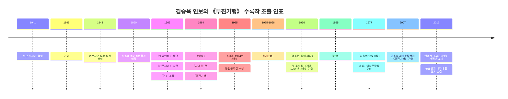

# 김승옥 《무진기행》 사전 리서치 보고서

## Executive Summary와 체크리스트

민음사 2007년 8월 3일자 《무진기행》은 김승옥의 대표 단편 10편을 한 권에 묶은 선집으로, 1962년 등단작 「생명연습」에서 1977년 이상문학상 수상작 「서울의 달빛 0장」까지를 가로지르며 작가의 문체 변화와 문제의식의 이동을 한눈에 보여 주는 “후대적 재편집본”이다. 따라서 이 판본을 읽기 전의 핵심 쟁점은 개별 작품 해설만이 아니라, 1966년 첫 소설집 《서울 1964년 겨울》과의 차이, 4·19 이후 자유의 감각과 5·16 이후 도시 근대화의 우울, 그리고 고향·서울·밤거리·여성 인물의 배치를 함께 보는 데 있다. citeturn24search6turn24search2turn13view0turn31search1turn21search0turn21search1

이 보고서는 공식 출판사 스니펫, entity["organization","한국학중앙연구원","seongnam, gyeonggi, south korea"] 백과, entity["organization","국립한글박물관","seoul, south korea"] e뮤지엄 초판 자료, 대학도서관 서지, KCI, KMDb를 우선 사용해 2007년 민음사판의 서지적 위치와 각 단편의 초출·주제·비평·매체 전환을 교차 검증했다. 일부 세부사항, 특히 2017년 개정판의 교정 내역, 2007년판의 상세 주석 여부, 「서울의 달빛 0장」의 잡지 초출 지면은 공개 자료에서 확인이 어려워 ‘미지정’으로 표기했다. citeturn24search6turn24search2turn24search3turn25search8

- 2007년 민음사판이 “초판”이 아니라 1962~1977 작품을 후대적으로 재선별한 판본인지 확인한다.
- 각 단편의 초출 연도와, 1966년 창우사 초판 소설집 《서울 1964년 겨울》 수록 여부를 분리해 본다.
- 김승옥의 문학을 정전적 “감수성의 혁명”으로만 읽지 않고, 사회사적·젠더적·정신분석적 관점을 함께 대조한다.
- 작품을 서울/비서울, 낮/밤, 질서/생명력, 남성 서술/여성 표상이라는 반복 축으로 읽는다.
- 영화 각색 기록은 KMDb를 기준으로 최소 확인만 하고, 확인 불가 항목은 ‘미지정’으로 남긴다.

## 작품 기본 정보

본 보고서에서 말하는 “초판 수록 여부”는 김승옥의 **첫 소설집**인 1966년 창우사 간행 《서울 1964년 겨울》 수록 여부를 뜻한다. 이는 2007년 민음사판 《무진기행》이 동일 제목의 초간본이 아니라, 대표작을 재구성한 세계문학전집 판본이기 때문이다. citeturn13view0turn31search1turn24search6

| 항목 | 정리 |
|---|---|
| 대상 판본 | 《무진기행: 김승옥 소설집》, 민음사 세계문학전집 149, 2007-08-03 발행. citeturn24search6turn24search2 |
| 서지 사항 | 서울: 민음사, 2007; 405쪽; 23cm; ISBN 9788937461491. citeturn24search2 |
| 판본 성격 | 대표 단편 10편을 선별한 **선집**이며, 1962년작부터 1977년작까지를 묶어 작가의 전·중·후기 일부를 한 권으로 읽게 하는 편집이다. citeturn24search6turn25search8 |
| 수록 범위 | 사용자가 제시한 10편(「무진기행」, 「서울 1964년 겨울」, 「생명연습」, 「건」, 「역사」, 「차나 한 잔」, 「다산성」, 「염소는 힘이 세다」, 「야행」, 「서울의 달빛 0장」)과 일치하는 대표작 구성으로 알려져 있다. citeturn24search6turn14search7 |
| 초판과의 관계 | 1966년 창우사 초판 소설집 《서울 1964년 겨울》은 11편 수록본이었고, 2007년판은 여기에 없는 후기작(예: 「서울의 달빛 0장」, 「야행」, 「다산성」, 「염소는 힘이 세다」)을 포함하는 대신, 초판 수록작 일부를 덜어낸 후대 선집이다. citeturn13view0turn31search1turn24search6 |
| 물성·장정 세부 | 표지 디자이너, 면지 구성, 띠지 문구, 상세 교정 이력은 공개 서지에서 미지정. citeturn24search2turn24search3 |
| 주석·해설 유무 | 공개 서지와 도서관 기록만으로는 상세 주석 존재 여부가 미지정. 다만 세계문학전집 번호 부여와 선집 성격은 확인된다. citeturn24search2turn24search3 |

2007년판의 실질적 의의는, 김승옥 문학을 “무진기행 한 편”이 아니라 「생명연습」의 음습한 자기고백, 「서울 1964년 겨울」의 도시 우울, 「다산성」의 낯선 실험성, 「서울의 달빛 0장」의 후기 도시 욕망까지 한 궤적으로 재배열했다는 데 있다. 즉 이 판본은 정전의 재현이면서 동시에 김승옥 읽기의 편집적 논평이다. citeturn24search6turn25search1turn25search8

## 저자 소개

김승옥은 1941년 일본 entity["city","오사카","japan"] 출생으로, 1945년 귀국 후 전남 entity["city","순천","jeollanam-do, south korea"]에서 성장했다. 1960년 서울대학교 불어불문학과에 입학했고, 1962년 「생명연습」이 『한국일보』 신춘문예에 당선되며 등단했다. 같은 해 김현·최하림 등과 동인지 『산문시대』를 창간해 「건」, 「환상수첩」 등을 발표했고, 1965년 「서울, 1964년 겨울」로 동인문학상을, 1977년 「서울의 달빛 0장」으로 제1회 이상문학상을 받았다. 이후 소설뿐 아니라 영화 각색 작업에서도 활약했다. citeturn20search0turn20search6turn5search7turn14search0turn34search6

비평사에서 김승옥은 흔히 “감수성의 혁명”을 일으킨 4·19세대 작가, 새로운 한글세대 문체의 선두 주자, 도시적 감각과 자기세계를 밀도 높게 언어화한 모더니스트로 규정된다. 그의 문학에서 두드러지는 것은 감각적 문장, 도시와 고향의 이중 공간, 자기기만과 수치심, 사회적 의사소통의 공허, 억눌린 욕망의 우회적 표출이다. citeturn33search4turn33search9turn20search10turn36search10

영향 관계는 직접적 자서전적 고백보다 **해석사적 맥락**에서 정리하는 편이 엄밀하다. 연구자들은 김승옥을 4·19 이후의 근대적 개인 발견, 프랑스 실존철학과 정신분석을 둘러싼 1960년대 지적 환경, 전후 세계문학과 누벨바그/뉴시네마 감수성, 그리고 1930년대 한국 모더니즘의 후속 계보와 연결해 읽어 왔다. 따라서 “사르트르·카뮈의 직접 영향”을 단정하기보다, **실존주의적 주체 문제와 모더니즘적 형식 감각이 김승옥 해석의 중심 참조틀**이었다고 쓰는 편이 정확하다. citeturn36search2turn36search3turn35search5turn37view0

| 연보 요약 | 내용 |
|---|---|
| 출생·성장 | 1941 오사카 출생, 1945 귀국, 순천 성장. citeturn20search0turn20search6 |
| 등단 | 1962 「생명연습」 한국일보 신춘문예 당선. citeturn20search6turn32search2 |
| 동인 활동 | 1962 『산문시대』 창간, 「건」·「환상수첩」 발표. citeturn5search7turn19search4 |
| 대표 수상 | 1965 동인문학상, 1977 이상문학상. citeturn38view2turn25search8 |
| 매체 확장 | 1967 이후 영화 각색에 적극 진출, 김승옥-김수용 계열의 문예영화와 긴밀히 연결. citeturn34search6turn23search7 |

## 시대·사회·문화적 배경

김승옥의 핵심 단편들은 4·19혁명 직후의 해방감과 5·16 군사정변 이후의 권위주의적 재편 사이에서 쓰였다. AKS는 5·16을 4·19 이후의 정치적 미성숙과 군부 정군운동이 결합된 군사쿠데타이자 이후 30년 이상 권위주의 체제의 출발점으로 설명한다. 이런 역사적 전환은 김승옥 소설의 자유·개인·행동 가능성이 왜 늘 좌절과 우울로 귀결되는지를 해명하는 강력한 배경이 된다. citeturn21search0turn38view2turn33search9

사회경제적으로는 1960년대 산업화와 도시화가 빠르게 진행되며 농촌 인구가 서울과 공업도시로 이동했고, 서울 인구는 1960년 245만 명에서 1970년 550만 명으로 급증했다. 그 결과 주택·교통·실업·빈민 문제뿐 아니라 익명성, 단절, 속도, 효율, 감시의 일상이 형성되었고, 김승옥의 서울 서사는 바로 이런 도시적 피로와 소외를 가장 감각적으로 포착한 사례로 읽힌다. citeturn21search1turn21search7turn33search5

작가 개인의 삶과 작품의 연관성도 중요하다. KMDb는 김승옥이 1948년 여순사건 때 아버지를 잃었다고 적고 있으며, AKS는 여수·순천 10·19사건이 국가폭력과 대규모 민간인 희생을 동반한 장기적 혼란의 사건이었음을 설명한다. 연구자들이 「생명연습」과 「건」에서 반복적으로 “아버지의 부재”, 유년기의 외상, 폭력의 내면화를 문제 삼는 이유가 여기에 있다. citeturn20search0turn21search2turn26search4turn28search12

다만 해석은 하나로 수렴되지 않는다. 정전적 읽기는 김승옥을 “개인의 발견”과 “문체 혁신”의 작가로 높이 평가하고, 사회사적 읽기는 4·19 이후 자유주의의 우울과 도시 감시 체제의 알레고리를 강조하며, 젠더·정신분석 읽기는 여성 표상의 폭력성, 자기기만, 분열된 주체를 비판적으로 재독해한다. 이 셋은 상호 배타적이라기보다, 김승옥 텍스트의 층위를 달리 부각하는 병행 가능한 독법이다. citeturn33search4turn33search9turn22search1turn27search6turn20search10

| 해석 관점 | 핵심 주장 | 장점 | 한계 |
|---|---|---|---|
| 정전·모더니즘 읽기 | 김승옥은 1950년대 엄숙주의를 넘어 감각적 문체와 근대적 개인을 형상화했다는 평가가 강하다. citeturn37view0turn38view2 | 문체와 형식 혁신, 한국 현대 단편의 미학적 전환을 선명하게 보여 준다. citeturn37view0turn33search4 | 사회구조·젠더 문제를 “감수성” 아래 약화시킬 위험이 있다. citeturn27search6turn20search10 |
| 사회사·정치 읽기 | 「서울, 1964년 겨울」의 밤 산책, 도시 방황은 4·19 이후 5·16 체제에 대한 내밀한 반발과 대항품행으로 해석된다. citeturn38view2turn22search1 | 역사적 시간성을 복원해 우울·무기력의 정치성을 읽어 낼 수 있다. citeturn22search1turn21search0 | 모든 우울을 정치 알레고리로 환원하면 텍스트의 심리·미학적 복합성이 줄어들 수 있다. citeturn12search9turn20search10 |
| 젠더·정신분석 읽기 | 여성 인물은 남성 서술의 대상이자 동시에 억압된 욕망·히스테리·자기기만의 징후로 재해석된다. citeturn27search6turn34search8turn36search3 | 기존 정전 읽기에서 가려진 폭력, 수치심, 분열된 주체를 드러낸다. citeturn20search10turn27search10 | 작품이 배태된 1960년대 정치경제적 맥락을 주변화할 가능성이 있다. citeturn33search9turn21search1 |

## 단편별 핵심 정리

아래 표의 “초판 수록 여부”는 1966년 창우사 초판 소설집 《서울 1964년 겨울》 기준이다. 초출 연도는 가능한 한 작품이 실린 지면을 제시한 서지·논문을 우선했고, 재수록·개작 흔적이 있는 「건」은 1962년 초출과 1965년 재수록을 병기했다. 「서울의 달빛 0장」의 경우 1977년 수상작품집 수록은 확인되나 잡지 초출 지면은 본 조사 범위에서 미지정이다. citeturn19search4turn18search3turn25search8

| 작품 | 초출 연도·초판 수록 여부 | 간결한 줄거리 | 핵심 주제·모티프 | 주요 학술·비평 해석 / 매체 전환 / 짧은 인용 |
|---|---|---|---|---|
| 무진기행 | 1964.10 『사상계』; 1966 초판 소설집 수록. citeturn37view0turn31search1 | 윤희중은 승진을 앞두고 고향 무진으로 내려간다. 그는 하인숙과 함께 서울로 떠날 가능성을 상상하지만, 출세 지향적 친구 조와 무진의 퇴락한 정경, 죽음의 장면을 통과하며 자신도 결국 서울의 현실로 복귀할 인물임을 확인한다. 편지를 찢는 결말은 일탈의 포기를 압축한다. citeturn37view0 | 귀향/탈향, 안개, 자기기만, 고향 상실, 근대화의 압력. 하인숙은 단순한 뮤즈가 아니라 남성 서술이 억눌러 둔 여성 탈출 욕망의 표식으로도 읽힌다. citeturn37view0turn6search11turn26search6 | AKS는 이 작품을 “개인의 자발성, 주체성, 창의성은 버려질 수밖에 없”음을 보여 주는 텍스트로 정리한다. 대표 각색은 entity["movie","안개","1967 korean film"](1967)이며, 후일 「무진 흐린 뒤 안개」(1986)도 기록된다. “안개로 상징되는 허무”라는 평은 무진을 목가가 아니라 퇴행의 유혹으로 읽게 한다. citeturn37view0turn23search7turn23search10turn23search9 |
| 서울 1964년 겨울 | 1965.6 『사상계』; 1966 초판 소설집 수록; 1965 동인문학상. citeturn38view2turn31search1 | 겨울밤 서울에서 구청 직원, 대학원생, 외판원이 우연히 만나 밤거리를 떠돈다. 외판원은 아내의 시신을 병원에 판 돈으로 술을 사고 화재 현장에 돈을 던진 뒤 여관에서 자살한다. 남은 두 인물은 도시의 조로한 삶과 자기들의 무력감을 체감한다. citeturn38view2 | 도시 소외, 밤 산책, 시민성의 공허, 꿈틀거림, 조로한 세대 의식. 서울은 배경이 아니라 인간을 소진시키는 시스템으로 기능한다. citeturn38view2turn22search1turn12search9 | AKS는 “우리가 너무 늙어버린 것 같지 않습니까?”라는 자조를 통해 1960년대 의식의 방황을 표출한 작품으로 본다. 사회사적 독법에서는 밤 산책을 감시사회 속 “대항품행”으로 읽는다. 매체 전환 기록은 본 조사 범위에서 미지정. citeturn38view2turn22search1 |
| 생명연습 | 1962 『한국일보』 신춘문예; 1966 초판 소설집 수록. citeturn20search6turn31search1 | 현재의 짧은 만남과 대화 속에 과거 가족사, 어머니와 주변 인물들의 관계, 모호한 사랑과 혐오가 교차 삽입된다. 사건 전개는 최소화되고 회상과 독백이 심리를 밀도 있게 채운다. 결국 ‘나’와 한 교수의 닮은 위악과 무기력이 드러난다. citeturn26search4turn28search14 | 아버지의 부재, 자기고백, 죄의식, 위악, 자기세계의 형성. 김승옥 초기 문학의 내면지향성과 주체 문제를 응축한 데뷔작으로 읽힌다. citeturn26search0turn26search4turn26search1 | KCI에서는 “아버지의 부재”와 “자기 고백”의 기독교적·정신분석적 양상을 함께 논의한다. 이 작품은 결핍이 자유를 보증하지 않고 오히려 욕망의 파국을 예고한다는 해석이 강하다. 매체 전환 기록은 미지정. citeturn26search0turn26search4turn36search3 |
| 건 | 1962 『산문시대』 창간호 초출, 1965.3 『청맥』 재수록; 1966 초판 소설집 수록. citeturn19search4turn31search1 | 성인 화자는 유년기의 사건을 소급적으로 회상한다. 그 기억에는 빨치산 시체를 산에 묻는 장면, 소녀 윤희를 성적 희생양으로 삼으려는 형들의 음험한 모의가 얽혀 있다. 소년은 어른들의 세계를 흉내 내다가 결국 순수의 상실을 경험한다. citeturn28search12turn28search8 | 여순사건의 그림자, 유년기 상실, 주체화, 폭력의 학습, 회고 서사. “건(乾)”은 건조한 세계 질서와 성인 세계 편입의 냉혹함을 상징적으로 떠안는다. citeturn28search8turn8search0 | DBpia는 이 작품을 “순수한 자아를 상실하고 어른들의 세계에 편입되는 과정”의 소설로 요약한다. 최근 읽기에서는 유년의 기억이 아니라 **성인이 된 뒤 구성된 회상**이라는 소급성에 더 주목한다. 매체 전환 기록은 미지정. citeturn28search8turn8search0 |
| 역사 | 1964.7 『문학춘추』; 1966 초판 소설집 수록. citeturn18search3turn31search1 | 바깥 이야기의 화자는 공원에서 한 청년의 사연을 듣는다. 청년은 창신동 빈민가의 생동감에서 벗어나 질서정연한 새집으로 옮겼지만 그 안락함에 질식한다. 그는 막노동자 서씨가 밤에 동대문 돌을 들어 올리는 장면을 떠올리고, 새집의 질서를 깨 보고자 흥분제를 타지만 아무 일도 일어나지 않는다. citeturn28search9 | 질서 대 생명력, 비능률, 도시 빈민, 동일화에 대한 저항, 우울. 서씨의 힘은 성공이 아니라 살아 있음을 증명하려는 잉여 행위다. citeturn8search1turn17search2turn27search11 | KCI·DBpia 계열 해석은 이 작품을 “무선택적 적응”과 “동일성의 폭력”에 대한 해체적 저항으로 읽는다. 교육용 해설도 새 하숙집의 기계적 질서와 창신동의 생명력 대비를 핵심으로 제시한다. 매체 전환 기록은 미지정. citeturn8search1turn28search9 |

| 작품 | 초출 연도·초판 수록 여부 | 간결한 줄거리 | 핵심 주제·모티프 | 주요 학술·비평 해석 / 매체 전환 / 짧은 인용 |
|---|---|---|---|---|
| 차나 한 잔 | 1964.10 『세대』; 1966 초판 소설집 수록. citeturn18search3turn31search1 | 실직과 소속 상실 앞에 놓인 주인공은 지인들을 찾아다니며 일을 부탁해야 하는 처지에 놓인다. 그러나 직접적인 절망을 드러내는 대신, 그는 “차나 한 잔” 하자는 회색빛 도시의 관습어로 부탁과 모멸을 포장한다. 작품은 도시적 예의와 내면의 절박함 사이의 간극을 추적한다. citeturn28search10 | 공허한 사교, 실직, 의사소통의 실패, 도시적 제스처, 상처 입히지 않는 관계의 불가능성. citeturn16search2turn17search2 | KCI는 “차나 한 잔”을 도시의 상징적·사회적 인간관계를 특징짓는 “텅 빈 제스처”로 규정한다. 이 표현은 공동체 언어가 오히려 절망을 은폐하는 장치라는 점을 드러낸다. 매체 전환 기록은 미지정. citeturn16search2turn17search1 |
| 다산성 | 1965.12~1966.6 『창작과비평』; 1966 초판 소설집 미수록. citeturn15search11 | 인과적 사건 전개보다 단절된 에피소드, 기이한 명명, 다방과 인물군의 반복적 등장으로 서사가 이어진다. 이야기 속에는 번식·과잉·생산을 연상시키는 이미지가 증식하지만, 현실적 필연성은 약하다. 독자는 줄거리보다 언어의 연쇄와 리듬을 따라가게 된다. citeturn27search0turn29search2 | 과잉 생산, 언어 실험, 명명의 연쇄, 자기지시적 서사, 반사실주의. citeturn27search0turn29search12 | KCI는 「다산성」을 김승옥의 “최초로 시도한 장편소설”이자, “연상과 가정으로 이질적인 화소들을 생성”하는 작품으로 본다. 주류 비평의 “감수성” 이미지 뒤에 가려진 난해한 실험성을 보여 준다는 점이 중요하다. 매체 전환 기록은 미지정. citeturn27search0 |
| 염소는 힘이 세다 | 1966.4 『자유공론』; 1966 초판 소설집 미수록. citeturn15search11 | 가난한 가족의 생계를 가까스로 지탱하던 염소가 죽으면서, 소년 화자는 가족과 세계의 힘 관계를 날것으로 체감한다. 병든 어머니, 노쇠한 할머니, 힘없는 누나와 함께 살아가는 집에서 “힘센 것”은 염소뿐이었다. 보호막이 사라진 뒤 소년은 세속의 폭력과 억압을 배우지만 그것을 극복하는 성숙까지는 나아가지 못한다. citeturn29search5turn27search1 | 힘과 무력, 반(半)성장소설, 가족 빈곤, 언캐니, 소리풍경. citeturn27search1turn27search5 | KCI는 이 작품을 통과제의가 완결되지 않는 “반(半)성장소설”로 읽고, 또 다른 연구는 도시 소음과 불안의 사운드스케이프를 핵심으로 본다. “이제 우리 집에 힘센 것은 하나도 없다”는 도입부는 가족 단위의 무력감을 집약한다. 매체 전환 기록은 미지정. citeturn27search1turn27search5turn29search5 |
| 야행 | 1969 『월간중앙』 연재; 1966 초판 소설집 미수록. citeturn22search7 | 현주는 같은 은행에 다니는 남편과의 결혼을 숨긴 채 일상을 연기한다. 어느 날 밤 폭력적 성적 사건 이후 낮의 질서와 밤의 욕망 사이에 균열이 생기고, 그는 밤거리를 배회하며 자기 존재의 공허를 확인한다. 결말부의 호명 변화는 억눌린 욕망과 사회적 연기의 충돌을 드러낸다. citeturn29search3turn27search10 | 밤거리, 여성 욕망, 히스테리, 국가주의적 남성성, 일상 연기, 폭력. citeturn17search2turn27search6turn27search10 | KCI는 「야행」을 “대낮의 광장”과 “밤거리”의 대립 속에서 읽거나, 여성 욕망을 통해 1960년대 국가주의적 남성성의 무의식을 드러내는 서사로 본다. 영화판 「야행」은 원작 김승옥, 감독 김수용으로 1973년 촬영 후 검열로 지연되어 1977년 개봉했다. citeturn17search2turn27search6turn23search0turn23search15 |
| 서울의 달빛 0장 | 1977 발표; 1977년도 제1회 이상문학상 수상작품집 수록 확인, 잡지 초출 지면 미지정; 1966 초판 소설집 미수록. citeturn25search1turn25search8 | 남성 화자는 비행기 안에서 만난 여성과 결혼하지만, 신혼 첫날의 충격과 이후의 파탄을 겪으며 욕망·혐오·소비의 도시 서울 한복판으로 미끄러진다. 그는 타인의 성적 이력과 자신의 이중 기준 사이에서 무너지고, 이후 방탕과 이해 욕구가 뒤엉킨 삶을 산다. 작품은 후기 서울 서사의 타락과 공허를 극단까지 밀어붙인다. citeturn29search10 | 도시 욕망, 소비, 남성의 자기파괴, 포르노그래피적 시선, 후기 모더니티. citeturn25search1turn29search16turn34search8 | KCI는 이 작품을 “심리 기제와 미적 모더니티”의 문제로 읽고, 제1회 이상문학상 선정이유는 “동시대적 인간의 문제”를 포착했다고 평했다. 매체 전환 기록은 본 조사 범위에서 미지정. citeturn25search1turn25search7 |

정리하면, 2007년판의 10편은 단순한 대표작 묶음이 아니라 **초기의 유년·결핍 서사(「생명연습」, 「건」), 1964~1965년의 서울/무진 핵심 단편군(「역사」, 「차나 한 잔」, 「무진기행」, 「서울 1964년 겨울」), 1966년의 실험과 폭력(「다산성」, 「염소는 힘이 세다」), 후기 도시 욕망 서사(「야행」, 「서울의 달빛 0장」)**를 하나의 연쇄로 읽게 하는 구성이다. 이 구성 덕분에 김승옥의 “감수성”은 단지 아름다운 문체가 아니라, 폭력과 수치심과 자기기만을 견디는 언어의 장치로 다시 읽힌다. citeturn24search6turn25search1turn20search10

## 판본 비교와 연표

2007년 민음사판의 위치를 정확히 이해하려면, 1966년 첫 소설집, 2014년 문학동네 선집, 2017년 개정·재편 판본과 비교하는 것이 가장 효율적이다. 결론부터 말하면, 2007년판은 **초기 대표작 총서화**와 **후기 대표작 포함**을 동시에 수행한다는 점에서 가장 “교과서적이면서도 후대적”인 선집이다. citeturn13view0turn24search6turn15search9turn24search3turn18search4

| 판본 | 발행 사항 | 수록 방식 | 2007년판과의 차이 |
|---|---|---|---|
| 《서울 1964년 겨울》 초판 | 창우사, 1966-02-05, 377쪽, 11편 수록. 책갑에는 entity["people","장 뒤뷔페","french artist"] 그림이 쓰였다. citeturn13view0turn31search1 | 「생명연습」, 「들놀이」, 「무진기행」, 「확인해본 열다섯 개의 고정관념」, 「건」, 「역사」, 「싸게 사들이기」, 「수술」, 「차나 한 잔」, 「서울, 1964년 겨울」, 「환상수첩」. citeturn31search1 | 2007년판은 초판의 11편을 재현하지 않는다. 대신 후기작을 넣고 일부 초기작을 뺐다. citeturn31search1turn24search6 |
| 《무진기행》 대상 판본 | 민음사 세계문학전집 149, 2007-08-03, 405쪽. citeturn24search6turn24search2 | 대표 단편 10편을 선별해 1962~1977의 궤적을 압축. citeturn24search6turn25search8 | 초간본 재현이 아니라 “김승옥 정전”의 재편집본이다. citeturn24search6turn13view0 |
| 《생명연습》 | 문학동네 한국문학전집 1, 2014, 대표중단편선. citeturn15search9turn28search11 | 「생명연습」, 「건」, 「환상수첩」, 「누이를 이해하기 위하여」, 「역사」, 「무진기행」, 「서울, 1964년 겨울」, 「다산성」, 「염소는 힘이 세다」, 「야행」. citeturn15search9 | 2007년판과 달리 「차나 한 잔」·「서울의 달빛 0장」을 빼고, 「환상수첩」·「누이를 이해하기 위하여」를 넣는다. 초기·중기 중심이라는 점이 더 강하다. citeturn15search9 |
| 《무진기행》 개정판 | 민음사, 2017,c2007, 세계문학전집 149, 개정판 표기. citeturn24search3turn24search7 | 총서 번호와 제목은 유지되며 재발행된다. citeturn24search3 | 세부 교정·본문 수정 내역은 공개 서지상 미지정이다. 따라서 2007년판과의 텍스트 차이는 보수적으로 “확인 불가”로 두는 편이 엄밀하다. citeturn24search3turn24search7 |
| 《차나 한 잔》 | 민음사 쏜살문고, 2017-06-30, 168쪽, 4편 수록. citeturn10view3turn18search4 | 「차나 한 잔」, 「서울 1964년 겨울」, 「서울의 달빛 0장」 등 도시적 정조가 강한 작품 위주의 소형 선집. citeturn16search5turn18search4 | 2007년판이 작가의 장기 궤적을 압축한 총서형이라면, 2017 쏜살본은 휴대성과 도시적 정조를 강조한 재패키징이다. citeturn18search4turn16search5 |

아래 타임라인은 작가 연보와 이번 민음사판 수록작의 초출 연도를 함께 엮은 통합 연표다. 연도는 초출 지면이 확인된 경우 그 지면을, 그렇지 않은 경우 수상작품집·대표 서지를 우선했다. citeturn20search0turn20search6turn19search4turn18search3turn15search11turn22search7turn25search8turn24search6

이 연표가 보여 주는 핵심은, 2007년판이 1964~1966의 정점만 모은 것이 아니라, 1962년의 데뷔적 불안과 1977년의 후기 도시 욕망까지 이어 붙여 “김승옥 문학의 시간 전체”를 재구성했다는 점이다. 따라서 사전 리서치의 실제 독서 전략은 작품별 감상 포인트보다 **초기-중기-후기 사이의 리듬 변화**를 잡는 데 두어야 한다. citeturn20search6turn25search1turn24search6

## 이미지·도표 제안

- **1966년 초판 소설집 실물 이미지**: e뮤지엄의 《서울 1964년 겨울》 초판본은 장정, 책갑, 크기, 발행일을 한눈에 확인하게 해 주므로 2007년판과의 물성 비교 도표에 가장 유용하다. citeturn13view0
- **영화화 비교 이미지**: KMDb의 「무진기행」 원작 영화 entity["movie","안개","1967 korean film"] 스틸/포스터와 영화 「야행」 자료를 함께 배치하면, 김승옥 소설의 문예영화 전환 양상을 시각적으로 설명하기 좋다. citeturn23search7turn23search1turn23search0turn23search15
- **판본 비교 표지 모음**: 2007 민음사 세계문학전집 《무진기행》, 2017 개정판 기록, 2017 쏜살문고 《차나 한 잔》을 나란히 두면 “정전 총서형/개정 재발행형/소형 재패키징형”의 편집 전략 차이를 보여 줄 수 있다. 출처는 민음사 스니펫과 대학도서관 서지, 서점 자료가 적절하다. citeturn24search6turn24search3turn10view3

## 주요 정보 누락 검증

2007년 대상 판본의 **상세 주석 유무**, **정확한 교정·교열 이력**, **2017 개정판의 본문 수정 범위**, **「서울의 달빛 0장」의 잡지 초출 지면**은 공개 서지·공식 소개에서 확인되지 않아 ‘미지정’으로 남겼다. 다만 2007년판의 서지 사항, 1966년 초판 구성, 2017 개정판 존재, 1977년 수상작품집 수록 사실은 교차 확인되었다. citeturn24search2turn24search3turn13view0turn25search8

보완적으로 말하면, 이 누락들은 이번 사전 리서치의 핵심 판단을 흔들 정도는 아니다. 2007년 민음사판을 읽기 위한 실질적 기준점은 **1966 초판과의 편집 차이**, **1964~1965 핵심작군의 역사성**, **1977 후기작의 삽입이 만드는 독서 효과**이며, 이 세 축은 충분히 검증되었다. citeturn31search1turn24search6turn25search1

**GPT 의견:** 이번 판본을 사전 검토할 때 가장 강하게 잡아야 할 포인트는 “김승옥=무진기행”이라는 단일 대표작 구도를 넘어, 2007년판이 의도적으로 **초기 결핍 서사 → 1964~1966의 정점 → 후기 도시 욕망 서사**를 한 권 안에 재서열했다는 사실이다. 이 판단의 확신도는 **높음**이다. citeturn24search6turn31search1turn25search1

**더 깊게 볼 질문**
- 2007년판이 「환상수첩」을 빼고 「서울의 달빛 0장」을 넣은 편집 판단은, 김승옥을 “실험적 작가”보다 “도시 우울의 정전 작가”로 고정하는 효과를 내지 않는가?
- 「무진기행」과 「야행」을 함께 읽을 때, 탈출 욕망의 주체가 남성일 때와 여성일 때 서술 윤리가 어떻게 달라지는가?
- 「서울 1964년 겨울」의 밤 산책을 정치적 알레고리로 읽는 해석과 실존적 우울로 읽는 해석 가운데, 어느 쪽이 2007년판의 편집 순서와 더 잘 맞는가?

[2026-04-16] #김승옥 #무진기행 #한국현대문학 #민음사 #판본연구

자체 점검: Executive Summary, 개념적 체크리스트, 다중 관점 비교, 작품 기본 정보 표, 단편별 표, 판본 비교표, mermaid 타임라인, 이미지 제안, GPT 의견, 탐색 질문, 날짜와 해시태그를 모두 포함했다.