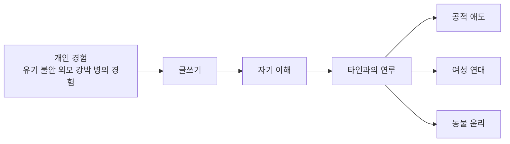

사전 리서치 체크리스트

- 이 책이 **정확히 어떤 책인지**부터 확인하기
- 최은영의 **생애와 등단 경로**를 먼저 잡기
- 최은영 문학의 반복 주제인 **여성 연대, 기억, 애도, 타자 윤리**를 미리 보기
- 『백지 앞에서』를 밀어올린 **개인적 배경**과 **사회적 배경**을 분리해서 읽기
- 책 바깥의 역사 이슈인 **세월호, 국가폭력 기억, 페미니즘 리부트, 동물권**을 함께 보기
- 읽을 때는 **고백의 윤리, 몸과 생산성, 연루성**이라는 렌즈를 들고 들어가기

# 최은영 산문집 백지 앞에서 사전 리서치 보고서

## 요약

이 보고서는 사용자가 읽고 있는 『백지 앞에서』를, “최은영이라는 작가가 왜 지금 이 방식으로 자신을 말하는가”라는 질문을 중심으로 읽기 위한 사전 지도다. 결론부터 말하면 이 책은 단순한 작가 에세이가 아니라, 최은영이 소설에서 오래 다뤄온 여성 연대, 기억, 애도, 타자 윤리, 자기혐오와 회복의 문제를 **허구의 우회 없이 직접 드러낸 핵심 텍스트**에 가깝다.[주1][주3][주7][주8] citeturn23view0turn25view0turn26view0turn27view0turn38view0turn14view4turn15view0turn15view2

이 보고서는 사용자가 말한 “최은영”을 **1984년생 한국 소설가 최은영**으로 가정해 작성했다. 출간일·서지·인터뷰 내용은 가능한 한 공식 출판사 소개, 저자 인터뷰, 학술·비평, 한국어 언론 순으로 대조했으며, 상충하거나 확정하기 어려운 정보는 ‘미확인’ 또는 ‘추정’으로 표기했다.[주1][주2] citeturn23view0turn34view3turn35view0

## 작품 기본 정보

| 항목 | 내용 |
|---|---|
| 제목 | 『백지 앞에서』 |
| 갈래 | 산문집, 한국 에세이 |
| 저자 | 최은영 |
| 출판사 | 문학동네 |
| 출간일 | 2026년 4월 30일 |
| 구성 | 프롤로그, 산문 10편, 에필로그 |
| 원고 구성 | 2024년 가을~2025년에 쓴 새 원고 6편 + 기존 발표 원고 4편 수정·추가 |
| 핵심 소재 | 글쓰기, 취약성, 유기 불안, 외모 강박, 질병과 치료, 혼자 살기, 애도, 세월호, 동물권 |
| 서지 메모 | 도서관 서지상 273쪽 확인. 다만 일부 유통·서지에서 목차의 특정 숫자 표기가 엇갈려 미확인 항목이 있음 |

위 표의 서지 정보는 교보eBook 상품소개, 문학동네 도서 페이지 검색결과, YES24 상품페이지, KAIST 도서관 서지를 대조해 정리했다. 『백지 앞에서』는 최은영의 **등단 13년 만의 첫 산문집**이며, 출판사 소개에 따르면 “작가가 처음 털어놓는 이야기”들로 채워진 책이다. 특히 버려질 것 같은 두려움, 갑상선암 진단, 외모 강박, 동물권과 세월호 참사 같은 사회문제가 한 권 안에서 함께 놓여 있다는 점이 중요하다.[주1] citeturn23view0turn21search7turn22search0turn33view0turn34view2turn34view3

이 책을 이해하는 가장 간단한 개념 지도는 아래와 같다. 개인적 취약성이 글쓰기를 통해 자기이해로 옮겨가고, 그 자기이해가 다시 타인의 고통과 공적 애도로 확장된다는 구조다.[주1][주3][주7][주8] citeturn23view0turn25view0turn26view0turn27view0turn38view0turn15view0turn15view2

## 작가와 작품의 좌표

- **작가의 생애**
  - 핵심 사실: 최은영은 1984년 경기도 광명에서 태어나 고려대학교 국어국문학과를 졸업했다. 고등학교 1학년 때 처음 소설을 썼고, 대학 졸업 뒤에는 한국어 강사 등 다른 일을 하며 공모에 여러 차례 도전한 끝에 서른이 되던 해인 2013년 『작가세계』 신인상에 「쇼코의 미소」가 당선되며 등단했다.[주2][주5][주6] citeturn35view0turn20view0turn37view0
  - 해석: 늦지 않지만 결코 빠르지도 않은 등단, 그리고 반복된 낙선 경험은 최은영 문학의 중요한 감정적 기반이다. 그의 작품에 자주 등장하는 머뭇거림, 자기 불신, 상처 입기 쉬운 인물들은 단순한 설정이 아니라 작가 자신의 시간 감각과 실패 경험에서 나온 것으로 읽힌다.[주5][주6] citeturn20view0turn37view0
  - 근거: 최은영은 인터뷰에서 글쓰기가 자신에게 “숨구멍”이었고, 20대를 지나도록 소설을 쓸 용기를 내지 못했다고 회고했다. 또한 20대 후반 “마지막이라는 생각”으로 도전했다고 말했다.[주5][주6] citeturn20view0turn37view0

- **작가의 주요 이력**
  - 핵심 사실: 주요 저서로 소설집 『쇼코의 미소』, 『내게 무해한 사람』, 『아주 희미한 빛으로도』, 장편소설 『밝은 밤』, 짧은 소설 『애쓰지 않아도』가 있으며, 2026년에 첫 산문집 『백지 앞에서』를 냈다. 수상 경력으로는 제5회·제8회·제11회 젊은작가상, 구상문학상, 한국일보문학상, 대산문학상 등이 확인된다.[주2] citeturn35view0
  - 해석: 이력의 핵심은 “단편에서 시작해 관계를 다루는 작가”가 “근현대 여성의 시간과 공적 애도를 다루는 작가”로 넓어졌다는 데 있다. 『백지 앞에서』는 이 흐름의 외전이 아니라, 그 확장의 내부 원인을 드러내는 책이다.[주1][주7] citeturn23view0turn38view0
  - 근거: 공식 작가 소개와 주요 작품 소개는 최은영의 궤적을 초기 관계 서사에서 기억·회복·연대로 확장된 문학세계로 요약한다.[주2][주7] citeturn35view0turn38view0

- **작품 세계**
  - 핵심 사실: 최은영 소설은 사적인 관계를 미세하게 그리면서도, 그 관계가 사회적 조건과 어떻게 얽혀 있는지를 드러내는 데 강점을 보인다. 여성들 간의 우정과 사랑, 차별과 혐오에 대한 맥락적 공감, 기억을 통한 회복, 국가폭력과 사회적 참사에 대한 애도, 글쓰기의 윤리가 반복 핵심어로 제시된다.[주7][주8] citeturn38view0turn14view4turn14view1turn15view0turn15view1turn15view2
  - 해석: 최은영의 세계는 “착한 문학”이라기보다 **상처를 어떻게 써야 타인의 고통을 이용하지 않게 되는가**를 탐색하는 문학에 가깝다. 그래서 그의 인물들은 쉽게 치유되지 않고, 이야기는 감정의 원인을 사회적·역사적 층위까지 밀고 들어가는 경향이 있다.[주7][주8] citeturn20view3turn38view0turn14view4turn15view0turn15view2
  - 근거: 2023년 작품 소개는 『쇼코의 미소』가 사적 관계의 사회적 맥락을, 『내게 무해한 사람』이 기억과 회복을, 『밝은 밤』이 여성 4대의 역사와 연대를 다뤘다고 정리한다. 학술 논문들은 이를 여성 우정의 정치성, 슬픔의 윤리, 대항기억의 서사라는 말로 설명한다.[주7][주8] citeturn38view0turn14view4turn15view0turn15view2

- **영향받은 사조와 작가**
  - 핵심 사실: 직접 확인되는 영향의 출발점은 **페미니즘**이다. 최은영은 대학 시절 여성주의 교지 『석순』 활동과 정희진의 강연을 계기로 세계 인식이 바뀌었다고 말했고, 황정은의 모든 단편을 좋아한다고 밝혔으며, 『백지 앞에서』의 한 대목에서는 프리모 레비의 증언 윤리를 직접 호명한다. 또 『밝은 밤』의 출발점으로는 박경리 『토지』에 스치듯 등장한 백정 소녀의 이미지가 있었다고 밝혔다.[주5][주6][주1] citeturn20view4turn20view0turn37view0turn34view2
  - 해석: 확인 가능한 영향선은 크게 세 갈래다. 첫째, 여성주의적 언어 감수성. 둘째, 황정은 같은 동시대 여성 작가의 정교한 관계 서사. 셋째, 프리모 레비와 박경리로 이어지는 증언·역사 서사의 윤리다. 반면 “박완서의 직접 영향” 같은 계보는 지금 확보한 자료로는 비교 가능한 친연성일 뿐, **확인된 자기 증언은 아니므로 추정으로 남겨두는 것이 안전**하다.[주5][주6][주8] citeturn20view4turn20view0turn37view0turn15view2
  - 근거: 인터뷰에서 최은영은 여성주의 교지 활동이 없었다면 지금 다른 직업인이 되었을 것이라고까지 말했고, 『백지 앞에서』의 소개문은 프리모 레비를 통해 “기억하고 말함으로써 침묵을 깨뜨리는” 윤리를 강조한다.[주5][주1] citeturn20view0turn20view4turn34view2

- **이 산문집과 관련한 삶의 배경**
  - 핵심 사실: 『백지 앞에서』에는 유기 불안, 착취적 관계의 경험, 외모 콤플렉스, 갑상선암 진단과 치료, 결혼과 이혼으로 이어지는 개인사, 『쇼코의 미소』 이후의 불안과 고립감, 상담을 통한 자기이해, 글을 거의 쓰지 못하던 시기 등이 직간접적으로 배경이 된다.[주1][주3][주4][주6] citeturn23view0turn19view0turn25view0turn26view0turn27view0turn37view0
  - 해석: 이 책의 자기고백은 “사소한 사생활 공개”가 아니라, 오래 숨겨온 취약성을 언어로 정리해 **자기 자신을 속이지 않는 법**을 배우는 과정으로 읽는 편이 더 정확하다. 작가 스스로도 산문을 쓰며 생각이 정리되고 자유로워졌다고 말한다.[주3][주4] citeturn25view0turn26view0turn27view0turn19view0
  - 근거: 2026년 인터뷰들에서 최은영은 산문에 “숨을 데가 없다”고 느꼈고, 불편한 지점까지 써보자고 결심했다고 밝혔다. 또한 자신에게는 “언어화하지 못하는 것”이 더 큰 고통이라고 설명했다.[주3][주4] citeturn25view0turn26view0turn27view0turn19view0

## 시대와 사회 문화적 배경

- **시대·사회·문화적 배경**
  - 핵심 사실: 『백지 앞에서』는 2024년 가을부터 2025년까지 쓰인 원고들을 중심으로 엮인 책이므로, 기본 무대는 **중후반 2020년대 한국 사회**다. 이 시기의 배경에는 페미니즘 리부트 이후의 백래시, 청년층 정신건강 악화와 번아웃, 성별화된 외모 강박, 공적 애도의 피로와 조롱 문화, 동물복지 담론의 제도화가 겹쳐 있다.[주1][주3][주10][주11][주13] citeturn23view0turn27view0turn39view0turn39view1turn39view2turn39view3turn39view4turn42view0turn42view1
  - 해석: 그래서 이 책은 사적인 불안의 기록이면서 동시에, **왜 한국 사회에서 자기혐오와 자기검열이 쉽게 개인의 문제로 환원되는가**를 보여주는 사회적 문서이기도 하다. 최은영이 반복해서 문제 삼는 것은 개별 감정 그 자체보다, 그 감정을 사소하거나 부끄러운 것으로 만들도록 압박하는 문화다.[주3][주4][주10] citeturn25view0turn27view0turn19view0turn39view0

- **작품의 주요 배경 시대와 국가와 사회상**
  - 핵심 사실: 책의 중심 배경은 한국이지만, 시간대는 단일하지 않다. 현재형의 글쓰기는 2024~2025년의 한국 사회에 발을 딛고 있고, 회고는 작가의 어린 시절과 청년기를 거쳐 1980~1990년대의 감각으로 후퇴하며, 일부 대목은 세월호 이후 한국의 공적 애도, 베트남전 기억, 홀로코스트 증언 문학까지 시야를 넓힌다.[주1][주8][주9][주12] citeturn23view0turn34view2turn15view2turn32search2turn32search5turn32search4turn32search8
  - 해석: 즉 이 책의 “배경”은 장소라기보다 **기억의 층위**에 가깝다. 개인의 몸과 감정, 가족과 연애의 기억, 한국 현대사의 상처, 더 멀리는 20세기 폭력의 증언 전통이 한 권 안에서 포개진다.[주1][주8] citeturn34view2turn14view2turn15view2

- **대표적 역사·사회 이슈**
  - **세월호 참사와 애도의 정치**
    - 핵심 사실: 세월호 참사는 2014년 4월 16일 발생했고, 476명 탑승객 중 304명이 희생됐다. 공식·공공 자료는 이를 단순 사고가 아니라 여전히 진상규명과 기억 보존의 과제가 남은 사건으로 설명한다. 최은영의 이전 작품 「미카엘라」는 학술적으로 세월호 이후의 사회적 트라우마·슬픔의 윤리를 다룬 텍스트로 읽혀 왔다.[주9] citeturn32search2turn32search5turn28search0turn15view3turn15view0
    - 이 책에 왜 중요한가: 『백지 앞에서』의 공적 애도 감각은 갑자기 생긴 것이 아니라, 최은영 문학에서 이미 오래 다져진 축이다. 그러므로 독자는 이 산문집의 애도를 “에세이적 의견”이 아니라 **기존 소설 세계의 연장**으로 읽는 편이 적절하다.[주8][주9] citeturn15view0turn15view3turn32search5

  - **베트남전 민간인 학살과 국가폭력 기억**
    - 핵심 사실: 최은영의 「씬짜오, 씬짜오」는 학술적으로 한국 사회의 베트남전 기억을 “대항 기억”으로 재구성하는 텍스트로 분석된다. 한편 현재 한국 사회에서 베트남전 민간인 학살 문제는 소송과 진실규명 범위를 둘러싼 쟁점으로 여전히 현재진행형이다.[주8][주12] citeturn15view2turn15view1turn32search4turn32search6turn32search8
    - 이 책에 왜 중요한가: 『백지 앞에서』에서 기억과 죄책감, 말해야 한다는 압박은 사적인 상처에만 붙어 있지 않다. 최은영에게 기억은 늘 국가폭력과 사회적 망각의 문제로 이어지며, 이 점이 그의 산문을 단순 자전 기록에서 끌어올린다.[주8][주12] citeturn15view1turn15view2turn32search4turn32search8

  - **페미니즘 리부트와 백래시**
    - 핵심 사실: 관련 연구와 비평은 한국의 “페미니즘 리부트”를 대체로 2015~2016년 이후의 흐름으로 보고, 강남역 살인사건, 문단 내 성폭력 폭로, 미투 운동, 이후의 반페미니즘 백래시가 20~30대 여성 독자와 작가의 감수성을 크게 바꿨다고 설명한다. 최은영 본인도 대학 시절 여성주의 교지 활동과 여성주의 독서가 자신의 세계를 바꿨다고 밝힌 바 있다.[주5][주13] citeturn20view4turn42view0turn42view1
    - 이 책에 왜 중요한가: 『백지 앞에서』를 “개인적 약점 고백”으로만 읽으면 절반만 읽는 셈이다. 이 책은 욕망의 대상이 아니라 욕망의 주체로 살고 싶다는 갈망, 여성을 평가하고 소모하는 시선에서 벗어나려는 투쟁을 아주 직접적으로 말한다.[주1][주3][주5][주10] citeturn23view0turn25view0turn20view4turn39view0

  - **외모 고정관념과 자기혐오**
    - 핵심 사실: 한국여성정책연구원은 2020년 이슈페이퍼에서 외모 강박이 한국 사회 여성 전반에 광범위하게 나타나며, 왜곡된 자기 인식, 우울감, 자살충동 등 건강권 문제와 연결될 수 있다고 지적했다. 최은영은 『백지 앞에서』에서 외모 강박과 “못생김”을 지우고 싶었던 감각을 전면적으로 다룬다.[주1][주10] citeturn39view0turn23view0turn34view2
    - 이 책에 왜 중요한가: 「못생겼다는 느낌」은 개인의 사춘기 콤플렉스 고백이 아니라, 한국 사회의 시각 문화와 젠더화된 평가 체계가 어떻게 내면화되는지를 보여주는 핵심 장이다.[주1][주10] citeturn34view2turn39view0

  - **청년 불안과 생산성 강박**
    - 핵심 사실: 연구와 국가 통계는 청년층 정신건강 악화가 단순 체감이 아니라 구조적 문제임을 보여준다. 한국보건사회연구원 게재 논문은 20대 우울·불안 증가를 지적했고, 국가데이터연구원은 2025년 ‘청년 삶의 질’ 보고서를 처음 발간했다. 최은영 역시 자신을 몰아붙이며 번아웃을 겪고, 쉬는 일마저 죄책감으로 경험했다고 말한다.[주3][주6][주10] citeturn39view1turn39view2turn27view0turn37view0
    - 이 책에 왜 중요한가: 『백지 앞에서』의 “휴식”, “혼자 사는 연습”, “긴 겨울”은 모두 자기계발 신화와 생산성 도덕을 거스르는 장이다. 즉 이 책은 마음챙김 조언서가 아니라 **생산성 윤리 비판의 산문**으로도 읽을 수 있다.[주3][주6][주10] citeturn26view0turn27view0turn37view0turn39view1

  - **동물권과 종간 윤리**
    - 핵심 사실: 한국에서는 1999년 이후 본격적 동물운동이 조직화되었고, 2025년 농림축산식품부는 제3차 동물복지 종합계획을 발표하며 사육금지제, 입양 전 교육 의무화, 길고양이 갈등 완화 등을 추진한다고 밝혔다. 『백지 앞에서』는 한 마리 고양이를 사랑하면서 모든 동물을 보는 시각이 달라졌다고 말한다.[주1][주11] citeturn39view3turn39view4turn30search6turn34view2
    - 이 책에 왜 중요한가: 「인간과 동물 사이」는 취향의 문제가 아니라, 최은영 문학에서 “약자와 타자를 어떻게 대할 것인가”라는 윤리가 인간 바깥의 존재에게까지 확장되는 순간이다. 이 확장은 여성 연대나 애도와 별개가 아니라 같은 축으로 읽는 편이 유익하다.[주1][주11] citeturn34view2turn39view3turn39view4

## 상반된 해석과 읽기 렌즈

먼저, 이 책에 대한 해석은 크게 세 갈래로 갈라질 수 있다.

- **주류 해석**: 『백지 앞에서』는 최은영 소설의 바닥에 있던 취약성, 여성주의적 자기인식, 공적 애도의 윤리를 직접 드러내는 “결정적 보충 텍스트”다. 이 관점에서는 이 산문집이 기존 소설을 더 깊게 읽게 해주는 열쇠가 된다.[주1][주7][주8] citeturn23view0turn38view0turn14view4turn15view0turn15view2
- **대안 해석**: 반대로, 최은영 소설의 강점이었던 우회와 여백, 허구적 거리감에 익숙한 독자에게는 이 책의 직접성과 자기노출이 다소 과감하거나 부담스럽게 느껴질 수 있다. 이는 현재까지 본격 비판으로 정리된 견해라기보다, 작가 스스로 산문을 “숨을 데 없는 글쓰기”로 말한 데서 가능한 **추정적 독법**이다.[주3] citeturn25view0turn26view0
- **확장 해석**: 더 나아가 이 책은 “소설의 원인”을 설명하는 자전 텍스트라기보다, 소설과 산문이 서로의 빈칸을 메우는 **쌍방향 메타텍스트**로 볼 수도 있다. 최은영은 이미 2018년에 삶과 글이 서로 뒤섞인다고 말했고, 이번 산문집도 그 혼합을 더 노골적으로 보여준다.[주2][주3] citeturn35view0turn25view0turn26view0

이 해석 갈래를 염두에 두고 읽으면 좋은 렌즈는 아래 다섯 가지다.

- **고백의 윤리 렌즈**
  - 무엇을 볼까: 이 책이 왜 지금, 왜 산문이라는 형식이어야 했는지 본다.
  - 읽는 포인트: “얼마나 솔직한가”보다 “왜 취약성을 드러내는 것이 윤리적 행위가 되는가”를 묻는 편이 더 생산적이다. 최은영에게 글쓰기는 수치스러운 자기를 없애는 일이 아니라, 그 자기를 말하게 하는 일에 가깝다.[주3][주4] citeturn26view0turn27view0turn19view0

- **페미니즘과 주체화 렌즈**
  - 무엇을 볼까: 대상이 되려는 습관에서 주체로 살려는 욕망으로의 이동을 본다.
  - 읽는 포인트: 「못생겼다는 느낌」, 교지 경험, 여성들의 우정과 기억은 모두 “나는 누구의 시선으로 나를 판단해왔는가”라는 질문으로 연결된다. 이 렌즈는 『내게 무해한 사람』, 『밝은 밤』, 『아주 희미한 빛으로도』와 함께 읽을 때 특히 강해진다.[주5][주7][주10][주13] citeturn20view4turn14view4turn38view0turn39view0turn42view0turn42view1

- **애도와 기억 렌즈**
  - 무엇을 볼까: 사적인 상실이 공적 애도로 어떻게 연결되는지 본다.
  - 읽는 포인트: 최은영은 “잘 극복된 상처”보다 구조를 비틀어놓는 상처에 더 관심이 있다. 그래서 이 책의 애도는 극복 서사가 아니라, 회피하지 않고 오래 머무는 실천으로 나타난다.[주1][주3][주9] citeturn23view0turn27view0turn15view0turn32search5

- **몸과 생산성 렌즈**
  - 무엇을 볼까: 아픔, 피로, 휴식, 번아웃을 단지 개인 건강 문제가 아니라 사회적 시간 감각의 문제로 본다.
  - 읽는 포인트: 갑상선암, 불안, 쉬지 못하는 태도, 미리 성과를 내야 한다는 압박은 “좋은 삶”의 기준이 얼마나 생산성 중심으로 짜여 있는지를 드러낸다. 이 렌즈는 최은영의 30대 여성 인물들을 이해하는 데도 유효하다.[주1][주3][주6][주10] citeturn23view0turn26view0turn27view0turn37view0turn39view1

- **연루성과 종간 윤리 렌즈**
  - 무엇을 볼까: 인간 사이의 연대가 왜 동물 윤리로까지 뻗는지 본다.
  - 읽는 포인트: 『백지 앞에서』는 “나의 상처”에서 끝나지 않고 “당신의 상처”, 더 나아가 “인간 바깥의 존재”까지 시야를 넓힌다. 이 확장은 최은영 문학의 감상적 확장이 아니라, 타인의 고통을 조롱하지 않는 마음을 끝까지 밀고 나간 결과로 보는 편이 타당하다.[주1][주3][주11] citeturn34view2turn27view0turn39view3turn39view4

## 북클럽 질문

- 『백지 앞에서』를 읽을 때, 우리는 이것을 “작가의 사생활 공개”로 읽어야 할까, 아니면 “최은영 문학의 원리 설명서”로 읽어야 할까?
- 최은영이 반복해서 말하는 취약성은 단지 개인 성격의 문제가 아니라 사회가 만들어낸 감각일까? 그렇다면 어디까지가 개인 경험이고 어디부터가 구조의 문제일까?
- 이 책에서 애도는 극복의 다른 이름이 아니라, 회피하지 않고 오래 머무는 일처럼 보인다. 이런 애도 개념은 세월호나 국가폭력의 기억을 읽을 때 어떤 윤리를 요구하는가?
- 「못생겼다는 느낌」 같은 대목은 자기혐오의 고백으로 읽히는가, 아니면 여성의 몸을 평가하는 사회적 시선에 대한 비판으로 읽히는가? 두 독법은 어디서 갈라지는가?
- 한 마리 고양이를 사랑한 경험이 세상의 모든 동물을 보는 시각을 바꿨다는 말은, 인간 사이의 연대와 어떤 방식으로 이어지는가? 이 확장을 설득력 있게 느끼는가, 아니면 급진적으로 느끼는가?

## 출처와 점검

### 각주형 출처 목록

- **[주1] 공식 출판사 소개와 서지**: 교보eBook 『백지 앞에서』 상품소개, 문학동네 도서 페이지 검색결과, YES24 상품페이지, KAIST 도서관 서지. citeturn23view0turn21search7turn22search0turn33view0turn34view2turn34view3
- **[주2] 공식 작가 소개와 이력**: YES24 작가파일, 문장 작가소개, 교보 인물소개. citeturn35view0turn10search11turn9search3
- **[주3] 『백지 앞에서』 관련 직접 인터뷰**: 채널예스 2026년 6월 2일 인터뷰. citeturn25view0turn26view0turn27view0
- **[주4] 『백지 앞에서』 관련 주요 언론 인터뷰**: 경향신문 2026년 5월 24일 인터뷰. citeturn19view0
- **[주5] 작가의 생애 전환과 여성주의 형성**: 채널예스 2021년 인터뷰, 연합뉴스 2018년 인터뷰. citeturn20view0turn20view2turn20view4
- **[주6] 장편과 경력 전환, 초기 직업 경험, 페미니즘 발언**: 뉴시스 2021년 인터뷰. citeturn37view0
- **[주7] 작품 세계를 정리한 주요 비평·학술**: 『아주 희미한 빛으로도』 소개, 여성들 간의 우정과 사랑에 관한 KCI 논문, 문장웹진 비평. citeturn38view0turn14view4turn14view1
- **[주8] 기억과 국가폭력 관련 비평·학술**: 문장 2024년 포스트메모리 비평, KCI 2025년 국가폭력과 죄의식 논문, KCI 2022년 베트남전 ‘대항 기억’ 논문. citeturn14view2turn15view1turn15view2
- **[주9] 세월호와 애도의 공적 배경**: 4·16재단, 4·16세월호 참사 개요, 한국민족문화대백과, 세월호 소설 연구. citeturn28search0turn32search2turn32search5turn15view3turn15view0
- **[주10] 외모 강박과 청년 정신건강 배경**: 한국여성정책연구원 이슈페이퍼, 한국보건사회연구원 논문, 국가데이터연구원 ‘청년 삶의 질 2025’. citeturn39view0turn39view1turn39view2
- **[주11] 동물권·동물복지 배경**: 농림축산식품부 제3차 동물복지 종합계획, 동물자유연대 연혁, 국가법령정보센터 동물보호법 검색결과. citeturn39view3turn39view4turn30search6
- **[주12] 베트남전 민간인 학살의 현재 쟁점**: 법률신문, 연합뉴스 보도 인용 결과, 한겨레 보도. citeturn32search4turn32search6turn32search8
- **[주13] 페미니즘 리부트와 백래시의 사회적 맥락**: 이화여대 여성학과 박사학위논문, 경향신문 인터뷰 기사. citeturn42view0turn42view1

### 내 판단

내 판단으로는 『백지 앞에서』는 최은영 작품을 읽기 위한 “부드러운 입문서”이기보다, 그가 왜 여성의 상처와 연대, 기억과 애도, 타자의 윤리를 반복해서 써왔는지를 가장 직접적으로 보여주는 **핵심 텍스트**다. 이 판단의 강도는 **높다**. 왜냐하면 이 산문집은 이전 소설들의 주제를 단순 반복하는 것이 아니라, 그 주제들이 어디서 왔는지까지 노출하기 때문이다.[주1][주3][주7] citeturn23view0turn26view0turn27view0turn38view0

### 누락 점검

이번 정리에는 작품 기본 정보, 작가의 생애와 주요 이력, 작품 세계, 영향 사조·작가, 삶의 배경, 시대·사회·문화적 배경, 주요 역사·사회 이슈, 읽기 렌즈, 북클럽 질문을 모두 포함했다. 다만 목차의 숫자 표기 가운데 한 편은 **‘17417’과 ‘174517’이 상충**해 정확한 표기는 미확인으로 남겨두는 편이 가장 엄밀하다.[주1] citeturn34view2turn34view3

자기 점검: 체크리스트, 요약, 작가·작품·배경, 다양한 해석 관점, 읽기 렌즈, 북클럽 질문, 출처 목록, 누락 점검을 모두 포함했다.

[2026-06-03] #최은영 #백지앞에서 #한국문학 #애도와기억 #여성서사