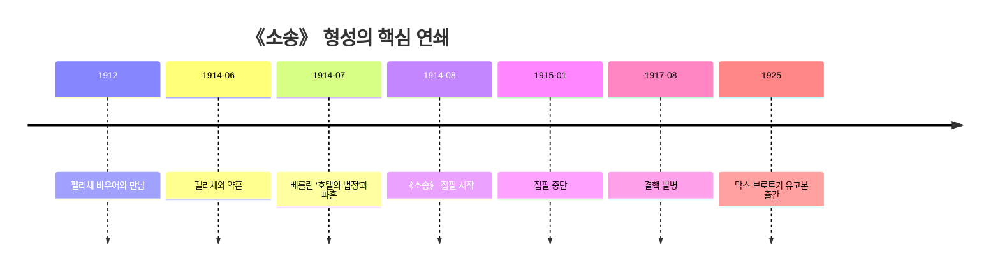

# 카프카의 《소송》을 깊게 이해하기 위한 사전 리서치 보고서

## Executive summary

- 《소송》은 1914~1915년에 쓰였으나 완결되지 못한 유고 소설이며, 1925년 막스 브로트 편집으로 처음 출간되었다. 이 작품을 이해하려면 줄거리만이 아니라, 카프카의 1914년 파혼 경험, 법학·보험 실무 경력, 프라하의 독일어·체코어·유대 문화가 교차하던 도시 환경, 그리고 합스부르크 제국 말기의 관료화와 민족 갈등을 함께 봐야 한다. 가장 생산적인 사전 이해의 초점은 “요제프 K.가 왜 기소되었는가”보다, 왜 소설이 끝까지 그 이유를 말하지 않는 형식으로 조직되었는가에 두는 편이다. citeturn35view0turn11view0turn33view0turn32view0

## 연구 체크리스트

- [ ] **원전과 판본 상태를 먼저 확인하기**
  - 독일어 원문, 초판 정보, 미완성 여부, 편집자 개입 범위를 먼저 잡아야 작품의 “정답 없는 구조”를 오해하지 않게 된다.

- [ ] **카프카의 삶에서 1912~1917 구간에 집중하기**
  - 펠리체 바우어와의 관계, 1914년 파혼, 1915년 집필 중단, 1917년 결핵 발병은 《소송》 이해의 중심 축이다.

- [ ] **프라하와 오스트리아-헝가리 제국의 맥락 읽기**
  - 소설 내부의 배경은 의도적으로 흐리지만, 창작의 실제 배후에는 제국 말기 프라하의 다언어·다민족 도시 경험과 관료제가 놓여 있다.

- [ ] **작품 세계를 줄거리보다 형식 중심으로 정리하기**
  - 주제, 상징, 시점, 비선형 구성, 장르적 혼합을 함께 봐야 《소송》의 불안이 어디서 생기는지 보인다.

- [ ] **영향 관계를 ‘단일 사조’가 아니라 ‘겹침’으로 파악하기**
  - 표현주의, 모더니즘, 유대 문화, 도시 경험, 그리고 플로베르·도스토옙스키·클라이스트 같은 개별 작가의 흔적이 한꺼번에 얽혀 있다.

- [ ] **편지·일기와 소설을 직접 교차시키기**
  - 카프카는 일기와 서한에서 이미 죄책감, 심판 감각, 결혼과 글쓰기의 충돌을 반복해서 기록했으므로, 이 자료를 소설의 사전 지도처럼 활용할 수 있다.

## 작품 기본 정보

- **제목·원제·초판 연도**: 한국어 통용 제목은 《소송》이다. 독일어 제목 표기는 자료와 판본에 따라 *Der Process*, *Der Proceß*, *Der Prozess*가 병존하는데, 카프카 공식 작품 해설은 *Der Process*를 쓰고, 디지털 초판 원전 자료는 1925년 베를린의 Verlag Die Schmiede 간행본을 *Der Prozess*로 제시한다. 따라서 본 보고서에서는 “원제(통용 병기): *Der Process / Der Prozess*”로 정리하는 것이 가장 안전하다. citeturn35view0turn28view0turn28view1

- **미완성 여부**: 이 소설은 완결본이 아니라 “posthum erschienenes Romanfragment”, 곧 사후 출간된 장편 파편이다. 카프카는 원고를 장(章) 단위로 묶어 두었지만 장 순서를 지정하지 않았고, 일부 장은 명백히 미완성이어서, 오늘의 독자는 처음부터 편집된 카프카를 읽고 있다. 이 점은 줄거리의 불완전성이 단순한 결함이 아니라 작품의 수용사 자체를 규정하는 핵심 조건임을 뜻한다. citeturn28view0turn35view0turn21search9

- **줄거리 요약**: 서른 살 은행원 요제프 K.는 어느 아침 느닷없이 체포되지만, 무슨 죄를 저질렀는지는 끝내 통보받지 못한 채 일상생활을 계속한다. 그는 법원, 심문실, 변호사, 화가, 성직자, 하급 관리들을 차례로 접촉하면서 자신의 사건을 이해하려 하지만, 절차는 그를 설명으로 이끌기보다 더 깊은 혼란으로 밀어 넣는다. 이야기의 후반부로 갈수록 그는 법과 재판의 실체를 파악하기는커녕, 자신의 태도와 사고방식마저 그 체계에 잠식당한다. 결국 그는 서른한 번째 생일 전날 밤 처형되며, 독자는 처음과 마찬가지로 끝에서도 “무슨 죄인가”를 알지 못한다. citeturn28view1turn35view0turn32view0

- **작품 세계의 핵심 주제**: 《소송》의 중심에는 죄와 무죄의 불투명성, 해명 불가능한 법, 자기소외, 현대 조직사회의 익명성, 그리고 설명을 향한 인간 욕망의 좌절이 놓여 있다. 카프카 공식 해설은 이 작품을 “자기소외, 파멸 불안, 방향 상실, 익명성, 인간의 서류화된 포착”을 다루는 소설로 요약하고, 철학 연구서는 동시에 정의·법·저항·주체성의 문제를 탐구하는 유럽 모더니즘의 대표 텍스트로 본다. 한국어 연구에서도 이 작품은 법 현실의 부조리를 통해 “세계상실”의 실존적 경험을 전달한다고 정리된다. citeturn35view0turn32view0turn14search7

- **상징·문체·구성**: 원전 첫 문장은 요제프 K.가 “중상모략”을 당했을 것이라는 가정과 “아무 나쁜 짓도 하지 않았는데 체포되었다”는 진술을 한꺼번에 제시해, 사실·소문·법적 진실의 경계를 처음부터 흔든다. 서술은 거의 끝까지 K.의 지각 범위에 갇혀 있어 독자도 인물만큼만 알게 되고, 카프카는 가까운 사물과 절차를 유난히 정확하게 묘사하면서도 전체 의미는 어둠 속에 남겨 둔다. 또한 이 작품은 비선형적으로 쓰였고, 시작과 끝 장이 먼저 작성된 것으로 확인되어, 형식 자체가 이미 “결말은 있으나 해명은 없는 소송”의 구조를 예비한다. citeturn28view1turn35view0

- **주요 상징 장면**: ‘법 앞에서’ 우화가 삽입되는 성당 장면은 《소송》 전체를 축약하는 해석의 중심축이다. 공식 해설은 이 장면을 통해 표면상 단순한 이야기조차 끝없이 해석이 분기되는 심연으로 바뀐다고 설명하고, 철학 연구서는 이를 법과 진실이 영원히 도달 불가능한 형태로 제시되는 핵심 장면으로 본다. 즉 이 소설에서 상징은 “정답을 주는 암호”라기보다, 독자를 더 깊은 해석 노동으로 끌어들이는 장치에 가깝다. citeturn35view0turn32view0turn29search3

- **해석의 관점들**:
  - **주류 관점**: 가장 널리 받아들여지는 독해는 《소송》을 현대 관료제와 익명 권력의 폭력에 대한 소설로 보는 것이다. 강점은 작품 속 절차·사무실·하급 관리·문서성의 압박을 사회사적으로 잘 설명한다는 데 있고, 한계는 요제프 K.의 내면과 죄책감의 문제를 너무 외부 체제 비판으로만 환원할 수 있다는 점이다. citeturn35view0turn32view0
  - **유력한 비주류 관점**: 또 하나의 강한 전통은 신학적·형이상학적 독해로, 이 작품을 “신이 부재한 세계의 법” 혹은 초월적 질서와의 단절을 다룬 텍스트로 읽는다. 강점은 ‘법 앞에서’와 성당 장면, 끝내 도달하지 못하는 최고 심급의 감각을 잘 포착한다는 데 있고, 한계는 구체적인 도시·직업·사회 현실의 밀도를 과소평가할 위험이 있다는 데 있다. citeturn32view0turn32view1
  - **소수이지만 설득력 있는 관점**: 공간 비평이나 도시 연구는 《소송》을 “근대 도시의 환등상” 속을 헤매는 인물의 여정으로 본다. 강점은 다락방 법원, 비좁은 방, 골목, 성당, 채석장 같은 공간이 단지 배경이 아니라 인물의 인식 붕괴를 만들어내는 장치임을 보여 준다는 점이고, 한계는 법의 철학적 차원을 상대적으로 약화시킬 수 있다는 점이다. citeturn31view2turn35view0
  - **사변적 관점**: 후대 독자들 가운데는 《소송》이 스탈린주의나 나치즘 같은 전체주의 국가를 “예언”했다고 보는 경향이 있다. 다만 카프카 공식 해설은 이런 독해가 가능한 측면은 인정하면서도, 작품의 핵심은 특정 전체주의를 미리 찍어낸 예언이라기보다 현대 대중사회 전반의 자기소외와 불안 경험에 있다고 분명히 선을 긋는다. citeturn35view0turn33view0

## 저자 소개

- **생애 핵심 사건**: 프란츠 카프카는 1883년 프라하에서 독일어를 사용하는 유대인 상인 가정의 장남으로 태어났다. 그는 프라하 독일계 김나지움과 프라하 독일대학에서 교육을 받았고, 1902년 막스 브로트를 만나 평생의 우정을 시작했다. 1906년 법학 박사학위를 받은 뒤 법원 실무를 거쳐 보험기관에 취직했고, 1912년 펠리체 바우어를 만나 본격적인 작품 창작과 사생활의 격동이 겹치는 시기로 들어섰다. citeturn10view0turn34view2

- **주요 이력과 직업**: 카프카는 1907년 Assicurazioni Generali에서 잠시 일한 뒤, 1908년부터 1922년까지 보헤미아 왕국 노동자재해보험공사에서 근무했다. 그는 법학 교육을 받은 실무 관료였고, 산업재해 보상과 행정 문서 업무를 오래 수행했으며, 만년의 의료 사유 조기 퇴직 시점에는 비서급 지위까지 올랐다. 그의 글이 관료제의 압박을 단지 상상으로만 그린 것이 아니라, 서류·기관·절차의 언어를 몸으로 익힌 시선에서 나온다는 점은 매우 중요하다. citeturn10view0turn34view1turn34view2

- **가족 배경과 정서적 구조**: 카프카는 가족 안에서 유일한 아들이라는 특권적 위치를 가졌지만, 동시에 부모와 특히 아버지의 판단을 오래도록 두려워했다. 공식 가족 해설은 그가 평생 부모와 가족 전체에게 무엇인가를 빚지고 있다는 감정에 시달렸고, 그 갈등이 그의 거의 전 작품에 걸친 “과도한 권위”와 “의존”의 문제를 형성했다고 정리한다. 《소송》을 읽을 때 법정이 단지 국가기구가 아니라 가족적·내면적 심판 장치처럼 느껴지는 이유가 바로 여기에 있다. citeturn10view1turn10view2turn23search5

- **건강과 사망**: 1917년 여름 카프카는 객혈과 함께 결핵 진단을 받았고, 이후 거의 7년 동안 요양소와 친지 집을 오가며 투병했다. 1924년에는 후두결핵이 공식 진단되어 음식을 삼키기조차 어려워졌고, 결국 1924년 6월 3일 오스트리아 키얼링 근처의 요양원에서 사망했다. 따라서 그의 말년 작품을 읽을 때 신체 붕괴, 침묵, 섭취 불능, 지연된 죽음의 감각을 단지 상징이 아니라 실제 질병 체험의 연장선으로 보는 것이 타당하다. citeturn10view0turn25search0turn25search2turn25search3

- **영향받은 사조·작가**: 카프카를 하나의 사조로 고정하기는 어렵지만, 그는 19세기 사실주의·자연주의에서 벗어나 내면 상태와 심리적 과정, 꿈과 욕망을 전면에 내세우는 중부유럽 모더니즘의 문맥 안에서 읽는 편이 적절하다. 그는 프라하의 반리얼리즘적 예술 분위기와 유대 문화, 특히 1911년 이후 접한 이디시 연극에서 강한 자극을 받았고, 동시에 플로베르·클라이스트·도스토옙스키·그릴파르처를 자신의 “혈연” 같은 작가로 언급한 것으로 전해진다. 또 다른 공식 소개는 그가 플로베르, 클라이스트, 도스토옙스키, 키르케고르, 그릴파르처, 괴테, 스트린드베리, 디킨스를 높이 평가했다고 정리한다. citeturn18view3turn17search2turn18view1turn16search5turn34view0

- **이 소설과 관련한 작가의 삶의 배경**: 《소송》은 카프카 작품 가운데 드물게 직접적인 전기적 촉발점이 비교적 뚜렷한 작품이다. 카프카 공식 해설은 1914년 7월 베를린 ‘Askanischer Hof’ 호텔에서 벌어진 파혼 장면을 소설의 직접 계기로 설명하며, 카프카 자신의 1914년 7월 23일 일기에는 “호텔의 법정”이라는 표현이 실제로 등장한다. 이어 1915년 1월 일기에는 그가 거의 《소송》을 계속할 수 없다고 적어, 이 작품이 단순한 착상에서 끝난 것이 아니라 심리적·육체적 한계와 맞물린 집필 투쟁이었음을 보여 준다. citeturn35view0turn7view0turn6view1

- **펠리체 바우어와의 관계**: 펠리체는 카프카가 1912~1917년 거의 600통에 가까운 편지와 엽서를 보낸 가장 길고 복잡한 연인이었다. 펠리체 소개와 연구 개요는 카프카가 동반자에 대한 욕구와 고독의 욕구, 결혼 욕망과 동거 혐오, 직업 유지와 글쓰기 절대성을 동시에 품고 있었으며, 이 상충이 관계를 반복적으로 파괴했다고 정리한다. 《소송》을 삶의 비유로 읽는 것은 언제나 조심해야 하지만, “설명할 수 없는 심판”과 “결혼과 글쓰기의 양립 불가능성”이 같은 시기 자료 속에서 맞물리는 것은 분명하다. citeturn24view0turn24view1

- **아래 연표는 《소송》의 형성에 직접 맞물린 카프카 삶의 연결 고리를 압축한 것이다.** 연표에 들어간 날짜와 사건은 공식 연보·일기·작품 해설에서 교차 확인했다. citeturn11view0turn35view0turn7view0turn34view2

## 시대·사회·문화적 배경

- **제국 말기의 오스트리아-헝가리**: 카프카가 《소송》을 쓰기 시작한 1914년 직전의 합스부르크 제국은 민족주의가 상시적 정치 위기를 만드는 한편, 행정은 “관료적 절대주의”로 불릴 만큼 경직되어 있었다. 동시에 제국의 다민족 구조는 근대주의 문화의 창조적 토양이기도 했고, 일부 역사가는 이 시기의 “비판적 모더니즘”을 반유대주의와 기능부전 사회에 대한 유대계 지식층의 응답으로 본다. 이런 배경은 《소송》을 단순한 개인 악몽이 아니라 급속한 근대화에 대한 회의와 불확실성의 문학으로 읽게 만든다. citeturn33view0turn32view0

- **프라하의 국가·언어·도시 상황**: 카프카의 프라하는 제국의 보헤미아 왕국 수도였고, 19세기 후반 이후 체코 민족운동이 성장하면서 독일어권과 체코어권의 공존이 점점 정치적 충돌로 바뀌던 도시였다. 1890년대 이후 거리 표지, 상점 간판, 대학, 극장, 신문이 언어정치의 일부가 되었고, 공적 생활은 점점 더 체코화되었으며, 독일계 프라하 시민—그중 다수는 유대 배경이었다—는 수세적 위치에 놓였다. 도시의 골목과 중정, 병렬적 공적 영역, 끊임없는 소속의 문제는 《소송》의 미로적 공간감과 잘 맞물린다. citeturn20view0turn20view1

- **프라하의 체코·독일·유대 문화 맥락**: 프라하는 오래된 독일어 문학의 도시이면서도, 20세기 초에는 체코·독일·유대 문화가 긴장 속에서 동시에 존재하던 장소였다. 다문화 프라하 소개 자료는 유대인이 종종 두 언어 공동체 사이의 중개자 역할을 했다고 설명하고, 유대 박물관 자료는 카프카를 “독일어를 쓰는 유대계 프라하 작가”로 규정하면서 그의 작품을 도시의 언어·역사·불안에서 분리할 수 없다고 강조한다. 따라서 카프카의 정체성은 “독일 작가”나 “체코 작가” 가운데 하나로 환원되기보다, 경계 위의 프라하 작가로 이해하는 편이 정확하다. citeturn20view1turn20view2

- **카프카 개인이 겪은 프라하 문화생활**: 카프카는 프라하 독일어권 작가들 가운데 드물게 체코 연극과 강연도 찾았고, 체코어에 대한 강한 수동적 이해를 지녔으며, 일상에서 체코인들과 직접 접촉했다. 그는 카페 아르코 같은 독일어권 카페 문화에도 속했지만, 이디시 극단 공연을 20회 이상 관람하고 배우 이츠하크 뢰비와 교류하며 유대 문화와의 관계를 새롭게 만들었다. 이 점은 《소송》의 세계가 단선적 독일 시민사회 소설이 아니라, 언어와 소속이 늘 어긋나는 도시적·유대적 경험 위에 세워졌음을 시사한다. citeturn34view0turn34view2turn18view1

- **소설 내부 배경의 시공간**: 작품 내부의 정확한 연도·국가·도시는 **미지정**이다. 그러나 연구자들은 이 소설을 “근대 도시의 환등상” 속을 이동하는 이야기로 읽으며, 중앙유럽 대도시의 표면·연극성·해독 불가능한 표상들이 인물의 불안을 키운다고 본다. 다시 말해, 《소송》의 배경은 지명 없는 도시이되, 그 도시성 자체는 매우 현대적이고 물질적이다. citeturn31view2turn32view0

- **대표 역사·사회 이슈와 소설의 연결**: 1914년 여름은 카프카 개인에게는 파혼의 충격이, 유럽 전체에는 1차 세계대전 발발이 겹친 시기였다. 공식 연보에 따르면 그는 파혼 직후이자 전쟁 발발 직후인 1914년 8월 《소송》 집필을 시작했고, 작품 해설은 이것이 전기적 촉발과 시대 불안이 겹친 두 번째 큰 창작 폭발이었다고 설명한다. 그래서 《소송》은 특정 제도 하나의 풍자가 아니라, 개인이 거대한 절차·기록·판단 체계 안에서 어떻게 자기 이해를 잃어버리는가를 전쟁 전야의 긴장 속에서 밀도 높게 형상화한 작품으로 볼 수 있다. citeturn11view0turn35view0

## 검증 및 보완

- **누락 검증**: 사용자가 요청한 작품 기본 정보, 저자 소개, 시대·사회·문화적 배경, 작품 세계, 영향받은 사조·작가, 그리고 이 소설과 관련한 작가의 삶의 배경은 모두 포함했다. 다만 소설 내부의 정확한 국가·도시는 원문이 의도적으로 밝히지 않으므로 **미지정**으로 남겨 두었고, 대신 실제 창작 맥락으로서 프라하와 합스부르크 제국의 배경을 보완했다. citeturn28view1turn31view2

- **GPT의 견해**: 《소송》을 처음 깊게 읽으려는 독자라면, 이 작품을 “부조리한 법정 소설”로만 시작하기보다, **파혼의 심판 체험 + 보험행정 실무 + 프라하의 다중문화 도시성**이 한꺼번에 응축된 텍스트로 잡는 것이 가장 이해 효율이 높다. 특히 “요제프 K.는 정말 무죄인가?”라는 질문보다 “왜 이 소설은 독자에게도 끝내 판결의 기준을 주지 않는가?”를 붙들 때 카프카의 형식이 보인다. 제 판단의 강도는 **높음**이다. citeturn35view0turn7view0turn34view1turn20view0

- **더 깊게 읽기 위한 질문**
  - 요제프 K.를 압박하는 것은 외부의 법원인가, 아니면 이미 내면화된 자기심판인가? citeturn35view0turn10view1
  - ‘법 앞에서’ 우화는 제도 비판의 이야기인가, 초월적 진리의 부재를 말하는 이야기인가, 아니면 해석 자체의 무한 지연을 보여 주는 이야기인가? citeturn35view0turn32view0turn29search3
  - 프라하의 다언어·다민족 현실을 모른 채 읽을 때와 알고 읽을 때, 《소송》의 공간감과 소외감은 얼마나 달라지는가? citeturn20view0turn20view1turn34view0

- **작성일**: [2026-05-21] #카프카 #소송 #프라하 #오스트리아헝가리 #문학해석

- **자체 점검**: 요청된 체크리스트, 세 개의 핵심 섹션, 다양한 해석 관점, GPT 의견, 심화 질문, 날짜와 해시태그, 그리고 누락 검증·보완까지 모두 포함했다.