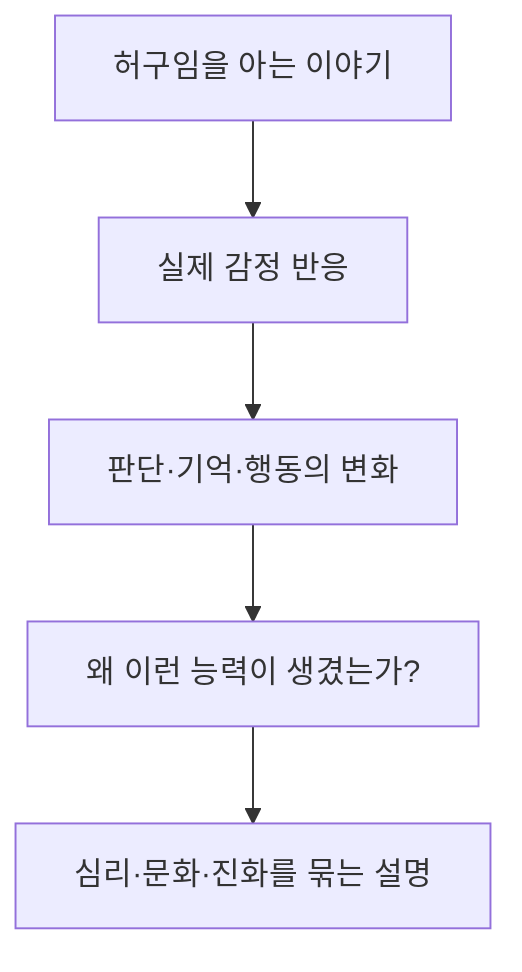

# 00_PreResearch_Core — 《스토리텔링 애니멀》

- 작업 상태: 사전 리서치 초안 v1
- 작성일: 2026-07-29
- 대상 도서: 조너선 갓셜, 노승영 옮김, 《스토리텔링 애니멀: 인간은 왜 그토록 이야기에 빠져드는가》
- 다음 단계: 사용 중인 판본의 판권면·목차를 확인한 뒤 인용구 분석 시작

---

## 0. 이번 사전 리서치의 체크리스트

- [x] 저자의 생애·연구 이력 가운데 이 책의 질문을 만든 요소를 추렸다.
- [x] 저자가 직접 밝힌 집필 계기와 더 긴 지적 경로를 분리했다.
- [x] 원서·한국어판 기본 정보와 장별 논증의 역할을 정리했다.
- [x] 진화론·사회인지·서사 설득·꿈·놀이·서사적 정체성의 근거를 따로 감사했다.
- [x] 동시대 호평, 대표 반론, 2012년 이후의 검증을 구분했다.
- [x] 인용구 분석에서 추적할 축과 초기 가설을 세웠다.
- [ ] 독자가 실제로 쓰는 한국어판의 발행일·총쪽수·장 시작 쪽수를 판권면으로 잠근다.

## 1. 표기 규칙

| 표기 | 뜻 |
|---|---|
| `[F]` | 독립된 자료로 확인 가능한 사실 |
| `[S]` | 저자·출판사·연구자가 직접 제시한 주장 |
| `[R]` | 연구 결과 또는 비평·수용사의 판단 |
| `[I]` | 여러 근거를 연결한 해석 |
| `[H]` | 독서 과정에서 검증할 초기 가설 |
| `[U]` | 판본·원문·추가 자료로 아직 잠가야 할 항목 |

확신도는 `높음 / 중간 / 낮음`으로 표시한다. 사실의 확실성과 주장의 타당성은 다르다. 예를 들어 “저자가 적응 가설을 주장했다”는 사실은 확실해도, 그 가설 자체의 타당성은 논쟁적일 수 있다.

---

## 2. 사전 결론

> 《스토리텔링 애니멀》은 인간이 이야기를 좋아한다는 관찰을 넘어, 이야기를 **사회적 문제를 가상으로 연습하고 세계에 인과적 질서를 부여하는 인간의 기본 장치**로 설명한다. 이 설명의 가장 강한 부분은 이야기의 편재성과 심리적 영향이고, 가장 약한 부분은 그 효용으로부터 곧바로 특정한 진화적 적응의 기원을 추론하는 대목이다. `[I·H / 확신도 높음]`

이 책은 “이야기는 유익하다”는 단선적 찬가로 읽기보다 다음 두 문장을 동시에 붙들 때 선명해진다.

1. 이야기는 타인의 마음·갈등·규범을 모의 실행하는 사회적 시뮬레이터다.
2. 이야기는 흩어진 사건을 원인과 의미로 묶기 때문에 공감뿐 아니라 자기기만·음모론·선동도 생산한다.

---

## 3. 기본 서지와 판본 잠금

### 3.1 원서

- `[F / 높음]` Jonathan Gottschall, *The Storytelling Animal: How Stories Make Us Human*, Houghton Mifflin Harcourt, 2012.
- `[F / 높음]` 원서 ISBN: 978-0-547-39140-3.
- `[F / 높음]` Google Books 서지에는 248쪽, 본문 9장으로 기재되어 있다.
- `[U / 중간]` 하드커버·페이퍼백·전자책 사이의 쪽수는 다를 수 있으므로 원서 쪽수는 인용 위치의 보조 좌표로만 쓴다.

### 3.2 한국어판

- `[F / 높음]` 조너선 갓셜 지음, 노승영 옮김, 민음사, 2014.
- `[F / 높음]` 한국어판 ISBN: 978-89-374-8914-3.
- `[U / 높음]` 민음사·알라딘은 종이책 발행일을 2014-04-25로, YES24는 2014-04-30로 표기한다. 같은 ISBN인데도 알라딘은 296쪽·160×230mm, YES24는 262쪽·153×224mm로 안내한다.
- `[작업 규칙]` 실제 인용 분석에서는 **사용자가 읽는 책의 판권면과 본문 쪽수**를 최종 기준으로 삼는다. 서점 메타데이터의 불일치는 교정하지 않고 판본 잠금 전까지 `[U]`로 보존한다.

### 3.3 책의 성격

- 분야: 대중 과학, 진화문학론, 서사심리학, 문학·과학 통섭 에세이.
- 핵심 질문: 존재하지 않는 인물과 사건에 왜 실제 시간·감정·자원을 쓰는가?
- 핵심 답변: 이야기 능력은 인간의 사회적 삶을 모의 실행하고 집단의 규범과 정체성을 조직하며, 현실을 인과적으로 이해하도록 돕는다.
- 방법: 개인적 일화, 문학 작품, 아동의 가장놀이, 꿈 연구, 심리 실험, 신경과학, 진화론적 추론, 역사적 사례를 하나의 설명으로 엮는다.
- 주된 위험: 서로 증거력이 다른 자료가 매끄러운 서술 안에서 같은 무게로 느껴질 수 있다.

---

## 4. 저자 연구

### 4.1 이 책에 필요한 생애·이력

- `[F / 높음]` 조너선 갓셜은 영문학을 기반으로 문학과 진화과학의 접점을 연구해 온 미국의 문학 연구자다.
- `[F / 높음]` 뉴욕주립대 빙엄턴에서 영문학 박사 과정을 밟으며 진화생물학자 데이비드 슬론 윌슨과 교류했다.
- `[I / 높음]` 이 경력은 문학 작품을 개별 해석의 대상으로만 보지 않고, 인간이라는 종이 반복해서 만드는 행동 자료로 보게 한 결정적 환경이었다.
- `[F / 높음]` 워싱턴 앤드 제퍼슨 칼리지에서 영어·문학을 가르치고 연구해 왔다. 기관·시점에 따라 표기되는 직함은 달라질 수 있으므로 본 프로젝트는 고정 직함보다 연구 궤적을 사용한다.

### 4.2 주요 작업의 흐름

| 시기 | 작업 | 이 책과의 관련성 |
|---|---|---|
| 2005 | David Sloan Wilson와 *The Literary Animal* 공동 편집 | 문학을 진화론적 인간 연구의 자료로 삼는 프로그램 |
| 2008 | *The Rape of Troy* | 서사에 반복되는 폭력·성·경쟁을 진화적 관점에서 읽음 |
| 2008 | *Literature, Science, and a New Humanities* | 인문학과 경험과학의 분리를 넘으려는 방법론적 선언 |
| 2010 | *Evolution, Literature, and Film* 공동 편집 | 매체를 넘어 반복되는 서사 현상을 비교 |
| 2012 | *Graphing Jane Austen*, *The Storytelling Animal* | 계량적 문학 연구와 대중적 통합 이론을 병행 |
| 2015 | *The Professor in the Cage* | 몸으로 검증하는 참여형 탐구로 방법을 확장 |
| 2021 | *The Story Paradox* | 이야기가 사회를 세우는 힘과 무너뜨리는 힘을 더 직접적으로 대칭화 |

### 4.3 연구자의 작업 습관

1. 흩어진 현상을 하나의 종 수준 질문으로 묶는다.
2. 문학 연구의 사례와 심리·생물학 연구를 같은 서사 안에 배치한다.
3. 개인적 체험을 질문의 입구로 삼고, 학제 간 연구를 답의 골격으로 사용한다.
4. 복잡한 논쟁을 강한 비유와 기억하기 쉬운 명제로 압축한다.
5. 이 장점은 동시에 위험이다. 압축된 명제가 실제 연구의 조건·효과 크기·반례를 가릴 수 있다.

---

## 5. 왜 이 책을 썼는가

### 5.1 저자가 직접 밝힌 계기

`[S / 높음]` 갓셜은 2012년 *Scientific American* 인터뷰에서 컨트리 음악 「Stealing Cinderella」를 듣다가, 아직 어린 딸들이 언젠가 자신을 떠날 미래를 그린 노래에 압도되어 차를 세우고 울었던 경험을 설명한다. 허구적·가정적 장면이 어떻게 실제 몸과 감정을 그렇게 강하게 움직이는지 이해하고 싶었다는 것이다.

이 사건은 책 전체의 작은 모형이다.

### 5.2 더 긴 지적 원인

`[I / 높음]`

데즈먼드 모리스의 《털 없는 원숭이》를 읽고 《일리아스》를 진화적으로 다시 본 전환  
→ 문학 전공과 과학에 대한 문제의식  
→ 데이비드 슬론 윌슨과의 지적 교류  
→ 인문학·과학의 “두 문화”를 잇는 연구 프로그램  
→ 두 딸의 자발적인 가상놀이 관찰  
→ 꿈·놀이·소설·영화·자기서사가 학과별로 흩어져 있다는 발견  
→ 이야기 전체를 하나의 인간 현상으로 설명하려는 욕구  
→ 개인적으로 경험한 서사의 압도적 정서 효과  
→ 《스토리텔링 애니멀》의 대중적 통합 이론

### 5.3 한 문장 집필 가설

> 갓셜은 허구임을 아는 이야기조차 사람의 감정·판단·행동을 장악하는 이유를, 문학·심리학·진화생물학·신경과학으로 흩어진 연구를 하나의 “이야기 과학”으로 묶어 설명하려고 이 책을 썼다. `[I / 확신도 높음]`

---

## 6. 지적 계보

직접 영향, 책 속 대화 상대, 형성 환경, 사후의 비교 대상은 섞지 않는다.

### 6.1 직접 영향

| 인물·흐름 | 관계 | 읽을 때 추적할 것 |
|---|---|---|
| 데즈먼드 모리스 | 저자가 진화적 문학 연구의 직접 전환점으로 회고 | 인간 행동을 다른 동물과 연속선에서 보는 시선 |
| 데이비드 슬론 윌슨 | 지도·협업 관계가 확인되는 직접 영향 | 적응, 집단, 협력, 다수준적 사회성 |
| E. O. 윌슨의 통섭 | 과학과 인문학을 연결하는 명시적 상위 틀 | 설명의 통일성과 영역 고유성 사이의 긴장 |
| 진화문학론·문학적 다윈주의 | 저자의 장기 연구 프로그램 | 문화적 다양성 속 종 공통 패턴을 찾는 방법 |
| 경험적·계량적 인문학 | 저자의 명시적 방법론 | 인상비평을 넘어 자료화하려는 욕구와 환원 위험 |

### 6.2 책이 명시적으로 씨름하는 이론적 대화 상대

| 논점 | 대표 대화 상대 | 핵심 쟁점 |
|---|---|---|
| 허구의 기능 | Keith Oatley의 사회적 시뮬레이션 | 허구가 사회 경험의 모형인가 |
| 꿈의 기능 | Antti Revonsuo의 위협 시뮬레이션 | 꿈이 적응적 리허설인가, 부산물인가 |
| 서사의 설득 | Green & Brock의 몰입·운송 이론 | 이야기 속으로 들어갈수록 신념이 움직이는가 |
| 이야기의 기원 | 적응론 대 Steven Pinker식 부산물 설명 | 현재의 효용이 진화적 기원을 증명하는가 |
| 마음읽기 | 마음이론·공감 연구 | 허구 읽기와 사회인지 사이에 인과가 있는가 |

### 6.3 형성 환경

- 1990년대 이후 진화심리학과 인지과학이 문화 현상으로 확장되던 흐름.
- 문학 연구 안에서 과학적 일반화에 대한 기대와 반감이 함께 커지던 시기.
- 기능성 뇌영상과 거울뉴런이 대중 담론에서 강한 설명력을 부여받던 시기.
- 서사심리학이 기억·자아·정체성을 이야기의 구성으로 설명하던 흐름.
- 게임, 인터넷, 초기 가상현실 담론이 “이야기의 종말인가 변형인가”를 묻던 매체 환경.

### 6.4 비교 가능하지만 직접 영향으로 단정하면 안 되는 흐름

- Dan McAdams의 서사적 정체성 연구는 8장의 논점을 정교화하는 비교 틀이다.
- Galen Strawson의 반서사성 논변은 “건강한 자아는 이야기여야 한다”는 보편화를 견제한다.
- 문화진화론·인지적 유인 이론은 이야기가 반복되는 이유를 특정한 적응 없이도 설명할 수 있다.
- 2021년 《스토리 패러독스》는 2012년 책의 철회가 아니라, 이야기의 파괴적 힘에 더 큰 비중을 준 후속 재배치로 읽는 편이 안전하다.

---

## 7. 시대 배경을 세 층으로 분리하기

### 7.1 출간 당시의 직접 배경: 2000년대 후반–2012년

- `[F·I / 높음]` 뇌과학의 대중적 권위가 높았고, 거울뉴런이 모방·공감·문화까지 설명하는 열쇠처럼 널리 소개되었다.
- `[F·I / 높음]` 소설 읽기와 공감·마음이론의 연관을 보여 주는 초기 상관 연구가 주목받았지만, 인과와 효과 크기는 아직 충분히 검증되지 않았다.
- `[F / 높음]` “transportation” 연구는 서사 몰입이 믿음과 태도에 영향을 줄 수 있음을 실험적으로 탐구하고 있었다.
- `[I / 높음]` 갓셜의 통합은 이 연구들을 대중에게 연결한 선구적 작업이지만, 초기 연구의 낙관을 함께 물려받았다.

### 7.2 책이 상정하는 장기 배경

- 인간의 큰 집단생활, 협력과 경쟁, 타인의 의도 추론.
- 언어 이전·이후의 가장놀이, 구전 전승, 꿈, 신화, 종교, 소문.
- 집단 규범을 공유하고 위반자를 식별해야 하는 사회적 압력.

이 층은 직접 관찰 가능한 출간 배경이 아니라 진화적 재구성이다. 따라서 “그럴듯한 기능”과 “그 기능 때문에 선택되었다”를 분리해야 한다.

### 7.3 2026년의 적용 맥락

- 생성형 AI가 이야기 생산 비용을 급감시킨 현상.
- 추천 알고리즘과 숏폼 플랫폼이 몰입·분노·정체성 서사를 최적화하는 현상.
- 게임·가상현실·인터랙티브 픽션이 독자를 참여자로 바꾸는 현상.
- 정치적 양극화와 음모론이 사실 목록보다 인과적 악당·피해자·구원자 구도로 확산되는 현상.

`[주의]` 이것들은 2012년 책의 직접 배경이 아니라 현재적 응용이다. 본문의 예측이 실제로 적중했는지는 별도의 사후 검증 항목으로 다룬다.

---

## 8. 장별 논증 지도

| 장 | 한국어판 제목 | 논증의 역할 | 핵심 검증 질문 |
|---|---|---|---|
| 1 | 이야기의 마법 | 이야기의 편재성과 정서적 지배력을 문제로 세움 | “이야기”의 범위가 너무 넓어지지 않는가 |
| 2 | 픽션의 수수께끼 | 비용이 큰 허구 소비가 왜 지속되는지 묻고 기능 가설을 연다 | 쾌락·부산물 설명과 적응 설명을 어떻게 가르는가 |
| 3 | 지옥은 이야기 친화적이다 | 이야기가 문제·갈등·위기에 집중하는 공통 문법을 제시 | 장르·문화의 반례를 감당하는가 |
| 4 | 밤의 이야기 | 꿈을 자동적으로 생성되는 서사와 위협 리허설로 검토 | 꿈의 서사성과 적응 기능이 각각 입증되는가 |
| 5 | 마음은 이야기꾼 | 마음이 원인·의도·질서를 만들어 내며 때로 거짓 설명도 낳음을 보임 | 인과 추론과 과잉 서사화의 경계는 어디인가 |
| 6 | 이야기의 도덕 | 이야기가 규범을 가르치고 집단을 결속한다고 주장 | 집단 내 협력과 보편적 도덕을 혼동하지 않는가 |
| 7 | 먹사람이 세상을 바꾼다 | 허구의 인물과 서사 몰입이 믿음·행동·역사에 미치는 힘을 논함 | 사례가 인과 증거인가, 설득 효과는 얼마나 지속되는가 |
| 8 | 삶 이야기 | 기억과 자아가 편집된 인생 이야기로 구성된다고 논함 | 서사적 자아는 보편적인가, 일관성은 진실과 같은가 |
| 9 | 이야기의 미래 | 매체가 바뀌어도 이야기는 사라지지 않고 더 몰입적으로 변한다고 전망 | 2012년 예측과 현재 관찰을 분리할 수 있는가 |

원서의 장 제목은 차례대로 “The Witchery of Story”, “The Riddle of Fiction”, “Hell Is Story-Friendly”, “Night Story”, “The Mind Is a Storyteller”, “The Moral of the Story”, “Ink People Change the World”, “Life Stories”, “The Future of Story”다.

---

## 9. 핵심 주장과 증거 감사

| 주장 | 2012년 책이 동원하는 주된 근거 | 2012년 이후의 안전한 판단 | 독서 규칙 |
|---|---|---|---|
| 인간 생활은 이야기로 포화되어 있다 | 꿈·놀이·소설·영화·대화·자기서사의 사례 | 넓은 기술 명제로는 강함 | “이야기”의 정의와 제외 사례를 요구 |
| 허구는 사회생활의 시뮬레이터다 | Oatley의 이론, 사회인지 연구, 갈등 중심 서사 | 유용한 기능 모형이나 진화적 기원과 실제 전이는 별개 | 모형·기능·기원을 세 칸으로 분리 |
| 소설은 공감·마음읽기를 향상한다 | 독서량과 사회인지의 상관, 초기 실험 | 메타분석상 평균 효과는 작고, 장기 현실 전이는 불명확 | 상관/인과, 단기/장기, 특정 텍스트/모든 소설 구분 |
| 이야기는 믿음과 행동을 바꾼다 | 몰입 실험, 역사·문화 사례 | 서사 일치 방향의 작은 평균 효과는 비교적 지지됨 | 효과 크기·지속성·반대 증거 확인 |
| 가장놀이는 발달 훈련이다 | 보편성, 이른 출현, 역할 연습의 외관 | 인과적 발달 이익은 혼재하며 부산물 가능성도 있음 | “함께 나타남”을 “원인”으로 읽지 않기 |
| 꿈은 위협 대처 리허설이다 | 위협 시뮬레이션 가설, 꿈 내용 | 적응 가설은 여전히 논쟁적이며 마음방황 부산물 설명도 강함 | 꿈의 내용과 꿈의 진화적 기능을 분리 |
| 거울뉴런이 허구 감정을 설명한다 | 행동 관찰과 모방의 신경 기제에서 확장 | 인간 공감·서사 이해를 단일 기제로 설명하기엔 과도함 | 뇌 활성은 기능·인과·적응의 증명이 아님 |
| 이야기는 도덕과 집단 결속을 만든다 | 반복되는 규범적 플롯, 종교·국가 서사 | 집단 내 협력과 외집단 배제가 함께 가능 | “친사회적”의 수혜 범위를 묻기 |
| 자아는 삶 이야기다 | 재구성 기억, 자전적 편집, 서사적 정체성 | 중요한 모형이나 개인·문화차가 크고 비서사적 자아도 가능 | 유용한 자기서사와 정확한 기억을 구분 |
| 이야기 능력은 자연선택된 적응이다 | 비용·보편성·기능의 결합에서 진화 기원 추론 | 적응·외적응·부산물 가설 사이의 결론은 열려 있음 | 현재 효용에서 과거 선택 원인을 곧장 추론하지 않기 |

### 9.1 현재 증거로 가장 잘 버티는 층

1. 인간이 다양한 매체와 상황에서 서사를 반복적으로 생성·소비한다.
2. 서사 몰입이 적어도 단기적으로 믿음·태도에 영향을 줄 수 있다.
3. 자전적 기억은 녹화물이 아니라 현재의 필요에 따라 재구성된다.
4. 이야기는 공감과 결속뿐 아니라 편향·기만·배제에도 쓰인다.

### 9.2 가장 조심해서 읽어야 하는 층

1. 이야기 능력 전체가 하나의 특정 적응으로 진화했다는 단일 기원 설명.
2. 꿈이 실제 위험 대처 능력을 높이기 위해 선택되었다는 주장.
3. 거울뉴런을 허구적 공감의 충분한 신경 기제로 제시하는 설명.
4. 어떤 소설이든 읽으면 사람이 더 공감적·도덕적으로 된다는 일반화.

### 9.3 저자의 실제 유보

`[S / 높음]` 갓셜은 출간 당시 인터뷰에서 이야기의 기능이 충분히 실험되지 않았고 여러 선택압과 여러 기능이 함께 작용했을 수 있으며, 이야기 능력이 전적으로 또는 부분적으로 진화의 부산물일 가능성도 인정했다. 그는 사회적 시뮬레이션 가설을 가장 매력적으로 보지만 확정된 단일 해답으로 제시하지는 않았다.

따라서 다음 두 문장을 분리한다.

- 출판 홍보 문구: “스토리텔링은 생존의 기술이다.”
- 본문·인터뷰의 더 좁은 태도: 사회적 시뮬레이션은 유력한 경쟁 가설이지만 적응·부산물·전용의 혼합 가능성이 열려 있다.

이 구분은 저자를 과장된 적응론자로 만드는 오독과, 반대로 책의 진화 질문을 무의미하게 축소하는 오독을 함께 막는다.

---

## 10. 수용과 반론

### 10.1 주류적 긍정

- `[R / 높음]` 출간 당시 다수의 대중 서평은 문학·심리·진화를 읽기 쉬운 하나의 질문으로 묶은 점을 높이 평가했다.
- `[F / 높음]` 이 책은 *New York Times* 편집자 추천 도서로 소개되었고, *Los Angeles Times* 도서상 과학·기술 부문 최종 후보에 올랐다.
- `[I / 높음]` 가장 오래 남은 공헌은 모든 세부 가설의 정답보다, 꿈·놀이·소설·자기기만·정체성을 “이야기를 만드는 동물”이라는 하나의 비교 공간에 놓은 데 있다.

### 10.2 대안적·소수 관점

- **부산물 관점:** 허구는 이야기 전용 적응이 아니라 언어, 마음읽기, 인과 추론, 놀이, 호기심 같은 기존 장치들을 문화가 결합한 부산물일 수 있다.
- **문화진화 관점:** 잘 기억되고 전파되는 서사 형식이 누적 선택되었을 뿐, 인간에게 “서사 기관”이 따로 선택되었다고 가정할 필요가 없을 수 있다.
- **반서사적 자아 관점:** 모든 사람이 자신을 연속적인 이야기로 경험하지 않으며, 서사적 일관성을 강요하는 것이 오히려 삶을 왜곡할 수 있다.
- **문학 형식 관점:** 인물·갈등·해결의 보편 패턴만 강조하면 문체, 시점, 장르 관습, 역사적 독서 공동체처럼 작품을 문학으로 만드는 차이를 잃는다.

### 10.3 대표적인 비판

1. **정의의 팽창:** 꿈, 소설, 소문, 기억, 종교, 국가, 광고를 모두 이야기로 묶으면 거의 모든 정신 활동이 이야기가 되어 반증이 어려워진다.
2. **기능에서 기원으로의 도약:** 어떤 능력이 지금 유익하고 널리 보인다는 사실만으로 그 이익 때문에 자연선택되었다고 결론 내릴 수 없다.
3. **증거 위계의 혼합:** 개인 일화, 역사적 사례, 상관 연구, 실험, 뇌영상, 진화 추론이 매끄러운 문장 속에서 같은 증거처럼 읽힌다.
4. **친사회성의 과장:** 타인의 마음을 잘 읽는 능력은 돌봄에도 조작에도 쓰인다. 집단 결속은 외집단 적대와 양립한다.
5. **초기 신경과학의 과신:** 거울뉴런 활성에서 복합적 공감과 문학 반응 전체로 넘어가는 설명은 현재 기준으로 지나치게 크다.
6. **형식과 역사성의 손실:** “인간 보편”을 찾는 동안 특정 작품의 형식, 독자, 매체, 권력 관계가 지워질 수 있다.

### 10.4 가장 강한 비판 한 문장

> 책은 이야기의 현재적 효과를 설득력 있게 보여 주지만, 그 효과가 왜 생겼는지를 설명할 때에는 **효용 → 보편성 → 적응**을 너무 빠르게 연결한다. `[I / 확신도 높음]`

이 비판은 책 전체를 무효화하지 않는다. 오히려 세 층으로 다시 읽게 한다.

- 기술: 이야기가 어디에 얼마나 나타나는가?
- 기능: 이야기가 지금 무엇을 하는가?
- 기원: 그 기능 때문에 이야기 능력이 선택되었는가?

기술과 기능이 강하게 지지되어도 기원은 열려 있을 수 있다.

### 10.5 저자의 후속 자기수정

- `[S·F / 높음]` 2013년 갓셜은 “문학다윈주의” 하나를 문학 연구의 독점적 패러다임처럼 내세운 초기의 대결적 태도를 비판하고, 더 복수적인 “통섭”으로 방법론을 넓혔다.
- `[S·F / 높음]` 2016년에는 테라노스 사례를 통해 증거보다 강한 이야기가 기업 사기를 보호할 수 있음을 경고했다.
- `[S·F / 높음]` 2021년 《The Story Paradox》와 관련 인터뷰에서는 전작이 이야기의 긍정적 힘을 과도하게 부각해 독자에게 충분한 경계심을 주지 못했을 수 있다는 불편함을 밝혔다.
- `[I / 높음]` 이는 2012년 책을 폐기한 것이 아니다. 전작에도 있던 음모론·광고·국가 신화·자기기만의 위험을 주변부에서 중심부로 옮긴 **윤리적 재가중**이다.

강독에서는 후속작을 정답지로 소급하지 않는다. 다만 저자가 이후 무엇을 더 무겁게 보게 되었는지는 6–9장의 잠재적 한계를 찾는 사후 증거로 기록한다.

---

## 11. 대표적 오독 방지

| 오독 | 교정 질문 |
|---|---|
| “이야기는 사람을 선하게 만든다.” | 누구에 대한 공감이며, 어떤 행동으로 얼마나 오래 이어지는가? |
| “보편적이면 곧 진화적 적응이다.” | 부산물·외적응·문화적 수렴으로도 설명 가능한가? |
| “사회적 시뮬레이션은 실제 훈련과 같다.” | 모의 경험이 현실 기술로 전이되었다는 직접 증거가 있는가? |
| “서사가 일관되면 진실하다.” | 인과적 매끄러움과 사실적 정확성을 분리했는가? |
| “뇌의 특정 영역이 켜졌으니 메커니즘이 입증되었다.” | 활성, 필요조건, 충분조건, 인과가 구별되는가? |
| “자아는 오직 이야기다.” | 비서사적으로 자신을 경험하는 사람과 순간적 자아를 설명하는가? |
| “후속작은 저자가 2012년의 낙관을 철회한 증거다.” | 철회, 보완, 강조점 이동 가운데 무엇인지 직접 자료로 확인했는가? |

---

## 12. 초기 독해 지도

### 축 A1. 범위와 정의 — 무엇까지 “이야기”인가

- 픽션, 서사, 꿈, 기억, 소문, 역사, 자아 이야기를 같은 범주로 묶는 기준.
- 사건의 시간적 배열, 인과, 행위자, 갈등, 종결 가운데 최소 조건이 무엇인지 추적한다.
- 정의가 넓어질수록 설명 범위는 커지지만 반증 가능성은 낮아진다.

### 축 A2. 기능과 진화 — 무엇을 하며, 왜 생겼는가

- 현재의 이익과 진화적 기원을 반드시 분리한다.
- 적응, 외적응, 부산물, 문화적 발명의 경쟁 설명을 함께 둔다.
- “비용이 든다”, “보편적이다”, “유익하다”가 각각 어떤 증거인지 묻는다.

### 축 A3. 영향과 권력 — 누구를 움직이며, 누구를 배제하는가

- 몰입 → 감정 → 믿음 → 행동으로 이어지는 각 연결고리의 증거를 따진다.
- 공감, 도덕화, 집단 결속, 선동, 광고, 음모론을 같은 메커니즘의 다른 결과로 읽는다.
- 이야기의 효과를 선악이 아니라 행위자·청중·제도·매체의 관계에서 판단한다.

### 축 A4. 일관성과 진실 — 의미를 만드는 힘은 어떻게 거짓도 만드는가

- 기억의 편집, 인과의 과잉 부여, 자기합리화, 음모론, 서사적 정체성을 함께 추적한다.
- 심리적 생존에 도움이 되는 설명과 사실적으로 정확한 설명이 갈라지는 지점을 본다.
- 이 축이 5장과 8장을 책 전체의 중심으로 연결할 가능성이 높다.

---

## 13. 초기 가설

| ID | 가설 | 현재 상태 | 반증·수정 조건 |
|---|---|---|---|
| H1 | 이야기의 편재성이라는 기술 명제는 강하지만, 단일 적응이라는 기원 명제는 훨씬 약하다. | 초기 / 중간-높음 | 책이 경쟁 기원 가설을 충분히 비교하고 독립적 예측을 제시하는 경우 |
| H2 | “사회적 시뮬레이터”는 유용한 기능 모형이지만 현실 기술 전이와 진화적 적응을 자동으로 증명하지 않는다. | 초기 / 높음 | 장기적·현실적 전이를 보이는 강한 인과 자료가 제시되는 경우 |
| H3 | 이야기의 도덕성과 집단 결속은 본질적으로 양면적이다. 내집단 협력은 외집단 배제와 함께 커질 수 있다. | 초기 / 높음 | 책이 수혜 범위와 권력 비대칭을 체계적으로 통제하는 경우 |
| H4 | 책의 가장 깊은 통합축은 “시뮬레이션”보다 “일관성-진실의 교환”이다. 같은 장치가 의미와 거짓을 함께 만든다. | 초기 / 중간 | 5·8장이 주변적이고 다른 장들과 인과적으로 연결되지 않는 경우 |
| H5 | 서사적 자아는 강력한 인간 모형이지만 보편적이거나 항상 건강하다는 명제로 확장할 수 없다. | 초기 / 높음 | 다양한 문화·개인의 비서사적 자아를 포괄하는 근거가 있는 경우 |
| H6 | 이 책의 풍부한 일화와 서사적 문체는 주장 자체를 수행해 보이는 장점이자, 증거의 무게를 부풀리는 위험이다. | 초기 / 높음 | 핵심 장마다 증거 위계와 한계를 명료하게 표기하는 경우 |
| H7 | 9장의 핵심 예측은 이야기의 소멸이 아니라 매체 이동과 몰입 강화이며, 2026년의 AI·게임 환경은 그 예측의 별도 사후 시험장이 된다. | 초기 / 중간 | 본문의 실제 예측이 더 제한적이거나 반대 방향인 경우 |

---

## 14. 인용구 분석에서 먼저 물을 질문

1. 이 문장은 관찰, 정의, 기능 설명, 인과 주장, 진화적 기원, 가치 판단 중 무엇인가?
2. 저자가 말하는 “이야기”는 이 대목에서 정확히 어떤 현상이며 무엇을 제외하는가?
3. 사례는 개념을 보여 주는 예시인가, 주장을 입증하는 증거인가?
4. 현재의 효용에서 과거의 자연선택으로 건너뛰는 문장이 있는가?
5. 상관, 짧은 실험 효과, 장기 행동 변화를 구분하는가?
6. 공감·결속의 수혜자는 누구이며 그 바깥의 사람은 어떻게 처리되는가?
7. 마음이 만든 일관성은 실제 사실과 어디에서 갈라지는가?
8. 저자의 매끄러운 이야기 방식이 독자의 근거 판단을 어떻게 바꾸는가?

---

## 15. 저자 연구 → 본문 분석 인계 카드

### 꼭 유지할 핵심

- 집필 동기: 허구가 실제 감정과 행동을 움직이는 힘을 설명하려는 욕구.
- 장기 프로젝트: 문학과 진화과학, 해석과 경험 연구의 “두 문화”를 잇기.
- 저자의 강점: 흩어진 연구를 기억 가능한 큰 질문으로 묶는 통합력.
- 저자의 위험: 정의 확대, 증거 위계 혼합, 적응 추론의 과속.

### 본문에서 추적할 네 축

1. 이야기의 범위와 최소 정의.
2. 현재 기능과 진화적 기원의 분리.
3. 공감·도덕·결속과 조작·배제의 동시성.
4. 심리적 일관성과 사실적 진실의 긴장.

### 장별 경계표

- 1–3장: 현상 제시 → 수수께끼 → 보편 문법.
- 4–5장: 꿈과 인과 구성이라는 자동적 이야기 생산.
- 6–7장: 도덕·집단·설득이라는 사회적 효과.
- 8장: 이야기 장치를 자아와 기억에 되돌려 적용.
- 9장: 매체 변화 속 지속성과 위험을 전망.

### 인용구 분석의 정지 신호

- “보편적”에서 곧바로 “적응”으로 넘어갈 때.
- 뇌 활성에서 복잡한 공감·도덕을 단일 인과로 설명할 때.
- 역사적 사례 하나가 일반적 효과의 증거처럼 쓰일 때.
- “친사회적”의 범위가 내집단인지 인류 전체인지 불명확할 때.
- 서사적 일관성이 정확성·건강·도덕성과 합쳐질 때.

### 판본 인계

- 사용 번역본의 판권면을 받기 전에는 발행일·총쪽수·장 시작 쪽수를 잠그지 않는다.
- 사용자가 제공한 인용문을 그대로 보존하고, 영문 대응어는 의미 판정에 필요한 경우에만 원서와 대조한다.
- 서점 소개문이나 검색 스니펫을 본문 인용으로 사용하지 않는다.

---

## 16. 나의 사전 판단

**판단 강도: 강함.**

이 책은 세부 과학 가설의 최종 판정문이라기보다, 왜 꿈·놀이·픽션·정체성·음모론을 하나의 연구 대상으로 볼 수 있는지 보여 주는 탁월한 “문제 설정의 책”이다. 강독의 성공 여부는 갓셜의 매력적인 통합을 받아들이거나 반박하는 데 있지 않다. 그 통합을 **기술–기능–기원**, **몰입–믿음–행동**, **결속–배제**, **일관성–진실**로 다시 분해해 어디까지 증거가 버티는지 확인하는 데 있다.

내가 현재 가장 중요하게 보는 가설은 H4다. 책의 표면적 구호는 “이야기는 사회적 비행 시뮬레이터”이지만, 더 오래 남는 통찰은 인간이 사실만으로 살지 않고 원인·의도·주인공·결말을 요구한다는 점이다. 바로 그 능력이 의미와 공동체를 만들고, 동시에 자기기만과 선동을 가능하게 한다. 다만 이 판단은 5장과 8장의 실제 인용구가 다른 장들과 어떻게 연결되는지 본 뒤 수정해야 한다.

---

## 17. 출처

### 17.1 책·저자·판본

- [Jonathan Gottschall 공식 책 소개 — *The Storytelling Animal*](https://www.jonathangottschall.com/storytelling-animal)
- [Jonathan Gottschall 공식 홈페이지](https://www.jonathangottschall.com/)
- [Google Books 서지 — *The Storytelling Animal*](https://books.google.com/books/about/The_Storytelling_Animal.html?id=Gd3lT5yP3ZQC)
- [민음사 도서 페이지](https://minumsa.minumsa.com/book/6387/)
- [알라딘 한국어판 서지](https://www.aladin.co.kr/shop/wproduct.aspx?ItemId=40368297)
- [YES24 한국어판 서지·목차](https://www.yes24.com/product/goods/12988229)
- [Scientific American, 저자 인터뷰](https://www.scientificamerican.com/blog/literally-psyched/the-storytelling-animal-a-conversation-with-jonathan-gottschall/)
- [Books and Ideas, 저자 인터뷰 전문](https://static1.squarespace.com/static/54babed6e4b0b0eaa1091650/54dbcfbfe4b0bd2b206cf910/54dbcfc2e4b0bd2b206cfbef/1345909771157/48-booksandideas-Gottschall.pdf)
- [The Chronicle of Higher Education, 저자의 학문적 전환과 자기평가](https://www.chronicle.com/article/survival-of-the-fittest-in-the-english-department/)
- [Northwestern University Press, *The Literary Animal*](https://nupress.northwestern.edu/9780810122871/the-literary-animal/)
- [Jonathan Gottschall, “Toward Consilience, Not Literary Darwinism”](https://doi.org/10.1075/ssol.3.1.04got)
- [Washington & Jefferson College, 저자와 후속작 소개](https://www.washjeff.edu/jonathan-gottschall-distinguished-fellow-at-wj-releases-his-eighth-book/)
- [Basic Books, *The Story Paradox*](https://www.basicbooks.com/titles/jonathan-gottschall/the-story-paradox/9781541645967/)
- [Harvard Business Review, “Theranos and the Dark Side of Storytelling”](https://hbr.org/2016/10/theranos-and-the-dark-side-of-storytelling)
- [Harvard Business Review, “The Positives and Perils of Storytelling”](https://hbr.org/podcast/2022/02/the-positives-and-perils-of-storytelling)

### 17.2 선행 연구와 사후 검증

- [Keith Oatley, “Why Fiction May Be Twice as True as Fact”](https://doi.org/10.1037/1089-2680.3.2.101)
- [Raymond Mar & Keith Oatley, “The Function of Fiction…”](https://doi.org/10.1111/j.1745-6924.2008.00073.x)
- [Mar et al., “Bookworms versus Nerds”](https://doi.org/10.1016/j.jrp.2005.08.002)
- [Green & Brock, 서사적 transportation 연구](https://pubmed.ncbi.nlm.nih.gov/11079236/)
- [Dodell-Feder & Tamir, 허구 읽기와 사회인지 메타분석](https://pubmed.ncbi.nlm.nih.gov/29481102/)
- [Braddock & Dillard, 서사 설득 메타분석](https://doi.org/10.1080/03637751.2015.1128555)
- [Lillard et al., 가장놀이의 발달 이익 검토](https://pubmed.ncbi.nlm.nih.gov/22905949/)
- [Revonsuo & Valli, 꿈의 위협 시뮬레이션 가설](https://pubmed.ncbi.nlm.nih.gov/15766897/)
- [G. William Domhoff, 꿈의 적응 가설 비판](https://dreams.ucsc.edu/Library/domhoff_2018.html)
- [Cecilia Heyes & Catmur, “What Happened to Mirror Neurons?”](https://pmc.ncbi.nlm.nih.gov/articles/PMC8785302/)
- [McAdams & McLean, 서사적 정체성 개관](https://doi.org/10.1177/0963721413475622)
- [Galen Strawson, “Against Narrativity”](https://doi.org/10.1111/j.1467-9329.2004.00264.x)
- [Dubourg et al., 허구의 진화적 부산물 설명](https://pmc.ncbi.nlm.nih.gov/articles/PMC8921504/)
- [Brian Boyd, 문학·예술의 적응 기능 논변](https://pmc.ncbi.nlm.nih.gov/articles/PMC5763351/)

### 17.3 수용과 비판

- [Publishers Weekly 동시대 서평](https://www.publishersweekly.com/9780547391403)
- [Marisa Bortolussi, 학술 서평](https://doi.org/10.1075/ssol.2.2.07bor)
- [Jonathan Kramnick, “Against Literary Darwinism”](https://english.rutgers.edu/images/documents/faculty/against_literary_darwinism.pdf)
- [Jack Zipes, 서평 서지](https://digitalcommons.wayne.edu/storytelling/vol10/iss1/11/)
- [Los Angeles Times Book Prizes 역사](https://www.latimes.com/events/festival-of-books/book-prizes/history)

---

## 18. 검증 기록과 남은 불확실성

- 자료 확인일: 2026-07-29.
- 저자의 직접 동기는 저자 인터뷰로 확인했다.
- 원서 서지와 9장 구성은 출판·서지 자료로 교차 확인했다.
- 한국어판 발행일의 메타데이터 불일치는 해소하지 않고 `[U]`로 보존했다.
- 과학적 판정은 책 출간 이전 자료와 2012년 이후의 사후 검증을 구분했다.
- 2012년 이후 연구는 “저자가 당시에 알았어야 할 자료”가 아니라 현재 강독자가 주장을 평가하는 보정 자료다.
- 아직 확보하지 않은 것: 사용 판본 판권면, 실제 본문 인용구, 장별 주석·참고문헌의 정확한 연결.
- 따라서 현재 문서는 해석의 결론이 아니라 검증 가능한 출발 지도다.
