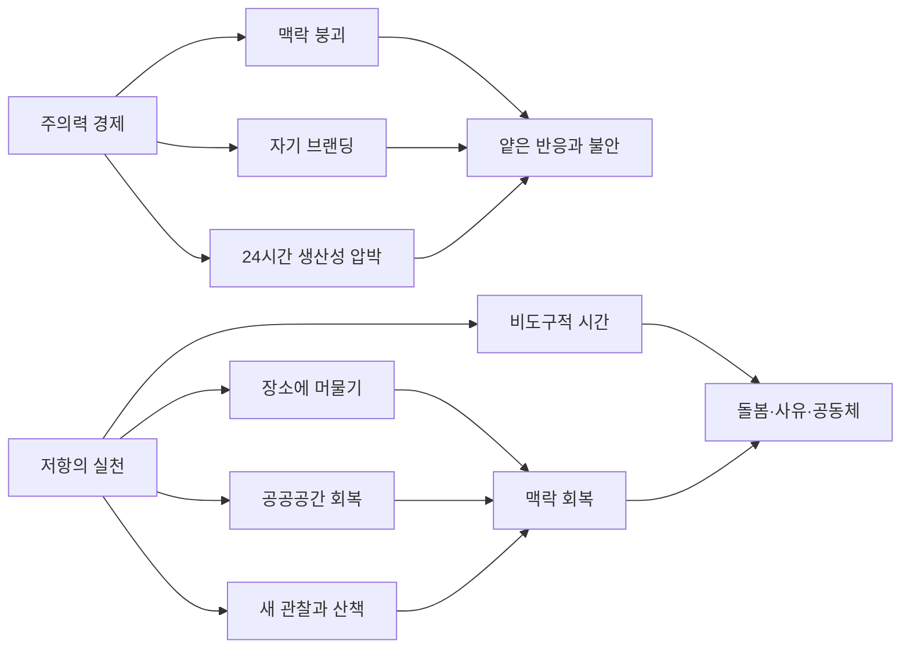

# 제니 오델의 《아무것도 하지 않는 법》 깊이 읽기 리서치

## 개념적 체크리스트

- 저자 제니 오델의 생애와 경력을 공식·준공식 자료로 먼저 확정한다.
- 책의 핵심 주장과 반복되는 이미지가 무엇인지 개념 지도를 만든다.
- 책과 연결된 예술 프로젝트·강연·개인적 경험이 어떻게 본문으로 확장됐는지 본다.
- 오델이 기대고 있는 사상가와 예술가를 실제 인용과 연결 근거로 검증한다.
- 2019년 전후 미국과 글로벌 사회의 플랫폼 경제·SNS·생태위기·생산성 문화를 책과 포개어 읽는다.
- 이 책에 대한 찬사와 비판을 함께 검토해, 실제 독서에서 무엇을 붙잡아야 하는지 정리한다.

## 핵심 요약

제니 오델의 《아무것도 하지 않는 법》은 제목과 달리 “게으름의 찬가”가 아니라, 관심(attention)이 상품이 되어버린 디지털 자본주의에서 자기 주의력을 회수하는 방법을 묻는 정치적·문화비평 에세이다. 출판사 소개와 주요 인터뷰에서 오델은 이 책을 단순한 디지털 디톡스가 아니라, 효율·성과·자기브랜딩의 압력으로부터 한 발 물러서서 다른 형태의 지각, 공동체, 공공성, 생태 감각을 회복하려는 시도로 제시한다. citeturn3view1turn17view1turn17view0

이 책을 깊게 읽으려면 “주의력 경제”라는 추상어만 따라가면 부족하다. 오히려 오클랜드의 장미정원, 새 관찰, 공공공간, 쓰레기 더미, 구글 위성사진, 산책 같은 구체적 장면들이 어떻게 오델의 예술 실천과 연결되는지 살펴봐야 책의 실제 규모가 보인다. 그녀의 관심사는 기술 일반의 폐해가 아니라, 세계를 맥락 없이 소비하게 만드는 시선의 구조 그 자체에 가깝다. citeturn3view0turn19view0turn20view0

## 작품 기본 정보

- **작품명**: 《How to Do Nothing: Resisting the Attention Economy》. 한국어판은 《아무것도 하지 않는 법》으로 소개된다. 이 책은 **소설이 아니라 에세이·문화비평·사회철학적 논픽션**에 가깝다. 출판사는 Melville House이며 2019년에 출간되었다. citeturn3view1

- **핵심 문제의식**: 출판사 설명에 따르면 오델은 “주의력 경제에서 이탈하는 실천”을 통해 삶을 되찾을 수 있다고 주장한다. 여기서 핵심은 기술 기기 자체를 악마화하는 것이 아니라, 우리의 가치가 24시간 데이터 생산성과 연동되는 사회 구조를 비판하는 데 있다. citeturn3view1

- **책의 성격**: GQ 인터뷰에서 오델은 이 책이 자기계발서처럼 오해될 수 있음을 인정하면서도, 실제로는 “소셜 미디어”와 “생산성 숭배”가 현대의 불안과 맥락 붕괴를 어떻게 낳는지 해부하는 책이라고 설명했다. 이 때문에 이 책은 “덜 일하고 잘 쉬는 법”이라기보다, **무엇이 삶을 산만하게 만드는가**를 구조적으로 묻는 책으로 읽는 편이 정확하다. citeturn17view1

- **주요 배경 시대·국가·사회상**: 이 책의 논의 무대는 분명히 **2010년대 후반 미국**, 특히 **북캘리포니아 베이 에어리어와 오클랜드**를 중심으로 한 디지털 플랫폼 사회다. 다만 오델이 비판하는 현상은 미국 로컬을 넘어, SNS·알고리즘·플랫폼 노동이 일상화된 글로벌 주의력 경제를 겨냥한다. citeturn3view3turn17view2turn17view0

- **주요 장면과 공간**: 오델은 Morcom Amphitheatre of Roses, 오클랜드의 공원과 도서관, Caltrain 통근열차, 스탠퍼드 주변, 새가 보이는 산책로 같은 구체적 공간을 사유의 발판으로 사용한다. 이 책은 추상적 이론서이면서도, 동시에 **장소 기반(place-based)** 에세이다. citeturn3view3turn20view0

- **대표적 성과와 수용**: 이 책은 *New York Times* 베스트셀러였고, 버락 오바마의 2019년 추천 도서에 포함되었으며, 여러 매체의 연말 베스트북으로 선정되었다. 즉, 주변부 실험서가 아니라 2019년의 문화적 불안을 정면으로 포착한 널리 읽힌 책이었다. citeturn3view1

## 저자 소개

- **출생지**: **미상**으로 처리하는 것이 가장 엄밀하다. 오델의 공식 개인 사이트는 출생지를 밝히지 않는다. 다만 YBCA의 아티스트 프로필은 그녀를 “1986년 캘리포니아 Mountain View 출생”으로 표기한다. 서로 다른 2차 자료에 이견이 존재하므로, 본 보고서는 우선순위 지침에 따라 공식 개인 사이트 기준으로는 **출생지 미상**, 준공식 예술기관 프로필 기준으로는 **Mountain View 표기 존재**라고 정리한다. citeturn3view0turn23view0

- **성장지**: 여러 인터뷰에서 오델은 자신이 **쿠퍼티노에서 자랐다**고 말한다. 이는 그녀가 베이 에어리어의 교외적 개발 풍경, 기술기업 문화, 동시에 지역 생태계를 오래 관찰할 수 있었던 배경과 직접 연결된다. citeturn15search6turn15search7turn23view1

- **학력**: University of California, Berkeley에서 **영문학 학사**를 2008년에 받았고, San Francisco Art Institute에서 **Design + Technology 계열 MFA**를 2010년에 받았다. 이 조합은 그녀가 문학적 문장력과 시각예술·디지털 문화 분석을 동시에 구사하는 배경을 설명해 준다. citeturn23view0turn3view0

- **거주지**: 현재 공식 개인 사이트와 최근 스탠퍼드·인터뷰 자료는 그녀를 **오클랜드 기반 작가·예술가**로 소개한다. 중기 프로필에는 샌프란시스코 거주 표기도 보이므로, 현재 기준으로는 오클랜드, 과거 경력 자료에는 샌프란시스코 표기가 있었다고 보는 편이 정확하다. citeturn3view0turn3view2turn23view0

- **주요 경력**: 오델은 작가(writer), 예술가(artist), 교육자(educator)로 활동해 왔고, 2013년부터 2021년까지 스탠퍼드 대학교에서 디지털 아트를 가르쳤다. 스탠퍼드 자료에는 Art & Art History 부서의 lecturer로, 공식 사이트에는 “2013–2021년 Stanford University에서 digital art를 가르쳤다”고 되어 있다. citeturn3view0turn3view2

- **주요 직책·레지던시·전시**: 그녀는 Recology SF, San Francisco Planning Department, Internet Archive, Montalvo Arts Center 등에서 artist in residence로 활동했고, 작업은 Contemporary Jewish Museum, New York Public Library, Fotomuseum Antwerpen, Les Rencontres d’Arles 등에서 전시되었다. 이는 그녀가 단순한 에세이스트가 아니라 **현대미술·아카이브·도시문화 연구의 경계에 선 실천가**임을 보여준다. citeturn3view0turn23view0

- **수상·선정**: YBCA 프로필은 San Francisco Arts Commission Individual Artist Grant, San Francisco Art Institute의 Outstanding Graduate Student Award, 전액 장학 지원 등을 기록한다. 책 차원에서는 *How to Do Nothing*이 *New York Times* 베스트셀러, Porchlight의 Personal Development & Human Behavior Book of the Year, 오바마의 추천 도서에 올랐다. citeturn23view0turn3view1

- **가족·생활 배경**: 버클리 동문 인터뷰에 따르면 그녀의 어머니는 HP에서 일했고, 오델은 기술 환경 가까이에서 자랐다. Dropbox 인터뷰에서는 어머니가 필리핀 출신이고 아버지는 백인이라고 말하며, “경계 사이(in-between)”에 있는 감각이 자기 작업의 혼종성·학제성에 영향을 주었을 수 있다고 언급한다. 이는 책의 핵심인 고정된 프로필·브랜드 자아를 거부하는 감각과도 닿아 있다. citeturn23view1turn17view0

## 작품 세계와 지적 계보

- **핵심 개념**: 오델 작품 세계의 중심에는 **attention, context, place, care, maintenance, non-instrumental time**이 있다. 그녀의 공식 사이트는 자신의 작업을 “가까이서 관찰하는 행위”의 연속으로 설명하며, 새 관찰, 스크린샷 수집, 쓰레기 조사, 이상한 전자상거래 해석을 예로 든다. 즉, 그녀에게 예술과 글쓰기는 세계를 더 많은 맥락 속에서 다시 보게 만드는 장치다. citeturn3view0turn3view2

- **반복적 이미지**: 새, 장미정원, 공원과 도서관 같은 공공공간, 위성사진, 버려진 물건, 산책, 지역 생태계가 반복해서 등장한다. 《아무것도 하지 않는 법》 안에서는 특히 새와 장미정원이 강한 축을 이루는데, 오델은 이 장면들을 통해 인간을 “아바타”가 아니라 몸을 가진 동물로 재배치한다. citeturn3view3turn19view0turn23view1

- **방법론**: 시각예술가로서의 오델은 자료를 수집하고, 분류하고, 나란히 놓고, 그 사이에서 의미가 발생하는 방식을 즐긴다. YBCA는 그녀의 작업을 “research and aesthetics의 교차”로 설명했고, *New Yorker*는 오델의 방법이 서로 다른 사물들을 옆에 두고 “무슨 일이 일어나는지 보는” 일종의 콜라주라고 정리했다. 이 책 역시 그 방법이 글쓰기 형식으로 옮겨온 사례다. citeturn23view0turn21view1

- **‘맥락’에 대한 집착**: 파리리뷰 발췌문에서 오델은 “맥락은 주의를 충분히 오래 열어둘 때 나타나는 것”이라고 쓴다. 새를 오래 관찰하다 보면 ‘새’라는 단일 명사 대신 서식지, 계절, 소리, 나무, 벌레, 인간 자신이 얽힌 관계망이 보이고, 바로 그 경험이 SNS 피드의 맥락 붕괴를 비판하는 출발점이 된다. 이 구절은 이 책 전체를 이해하는 거의 가장 중요한 열쇠다. citeturn19view0

- **주의력 경제 정의**: GQ 인터뷰에서 오델은 attention economy를 아주 간단히 “**주의의 매매**”라고 정의한다. 그러나 곧바로 그것이 앱 설계만의 문제가 아니라, 짧아진 뉴스 사이클과 “온라인에 매일 표현하지 않으면 존재하지 않는 것 같은 느낌”까지 낳는 문화 전체의 문제라고 확장한다. 따라서 이 책에서 attention economy는 기술 설계와 문화 양식이 결합한 체제다. citeturn17view1

- **영향받은 사조와 사상가들**  
  - **David Abram**: 오델은 EYEO 원고 말미에서 David Abram의 *The Spell of the Sensuous*를 자신의 주요 영감으로 직접 언급하고, 본문에서도 Abram의 “직접적인 감각 현실”을 반복해 끌어온다. 이는 오델이 온라인 추상 세계를 벗어나 **땅, 하늘, 몸, 비인간 존재와의 실제 접촉**을 회복하자고 말하는 이유를 설명한다. citeturn16view1  
  - **Pauline Oliveros**: 오델은 Oliveros의 Deep Listening을 중요한 모델로 호출하며, 이를 “모든 가능한 것을 듣는” 집중·수용의 훈련으로 소개한다. 오델의 ‘새를 알아차리는 attention’은 사실상 시각적 Deep Listening의 변주다. citeturn16view0turn19view0  
  - **Hannah Arendt**: 오델은 Abram을 설명하면서 곧바로 아렌트의 *The Life of the Mind*를 연결하고, “이론적(theoretical)” 사유를 바깥에서 바라보는 관조의 시선으로 끌어온다. 이는 **행위와 이해, 참여와 거리두기**를 함께 생각하게 만드는 철학적 축이다. citeturn16view0turn16view1  
  - **Rebecca Solnit**: 오델은 Solnit의 *Wanderlust*와 *Paradise Built in Hell*을 불러오며, 산책의 집중성과 재난 속 상호부조를 언급한다. 이 연결은 책이 단순히 개인의 마음챙김이 아니라 **관심의 회복이 공동체적 돌봄으로 이어져야 한다**고 본다는 점을 보여준다. citeturn16view2  
  - **Franco Berardi, Gilles Deleuze, Mike Davis**: EYEO 원고에서 오델은 Berardi를 통해 1980년대 이후 기업가적 자기관리와 24시간 가용 노동을 비판하고, Deleuze의 “말하지 않을 권리”, Mike Davis의 가짜 공공공간 비판을 호출한다. 이로써 그녀의 책은 생태 감수성만이 아니라 **자율성, 노동, 도시공간의 정치경제학**을 함께 끌어안는다. citeturn20view0

- 위 도식은 책의 핵심 논리를 요약한 것이다. 오델에게 중요한 것은 “인터넷을 끊는가”가 아니라, **맥락을 되찾는 느린 주의**가 다시 공동체와 정치적 행위의 조건이 될 수 있는가 하는 질문이다. citeturn3view1turn17view1turn19view0

## 집필 배경과 프로젝트 연계

- **직접적인 출발점**: 오델은 2017년 EYEO 키노트 원고를 공개하며, 이것이 훗날 책에 “adapted version”으로 들어갔다고 명시했다. 따라서 이 책은 처음부터 순수 학술서가 아니라 **강연-에세이-책**으로 발전한 텍스트다. citeturn3view3turn14search9

- **장미정원에서의 집필**: 같은 원고에서 그녀는 이 강연을 주로 **오클랜드 Morcom Rose Garden에서 썼다**고 하며, 그곳이 “아무것도 하지 않기”와 “공공공간”, “care and maintenance”, “birds”를 모두 묶는 장소였다고 설명한다. 이 공간은 책의 은유가 아니라 실제 사유의 작업실이었다. citeturn3view3

- **2016년 미국 대선 이후의 심리적 배경**: 오델은 2016년 선거 이후 거의 매일 장미정원에 갔다고 썼다. 그 이유는 온라인 정보의 “초현실적이고 무서운 급류” 속에서 인간 동물로서의 현실감, 땅에 발붙인 감각을 잃고 있었기 때문이라고 말한다. 따라서 이 책은 추상적 명상론이 아니라, **정치적 충격 이후 현실감 회복의 시도**이기도 하다. citeturn3view3turn20view0

- **예술 프로젝트와의 연계**  
  - *Satellite Collections*와 *Satellite Landscapes*는 Google 지도·위성뷰에서 주차장, 폐기물 웅덩이, 인프라 구조물을 잘라내 인간 흔적을 다시 보게 만드는 작업이었다. 이는 화면을 버리는 것이 아니라, 화면을 통해 **가려진 물질적 세계를 다시 지각하게 만드는 훈련**이었다. citeturn14search1turn14search3  
  - *The Bureau of Suspended Objects*는 샌프란시스코 쓰레기장에서 200개의 버려진 물건을 채집·아카이브·조사한 프로젝트였다. 책에서 ‘무언가를 자세히 보기’가 중요하다는 주장은, 이미 이 프로젝트에서 **사물의 제조·유통·폐기 맥락을 끝까지 추적하는 습관**으로 실행되고 있었다. citeturn14search0turn14search2  
  - *There’s No Such Thing as a Free Watch* 같은 프로젝트는 SNS 광고, 무료 시계 사기, 전자상거래의 수상한 연결망을 추적했다. 이 역시 attention economy를 단지 추상 이론이 아니라, 실제 **눈길과 지갑을 사냥하는 시각-상업 장치**로 다뤘다는 뜻이다. citeturn14search7turn21view0

- **개인사와 연결되는 배경**: 버클리 동문 인터뷰는 오델이 기술 환경 가까이에서 자랐지만 동시에 자연, 라이브 퍼포먼스, 깊은 관찰을 장려받았다고 전한다. 그녀가 기술에 도덕주의적으로 반응하기보다, 기술과 생태·예술·산책의 접점을 찾는 이유는 바로 이 이중 배경에 있다. citeturn23view1

- **현재형으로 이어지는 배경**: 2020년 인터뷰에서 오델은 반복해서 같은 언덕길을 걸으며 “이 언덕은 왜 이런 모양일까?”를 집요하게 묻는 습관을 소개했다. 이는 《아무것도 하지 않는 법》이 일회성 유행 담론이 아니라, 그녀의 실제 생활 리듬과 관찰법에서 나온 것임을 보여준다. citeturn23view2

## 시대·사회·문화적 배경

- **출간 연도 전후 미국의 플랫폼·SNS 환경**: 2019년 Pew 조사에 따르면 미국 성인의 주요 소셜미디어 사용률은 대체로 유지되고 있었고, 그 시점 이미 프라이버시, 가짜뉴스, 검열 논란이 장기간 이어지고 있었다. 즉, 플랫폼이 신기술로 받아들여지던 시기를 지나, **문제가 분명한데도 일상 기반시설이 되어버린 단계**가 바로 이 책의 배경이다. citeturn9search0

- **감시 자본주의와 데이터 스캔들**: 2019년 FTC는 Facebook에 50억 달러 벌금과 새로운 프라이버시 제한을 부과했고, Cambridge Analytica 관련 사건도 같은 해 정리 단계에 들어갔다. 오델이 말하는 “주의의 매매”는 취향과 감정의 상품화만이 아니라, **사용자 데이터와 행동패턴이 정치·광고·플랫폼 수익으로 환전되는 구조**와 겹친다. citeturn9search1turn9search8

- **생태위기와 환경 감수성**: UN과 UNEP가 2019년 소개한 IPBES 평가에 따르면 약 100만 종이 멸종 위험에 놓여 있었다. 오델의 새 관찰과 생태 감각은 낭만적 취미가 아니라, 인간 중심의 생산성 언어로는 포착되지 않는 위기를 **감각적·인접한 현실**로 되돌려 놓으려는 시도로 읽을 수 있다. citeturn22search0turn22search1turn22search4

- **생산성 문화와 번아웃 담론**: WHO는 2019년 번아웃을 관리되지 않은 만성적 직무 스트레스에서 오는 occupational phenomenon로 분류했고, Gallup은 2018년 조사에서 정규직 노동자의 약 3분의 2가 적어도 가끔 번아웃을 경험한다고 보고했다. 오델이 비판한 “항상 연결되어 있고 항상 성과를 내야 하는 삶”은 당시 이미 개인 감정이 아니라 **공적 건강 문제**로 가시화되고 있었다. citeturn10search0turn10search3turn10search14

- **플랫폼 노동과 자기기업가화**: EYEO 원고에서 오델은 Uber 기사, 프리랜서, 유튜브 지망생, 시간 단위 마이크로태스크 노동, 개인 브랜드 관리 등을 한 흐름으로 묶는다. 그녀가 문제 삼는 것은 노동시간의 증대만이 아니라, **삶 전체가 잠재적 수익화 시간으로 계산되는 상태**다. citeturn20view0

- **공공공간의 약화**: 오델은 도서관과 공원을 “8시간의 우리가 원하는 것(what we will)”을 가능하게 하는 공간으로 보며, 쇼핑몰이나 faux-public space를 소비자만 허락되는 공간으로 대비시킨다. 장미정원이 1930년대 WPA 공공사업의 산물이라는 사실을 강조하는 것도, 이 책이 단지 개인 명상이 아니라 **공공성과 제도적 조건의 문제**를 다루기 때문이다. citeturn20view0

- **대표적 역사·사회 이슈 정리**  
  - **주의력 경제**: 앱 설계, 뉴스 사이클, 알림, 반응경제 전반. citeturn17view1turn17view0  
  - **감시 자본주의**: 개인정보 수집, 정치·광고 표적화, 플랫폼 권력. citeturn9search1turn9search8  
  - **생산성 숭배**: 비가시적 시간까지 성과와 ROI로 계산하는 문화. citeturn20view0turn10search3  
  - **맥락 붕괴와 정보 과부하**: 피드가 사건의 시간·공간 관계를 지워버리는 문제. citeturn19view0turn20view0  
  - **생태위기**: 인간의 주의가 시장과 정치적 분열에 사로잡히는 동안 비인간 세계의 위기가 심화되는 문제. citeturn22search0turn22search1

## 비판적 수용과 읽기 포인트

- **주류적 평가**: 출간 당시 여러 평은 이 책을 “자기계발서처럼 시작하지만 정치적 선언으로 확장되는 책”, “anti-optimization creed”, “quiet manifesto” 같은 표현으로 읽었다. 긍정적 독해의 핵심은 오델이 주의력 문제를 개인 집중력 기술이 아니라 **사회 구조와 시민성의 문제**로 확장했다는 데 있다. citeturn3view1turn17view3turn21view1

- **소수파·비판적 평가**: 반면 *New Yorker*의 비평은 그녀의 처방이 장미정원과 여름 방학을 가질 수 있는 상대적 특권의 위치에서 나온다는 불만을 정리했다. 또한 콜라주식 사유가 때로는 설득력 있는 연결 대신 타인의 작업을 빠르게 요약·배열하는 방식으로 보인다는 비판도 존재한다. citeturn21view1

- **균형 잡힌 해석**: 흥미로운 점은 오델 자신도 이런 비판을 부분적으로 예상하고 있었다는 것이다. 그녀는 EYEO 원고에서 “이 모든 것이 특권에서 나온다는 명백한 비판”을 직접 언급하며, 그래서 “아무것도 하지 않을 권리”를 사적 호사품이 아니라 권리의 언어로 재정식화하려 한다. 즉, 약점이 없는 책이라기보다, **스스로 자기 약점을 인지한 채 밀어붙이는 책**에 가깝다. citeturn20view0

- **오늘의 확장 해석**: 2026년의 관점에서 보면 이 책의 문제의식은 숏폼 피드, 크리에이터 경제, 생성형 AI가 낳는 요약·추천·자동응답 환경 속에서 더 날카로워졌다. 이 부분은 본래 책이 직접 다루지 않은 후속 적용이지만, 플랫폼이 인간의 시간과 주의를 더 세밀하게 포획하는 방향으로 발전했다는 점에서, 오델의 “맥락을 오래 붙드는 훈련”은 오히려 더 시급해졌다고 볼 수 있다. 이 문장은 최근 기술환경을 바탕으로 한 **해석적 추론**이다. citeturn17view0turn21view1

- **장점과 한계를 함께 보면**  
  - **장점**: 책은 ‘주의력’을 사적 웰빙이 아니라 공적 자원으로 취급하게 만들고, 공공공간·생태·돌봄·정치적 행위까지 연결하는 데 성공한다. citeturn3view1turn20view0  
  - **한계**: 계급, 노동시간, 돌봄 부담, 인종화된 시간의 불평등 때문에 누구나 같은 방식으로 “이탈”할 수 없다는 반론이 설득력을 가진다. citeturn21view1  
  - **독서 포인트**: 따라서 이 책은 “나도 당장 산책해야지”로 끝내기보다, **누가 공공공간을 갖는가**, **누가 맥락을 잃도록 설계된 환경에서 일하는가**, **느린 주의를 가능하게 하는 제도는 무엇인가**를 함께 물을 때 가장 잘 읽힌다. citeturn20view0turn21view1

### GPT 의견

나는 이 책을 **디지털 디톡스 에세이로 읽는 해석보다, ‘주의를 어디에 둘 것인가’라는 질문을 통해 민주주의·공공공간·생태적 감수성의 조건을 다시 묻는 정치적 책으로 읽는 해석**이 가장 강하다고 본다. 특히 오델이 새와 공원, 도서관, 쓰레기, 위성사진 같은 구체물을 통해 “맥락의 회복”을 말한다는 점에서, 이 책의 힘은 일반론이 아니라 **지각 훈련을 정치화하는 방식**에 있다. 내 입장 강도는 **강함**이다.

### 더 깊게 읽기 위한 질문

- 오델이 말하는 “아무것도 하지 않기”는 정말 무위인가, 아니면 자본주의적 시간 조직을 거부하는 다른 형태의 적극성인가.
- 그녀가 강조하는 장소감과 공공공간은, 디지털 플랫폼에 강하게 의존해야 하는 노동자나 돌봄 제공자에게도 같은 방식으로 유효한가.
- 새 관찰과 산책 같은 감각 훈련이 개인의 위안에 머무르지 않고, 실제 집단적 정치 행위로 이어지려면 어떤 제도적 조건이 더 필요할까.

## 검증과 보완

요청된 항목인 **작가의 생애, 주요 이력, 작품 세계, 영향받은 사조·사상가, 집필 배경, 시대·사회·문화적 배경, 주요 배경 시대·국가·사회상, 대표적 사회 이슈**를 모두 포함했다. 추가 보완이 필요한 부분은 출생지처럼 자료 간 차이가 있는 정보였고, 그 대목은 지시대로 “미상”을 우선 표기한 뒤 준공식 자료의 상이한 기재를 병기해 엄밀성을 유지했다. citeturn3view0turn23view0

[2026-06-24]  
#제니오델 #아무것도하지않는법 #주의력경제 #생산성문화 #현대에세이

자체 점검: 체크리스트, 요약, 구조화된 섹션, 생애·경력·작품세계·영향·배경·사회이슈·비판적 관점·GPT 의견·탐구 질문·날짜·해시태그를 모두 포함했다.