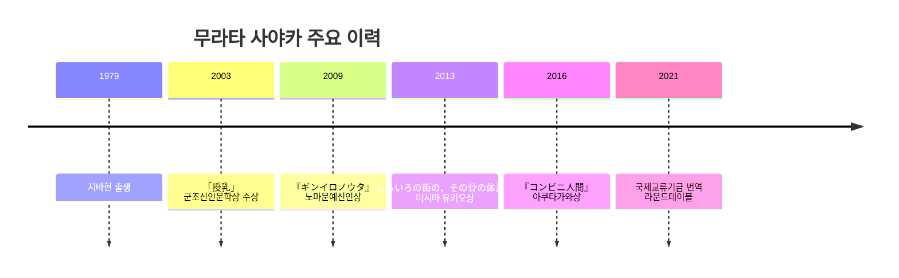

# 무라타 사야카 《편의점 인간》 사전연구 보고서

이 작품을 깊게 이해하기 위한 예비 독해의 핵심은 세 가지다. 첫째, 《편의점 인간》은 2016년 일본의 노동·젠더·가족 규범을 압축한 소설이며, 제155회 아쿠타가와상 수상작이라는 문학사적 표지를 가진다. 둘째, 작가 무라타 사야카의 실제 편의점 노동 경험과 “정상” 규범에 대한 문제의식이 작품의 설정과 시선을 직접적으로 떠받친다. 셋째, 이 작품은 단순한 “별난 개인”의 이야기가 아니라, 규격화된 서비스 노동이 한 개인에게는 오히려 생존 기술과 정체성의 틀을 제공한다는 역설을 탐구한다. citeturn32view0turn11view0turn11view2turn19view2turn12view0

**개념 체크리스트**

- 텍스트의 기본 서지와 초출·수상 정보를 먼저 고정한다. citeturn32view0turn2search3turn11view0
- 작가의 생애와 실제 노동 경험이 작품에 어떻게 변환되는지 확인한다. citeturn11view1turn11view2turn22search0
- ‘정상성’, 노동, 젠더, 가족, 소비문화라는 핵심 읽기 축을 분리해 본다. citeturn19view2turn12view0turn12view1
- 무라타가 직접 언급한 선행 작가와 사조를 바탕으로 영향 지형을 정리한다. citeturn18view0turn11view4turn11view5
- 2015~2016년 일본의 인구, 결혼, 비정규 노동, 여성활약 법제를 작품 배경으로 접속한다. citeturn34view0turn35view1turn26view0turn29view0turn14view1

## 작품 기본 정보

- **표제**: 《편의점 인간》, 원제 **コンビニ人間**. 작가는 무라타 사야카. 작품은 『文學界』 2016년 6월호에 발표되었고, 같은 해 7월 27일 문예춘추에서 단행본으로 출간되었다. 한국어판은 2016년 11월 1일 살림출판사에서 나왔다. citeturn32view0turn2search3turn1search8
- **발표 연도**: 2016년. **장르**는 공식 소개상 “소설”로 표기되며, 비평·출판 맥락에서는 흔히 중편소설 또는 현대 일본문학의 사회풍자적 문학소설로 읽힌다. 세부 장르 명칭은 출처별로 다소 달라, 더 좁은 규정은 **unspecified**로 두는 편이 안전하다. citeturn11view0turn1search8
- **핵심 줄거리 요약**: 후루쿠라 게이코는 36세, 미혼, 연인 없음, 편의점 아르바이트 18년 차의 인물이다. 그는 편의점 점원일 때만 자신이 “세계의 톱니” 또는 “정상적인 부품”처럼 기능한다고 느낀다. 그런데 결혼을 생존전략으로 삼는 신입 남성 시라하가 등장하면서, 게이코의 삶은 사회가 강요하는 정상성의 기준과 정면으로 충돌한다. 그 결과 소설은 “보통”이란 무엇인가, 누가 누구를 비정상으로 규정하는가를 묻는다. citeturn11view0turn1search8turn31search5
- **문학사적 위상**: 이 작품은 제155회 아쿠타가와상 수상작이며, 이후 국제적으로 널리 번역되었다. 일본문학진흥회는 2016년 상반기 수상작으로 이를 등재하고 있고, 국제교류기금은 2021년 시점에 이미 30개 이상 언어로 번역되었다고 소개한다. citeturn32view0turn33view0

- **핵심 참고자료**
  - 문예춘추 문고판 소개 페이지. citeturn11view0
  - 일본문학진흥회 아쿠타가와상 수상자 목록. citeturn32view0
  - 『文學界』 2016년 6월호 목차 페이지. citeturn2search3
  - 예스24 한국어판 도서 소개. citeturn1search8
  - 국제교류기금 Bookmark JF 번역 라운드테이블 소개. citeturn33view0

## 저자 소개

- **기본 생애**: 무라타 사야카는 1979년 지바현 출생이며, 다마가와대학 문학부 예술문화학과를 졸업했다. 대학 공식 기사에 따르면 그는 2002년 졸업생으로 소개된다. citeturn11view1turn30view0
- **주요 이력**: 2003년 「授乳」로 군조신인문학상(소설부문 우수작)을 받으며 데뷔했다. 이후 2009년 『ギンイロノウタ』로 노마문예신인상, 2013년 『しろいろの街の、その骨の体温の』로 미시마 유키오상을 받았고, 2016년 「コンビニ人間」으로 아쿠타가와상을 수상했다. citeturn11view1turn33view0
- **수상 뒤의 자기 규정**: 다마가와대학 기사에 따르면 수상식 연설에서 무라타는 “작가는 악보를 쓰고, 독자가 그것을 연주한다”는 비유로, 자신이 받은 것은 독자의 연주였다고 말했다. 이것은 그가 작품을 완결된 메시지보다 독자와의 수행적 관계로 본다는 점을 보여준다. citeturn30view0
- **관련 인터뷰·발언**: 무라타는 《편의점 인간》 덕분에 “또 다른 언어의 세계”로 갈 수 있었고, 자신을 “세상을 녹화하는 카메라”처럼 느낀다고 한국어 인터뷰에서 말했다. 또 회고문에서는 편의점을 너무 사랑했기 때문에 오히려 한동안 소설로 쓰지 못했고, 다른 원고를 버린 뒤에야 편의점을 무대로 삼기로 결심했다고 밝혔다. citeturn19view1turn11view2

- 아래 타임라인은 공식 약력과 수상 이력을 기준으로 묶은 것이다. citeturn11view1turn30view0turn33view0

- **핵심 참고자료**
  - 신초샤 작가 프로필. citeturn11view1
  - 다마가와대학 졸업생 수상 기사. citeturn30view0
  - 국제교류기금 Bookmark JF 작가 소개. citeturn33view0
  - 보그 코리아 무라타 사야카 인터뷰. citeturn19view1

## 작품 세계

- **주요 주제**: 가장 중심적인 축은 ‘정상/비정상’의 경계다. 무라타는 직접 인터뷰에서 “정상은 이상(異常)의 한 종류처럼 느껴진다”고 말했고, 성행위에 관심이 없는 인물들에 대해서도 “그들에게는 그것이 정상”이라고 말했다. 따라서 이 작품은 단순한 부적응 서사보다, 다수의 규범 자체를 낯설게 만드는 소설에 가깝다. citeturn19view2
- **노동과 존재의 문제**: 공식 소개가 강조하듯 게이코는 “점원”일 때만 세계의 톱니가 될 수 있다고 느낀다. 이 때문에 편의점은 착취의 공간이면서 동시에 정체성을 임시로 지탱하는 장치가 된다. 이 이중성 때문에 소설은 반(反)노동 소설이라기보다, 표준화된 노동이 어떤 사람에게는 사회적 언어를 제공한다는 역설의 소설로 읽힌다. citeturn11view0turn31search5
- **서사·문체 특징**: 한국어판 소개는 이 작품을 “CCTV로 지켜보는 듯한 극사실주의”로 설명한다. 동시에 아쿠타가와상 선평 요약에서는 심리를 바싹 조여 들어가는 방식이 유머를 낳고, ‘정상성’의 폭력을 드러낸다고 평가되었다. 요컨대 문체는 건조하고 평면적이지만, 그 평면성이 오히려 불안과 잔혹한 웃음을 생산한다. citeturn1search8turn31search1
- **등장인물 분석**: 게이코는 사회 규범을 “내면화”한 인물이라기보다, 규범을 외부에서 관찰하고 모방하는 인물이다. 반면 시라하는 결혼, 생존, 남성 역할, 노동시장 실패를 노골적 언어로 말하는 인물로, 게이코의 반대편이라기보다 사회의 숨은 본심을 거칠게 표면화한 거울에 가깝다. 둘의 기묘한 동거는 사랑의 서사가 아니라 ‘정상으로 보이기 위한 위장 연합’의 실험이다. citeturn11view0turn1search8
- **상징·모티프**: 예비 독해 차원에서 보면, 편의점은 규격화된 일본 사회의 축소모형이고, 매뉴얼·유니폼·인사 멘트는 “보통 사람”을 연기하게 만드는 프로토콜이다. 또한 음식, 발주, 진열, 레지의 리듬은 몸과 기계를 같은 박자로 맞추는 모티프로 작동한다. 이 해석은 저자의 “정상한 부품” 발언과 작품 소개의 조합에서 도출되는 **분석적 추론**이다. citeturn31search5turn11view0
- **해석의 가닥들**
  - **주류 해석**: 순응 압력과 노동 규율이 개인을 어떻게 조직하는지 보여주는 사회비판 소설. citeturn11view0turn12view0
  - **소수 해석**: 게이코를 병리화하지 않고, 비성애·비규범적 사회성 혹은 신경다양성의 가능성으로 읽는 접근. 이때 초점은 “교정”이 아니라 비규범적 존재 방식의 정당성에 놓인다. 이는 무라타의 “그들에게는 그것이 정상”이라는 발언과 잘 맞물린다. citeturn19view2
  - **탐색적 해석**: 편의점을 인간을 임시 조립해내는 운영체제 또는 포스트휴먼적 장치로 읽는 접근. 이 경우 작품은 개인심리보다 시스템과 부품의 관계를 해부하는 소설이 된다. citeturn31search5turn11view0

- **핵심 참고자료**
  - 문예춘추 문고판 소개. citeturn11view0
  - 데일리인베스트 무라타 사야카 인터뷰. citeturn19view2
  - 한국어판 예스24 도서 소개. citeturn1search8
  - 아쿠타가와상 선평 요약 자료. citeturn31search1
  - 수상기념 인터뷰 요약 영상 소개. citeturn31search5

## 영향받은 사조와 작가

- **직접 언급된 초기 영향**: 무라타는 어린 시절 형의 책을 통해 호시 신이치와 아라이 모토코를 읽었고, 아라이의 『くますけと一緒に』를 쓰면서 떠올렸다고 말했다. 또한 자신이 문체에 대한 동경 속에서 “아라이 모토코풍”, “호시 신이치풍”으로 써보기도 했다고 회고했다. 이는 그의 문장이 보이는 짧고 건조한 리듬, 낯설게 보기, 설정형 아이디어의 배경으로 읽을 수 있다. citeturn18view0
- **기이한 감각의 원천**: 그는 미야자와 겐지의 문장을 “무서웠다”, 그러나 동시에 끌어당기는 “마력”이 있었다고 말했다. 이 발언은 무라타 작품의 표면상 단정한 문장 안에 감각적 불안을 배치하는 방식을 이해하는 데 유용하다. citeturn18view0
- **실존적 아웃사이더 계보**: 무라타는 오가와 요코의 『妊娠カレンダー』와 카뮈의 『異邦人』을 “굉장히 좋아했다”고 말했고, 더 최근 인터뷰에서는 학생 시절 중요했던 책으로 카뮈의 『이방인』과 다자이 오사무의 『인간실격』을 들었다. 특히 다자이의 주인공을 대학 시절 읽고 “아, 이건 나다”라고 느꼈다는 대목은, 사회적 위장과 노출 공포가 《편의점 인간》의 중요한 선행 회로임을 시사한다. citeturn11view4turn11view5
- **사조 차원의 정리**: 따라서 무라타의 계보는 대체로 부조리·실존주의적 아웃사이더 서사, 일본 현대문학의 기이한 일상성과 신체 불안, 그리고 SF·쇼트쇼트적 설정 사고가 교차하는 지점으로 요약할 수 있다. 이 문장은 인터뷰 발언을 바탕으로 한 **예비 종합**이다. citeturn18view0turn11view4turn11view5

- 아래 비교표는 무라타 본인의 독서 발언과 실제 작품의 주제 중첩을 바탕으로 한 **예비 비교**다. citeturn18view0turn11view4turn11view5

| 비교 작가 | 공통 주제 | 무라타와의 차이 |
|---|---|---|
| 알베르 카뮈 | 감정 규범에 어긋나는 인물, 사회가 타자를 심판하는 방식 | 무라타는 부조리를 추상화하기보다 편의점·젠더·서비스노동 같은 구체 제도 안에 배치한다 |
| 다자이 오사무 | ‘가짜로 들킬까’ 하는 공포, 정상성 연기의 피로 | 다자이는 고백체가 강하고, 무라타는 관찰체·풍자체가 더 강하다 |
| 오가와 요코 | 일상 내부의 기이함, 몸과 심리의 미세한 불안 | 오가와가 밀도 높은 서늘함을 강조한다면, 무라타는 사회 규범의 구조적 압력을 더 전면화한다 |

- **핵심 참고자료**
  - 『작가의 독서도』 무라타 사야카 인터뷰 1편. citeturn18view0
  - 『작가의 독서도』 무라타 사야카 인터뷰 2편. citeturn11view4
  - WIRED Japan 무라타 장문 프로필. citeturn11view5
  - 국제교류기금 번역 라운드테이블 소개. citeturn33view0

## 소설과 관련한 삶의 배경

- **편의점 노동 경험의 직접성**: 무라타는 《편의점 인간》을 쓸 당시 실제로 편의점에서 일하고 있었다고 회고했다. 그는 편의점에 대한 애정이 너무 강해 “지금은 못 쓴다”고 여겼지만, 다른 소설이 막히자 오히려 가장 가까운 재료인 편의점을 쓰기로 했다고 밝혔다. 즉 이 소설은 작가의 경험을 거의 그대로 옮긴 기록문이 아니라, 가장 밀착된 삶의 장면을 문학적으로 재구성한 결과물이다. citeturn11view2
- **사회적 위치와 위장**: 무라타는 가족에게 자신이 소설을 쓴다는 사실을 숨긴 채, “한 회사만 붙어서 아르바이트하며 천천히 일자리를 찾겠다”고 말했다고 회고했다. 이는 정규직 진입, 생활 안정, 가족 승인이라는 통상 경로 바깥에서 글쓰기와 비정규 노동을 병행했던 그의 위치를 보여준다. citeturn22search0
- **수상 당시에도 이어진 노동**: 한국어판 소개에 따르면 무라타는 수상식 당일 아침에도 편의점에서 일하고 왔다고 말했으며, 편의점을 “성역 같은 곳”이라고 표현했다. 이 맥락은 소설 속 게이코가 편의점을 단지 생계 수단이 아니라 존재를 정렬해주는 장소로 느끼는 이유와 강하게 겹친다. citeturn5search3
- **정상성·섹스·재생산에 대한 문제의식**: 무라타는 자신의 주인공들이 종종 성행위에 흥미가 없으며, 그것도 그들에게는 정상이라고 말했다. 이런 발언은 《편의점 인간》에서 결혼, 출산, 이성애를 자동적으로 성숙의 척도로 삼는 사회의 시야가 왜 반복적으로 해체되는지 설명해준다. citeturn19view2

- **핵심 참고자료**
  - 무라타의 회고문 「古倉さんと一緒に海外へ何度も旅をした」. citeturn11view2
  - 예스24 한국어판 소개문. citeturn5search3
  - e-aidem 인터뷰 검색 결과 스니펫. citeturn22search0
  - 데일리인베스트 인터뷰. citeturn19view2

## 시대 사회 문화적 배경

- **인구 구조 변화**: 일본 총무성 통계국은 2015년 인구센서스가 1920년 조사 시작 이래 처음으로 일본 총인구 감소를 기록했다고 밝힌다. 동시에 공식 통계 핸드북은 2015년 1인 가구 비중이 34.6%였다고 제시한다. 이 배경은 “결혼-핵가족-정상적 생애주기”가 더 이상 유일한 표준이 아니면서도 여전히 강한 압력으로 남아 있는 사회를 뜻한다. citeturn24search1turn34view0turn35view1
- **노동과 젠더의 비대칭**: 2017년 남녀공동참획백서는 2016년 여성 비정규 고용 비율이 55.9%였고, 15~64세 여성 취업률은 66.0%로 상승했지만 M자형 취업구조는 여전히 존재한다고 요약했다. 이는 여성의 노동참여가 늘어나는 동시에, 그 참여 방식이 불안정·단절적일 수 있다는 현실을 보여준다. citeturn12view0
- **결혼·출산과 경력 단절**: 내각부 백서는 결혼 전 일하던 여성 중 정규직 비율이 결혼 후 64.2%에서 43.6%로 떨어지고, 27.7%가 결혼 뒤 이직이 아니라 아예 이탈한다고 제시한다. 또한 출산 전 취업 여성의 약 6할이 출산 후 이직·단절을 겪는다고 설명한다. 《편의점 인간》에서 주변 인물들이 게이코에게 결혼과 정착을 강요하는 문화적 압력이 왜 그렇게 자연스러운 상식처럼 작동하는지 여기서 읽힌다. citeturn12view1
- **소비문화와 인프라로서의 편의점**: 일본 프랜차이즈체인협회는 편의점 업계를 전국적 통계 단위로 월별 집계하고 있고, 같은 협회의 세이프티스테이션 소개는 편의점이 단순 유통공간을 넘어 “마을의 인프라”이자 “재난 시 라이프라인”으로 기능한다고 설명한다. 즉 편의점은 소비 장소이면서 사회서비스의 접점이기도 하며, 그래서 이 소설의 무대는 사소한 일터가 아니라 현대 일본의 일상 운영체제가 된다. citeturn36search0turn36search9

- **핵심 참고자료**
  - 일본 총무성 통계국 2015 인구센서스 요약 및 2024 통계 핸드북. citeturn24search1turn34view0turn35view1
  - 2017년 남녀공동참획백서 개요. citeturn12view0
  - 여성의 라이프스테이지와 취업에 관한 내각부 백서. citeturn12view1
  - 일본 프랜차이즈체인협회 통계·세이프티스테이션 자료. citeturn36search0turn36search9

## 소설의 주요 배경 시대 국가 사회상 및 대표적 이슈

- **배경 시기·국가·사회상**: 작품의 국가 배경은 일본이며, 공식 소개와 초출 정보로 보아 2010년대 중반의 동시대 일본 사회를 반영하는 소설로 읽는 것이 가장 타당하다. 다만 공식 서지 소개에 구체 도시나 점포 실명은 제시되지 않으므로, 세부 지리적 배경은 **unspecified**로 두는 편이 적절하다. citeturn11view0turn2search3
- **대표 통계 이슈**: 후생노동성 2016 인구동태통계는 출생아 수 976,979명, 합계출산율 1.44, 혼인 620,523건, 평균 초혼연령 남성 31.1세·여성 29.4세를 제시한다. 이는 작품 속 인물들이 30대 중반을 지나며 결혼과 재생산 압력을 체감하는 사회 분위기를 구체적인 숫자로 뒷받침한다. citeturn26view0turn27view0turn27view1
- **대표 노동 이슈**: 총무성 2016 노동력조사는 취업자 6,440만 명, 완전실업률 3.1%를 제시하고, 역할원을 제외한 고용자 중 비정규 비율이 37.5%였음을 보여준다. 같은 시기 여성 비정규 비율은 55.9%였다. 즉 표면상 고용은 회복세였지만, 특히 여성에게는 불안정 고용이 구조적으로 두꺼웠다. citeturn11view7turn14view0turn14view1turn12view0
- **대표 법제도 이슈**: 내각부 자료에 따르면 여성활약추진법은 2015년에 제정되었고, 사업주에게 수치 목표를 담은 행동계획 수립·공표와 정보공개를 의무화했다. 영문 안내 자료는 행동계획 규정이 2016년 4월 1일 시행되었다고 설명한다. 작품이 발표된 바로 그 시기 일본은 제도 차원에서는 여성의 노동참여를 장려했지만, 생활세계에서는 여전히 결혼·출산·규범적 여성성 압력이 강했다는 점이 중요하다. citeturn29view0turn12view2turn12view3
- **편의점 산업 이슈**: 일본 프랜차이즈체인협회는 편의점 매출과 점포 수를 매월 집계하며, 2016년 자료도 월별로 아카이브해 두고 있다. 또한 세이프티스테이션 활동은 2000년 약 42,000개 점포에서 시작해 현재 약 57,000개 점포로 확장되었다고 설명한다. 이 점은 편의점이 국가적 일상 인프라로 자리를 굳힌 맥락에서 게이코의 일터가 왜 그렇게 “정상 사회”의 압축판이 되는지를 보여준다. citeturn15view0turn36search9

- **핵심 참고자료**
  - 후생노동성 2016 인구동태통계 월보 연계 개요. citeturn26view0turn27view0turn27view1
  - 총무성 2016 노동력조사. citeturn11view7turn14view1
  - 내각부 여성활약추진법 안내 및 영문 법률 번역. citeturn29view0turn12view2turn12view3
  - 일본 프랜차이즈체인협회 과거 통계·세이프티스테이션 자료. citeturn15view0turn36search9

**심화 질문**

- 게이코의 편의점 적응은 “해방”인가, 아니면 또 다른 규율의 내면화인가. 아니면 둘 다인가.  
- 이 작품을 노동소설로 읽을 때와 신경다양성 혹은 비성애성의 서사로 읽을 때, 시라하의 의미는 어떻게 달라지는가.  
- 무라타는 왜 편의점이라는 가장 익숙한 장소를 통해 오히려 인간 사회 전체를 가장 낯설게 보이게 만드는가.  

**GPT 의견**: 이 작품을 가장 생산적으로 읽는 방법은 “이상한 개인의 일탈”보다 “정상성을 자동화하는 사회 시스템의 해부”에 중심을 두되, 게이코가 편의점에서 느끼는 안정감의 진정성도 동시에 인정하는 것이다. 다시 말해 이 소설은 규범 비판과 노동의 미세한 구원 가능성을 함께 품고 있으며, 이 판단의 확신도는 **높음**이다. citeturn11view0turn11view2turn19view2turn12view0

검증 메모: 일본 초판의 세부 물성 정보나 작품 내 점포의 구체 지명처럼 공식 자료에서 즉시 확인되지 않는 항목은 **unspecified**로 남겼다. 다만 초출·단행본·수상·작가 이력·2015~2016년 일본의 인구·노동·법제 자료는 공식 및 준공식 출처로 상호 확인해 예비연구용 핵심 누락은 최소화했다.

[2026-07-01] #편의점인간 #무라타사야카 #일본문학 #노동과젠더

자체 점검: 실행 요약, 체크리스트, 7개 요청 섹션, 타임라인, 비교표, 다각적 해석, 최종 의견, 날짜와 해시태그, 검증 메모를 포함했다.