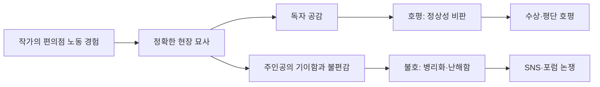

# 무라타 사야카 《편의점 인간》 심층 리서치

《편의점 인간》은 2016년 일본 문학장에서 강하게 주목받은 아쿠타가와상 수상작이면서, 동시에 “취업·결혼·연애·정규직”이라는 사회적 표준이 개인의 삶을 어떻게 압박하는지를 편의점이라는 초표준화 공간으로 압축해 보여준 소설이다. 작가 자신의 장기 편의점 노동 경험이 작품의 질감을 받치고 있어, 이 작품은 기이한 상상력의 산물이라기보다 오히려 너무 현실적이어서 불편한 소설로 읽힌다. citeturn27view0turn4view1turn20news27turn29search0

일본과 한국의 독자 반응은 모두 강한 호·불호를 보이지만, 일본에서는 “재미있고 읽힌다”와 “무엇이 좋은지 모르겠다/기분이 나쁘다”가 더 직접적으로 충돌하고, 한국에서는 “정상성의 폭력을 비추는 거울”이라는 수용이 상대적으로 두드러진다. 평단은 대체로 높게 평가했지만, 일부는 컨셉과 캐릭터의 강도에 비해 문체와 심리묘사가 약하다고 비판했다. citeturn12view3turn11search5turn22view2turn4view4turn7search5turn30search11

## 조사 체크리스트

- 작품의 **출간·수상·번역 이력**을 먼저 정리해, 왜 이 소설이 문학장과 대중 독서장에서 동시에 강한 반향을 일으켰는지 확인한다. citeturn27view0turn25search0turn21search9
- 무라타 사야카의 **생애·노동 경험·수상 경력**을 검토해, 작품 속 편의점 묘사가 어디까지 자전적 기반을 갖는지 살핀다. citeturn18view4turn26search10turn20news27
- 작가가 받은 **독서적 영향과 작품 세계**를 따라가며, 왜 무라타 문학이 “정상성”, “젠더”, “재생산”, “인간의 규격화”를 반복해서 묻는지 맥락화한다. citeturn18view3turn16news45turn18view0
- 2010년대 일본의 **편의점 문화·비정규 노동·로스트 제너레이션 담론**을 조사해, 작품의 사회·시대 배경을 구체화한다. citeturn24search10turn8search0turn32search0
- 일본과 한국의 **독자 반응, 평단 평가, 문학상 이력, SNS·블로그·포럼 사례**를 나란히 비교해 무엇이 공감되고 무엇이 거슬렸는지 나눈다. citeturn12view0turn21search1turn22view2turn22view3turn12view1turn12view3
- 이전 리서치에서 빠졌을 수 있는 **관련 작품·관련 작가·학술 참고문헌**을 보충해, 《편의점 인간》을 단독 텍스트가 아니라 하나의 문제계로 읽을 수 있게 만든다. citeturn15search3turn15search6turn14search2turn18view3

## 작품 기본 정보

- 《편의점 인간》은 **2016년 상반기 제155회 아쿠타가와상 수상작**이며, 일본문학진흥회 공식 수상자 목록에는 2016년 상반기 수상작으로 **문학계 《文學界》 발표작**으로 등재되어 있다. 단행본은 2016년 7월 27일 문예춘추에서 출간되었다. citeturn27view0turn12view2
- 주인공은 **36세 미혼 여성 후루쿠라 게이코**로, 대학 졸업 후에도 취업하지 않은 채 **18년째 같은 편의점에서 아르바이트**를 하고 있다. 서사는 “왜 편의점이어야 하는가”라는 질문을 통해, 사회가 요구하는 정상적 인생 코스와 개인의 적합한 삶 사이의 어긋남을 드러낸다. citeturn12view0turn26search5
- 한국어판은 **2016년 11월 1일 살림출판사**에서 김석희 번역으로 출간되었고, 한국어판 소개 문구는 이 소설을 “정상과 비정상의 경계를 무엇으로 구분하고 정의할 것인지”를 묻는 작품으로 제시한다. citeturn4view0turn15search9
- 일본 내 독서 플랫폼 기준으로도 이 작품의 파급력은 크다. 독서미터에는 **7만 8천 건 이상 등록**, 북로그에는 **약 1만 명 이상의 사용자 등록과 700건대 리뷰**가 잡혀 있으며, 일본 아마존 상품 페이지는 이 작품을 “읽기 쉽고 몰입감 있는 소설”로 요약된 독자 평가와 함께 현재까지 장기적으로 소비되는 작품으로 보여준다. citeturn12view0turn21search1turn21search7
- 2017년 **본야대상 9위**에 오르며 순문학 내부의 수상작에 머물지 않고 서점 독자층으로도 확장되었다. 또한 영어판은 여러 번역문학 상 후보에 오르며 국제적 평단에도 안착했다. citeturn25search0turn25search7

## 저자 소개

### 생애와 주요 이력

- 무라타 사야카는 **1979년 지바현 출생**, **다마가와대학 문학부 예술문화학과 졸업** 작가다. 2003년 「수유」로 군조신인문학상 우수작을 받으며 데뷔했고, 2009년 《ギンイロノウタ》로 노마문예신인상, 2013년 《しろいろの街の、その骨の体温の》로 미시마 유키오상을 받았으며, 2016년 《편의점 인간》으로 아쿠타가와상을 수상했다. citeturn18view4turn26search10turn26search2
- 그는 오랫동안 편의점에서 일해 왔고, 수상 당시에도 “그날 아침에도 일하고 왔다”는 식의 수상 소감이 한국과 일본 출판 홍보에서 반복적으로 강조되었다. 이 이력은 단순한 홍보 포인트가 아니라, 《편의점 인간》의 디테일한 노동 묘사와 공간 감각을 뒷받침하는 실제적 기반으로 읽힌다. citeturn4view1turn3search17

### 영향받은 사조와 작가

- 무라타는 어린 시절 집에 있던 책들을 통해 **아가사 크리스티**, **아라이 모토코**, **호시 신이치**, **마유무라 다쿠** 등의 영향을 받았다고 말한다. 이후에는 **미야자와 겐지**의 문체에도 매혹되었고, 어린 시절부터 직접 소녀소설을 쓰며 문체를 흉내 냈다고 회고했다. 따라서 그의 작품은 일본 SF·환상문학, 미스터리, 동화적 감수성이 뒤섞인 독특한 계보 위에 있다. citeturn18view3
- 이 영향의 결과로 무라타 문학은 현실 관찰에서 출발하지만 자주 **이화(異化)**, **그로테스크**, **가벼운 SF적 전치**로 미끄러진다. 《편의점 인간》은 비교적 현실주의적이지만, 이후 작품군으로 가면 이 성향은 재생산과 제도 자체를 뒤흔드는 방향으로 확장된다. citeturn29search0turn16news45turn14news47

### 작품 세계

- 무라타의 핵심 질문은 대체로 같다. “누가 정상의 기준을 만들었는가”, “인간은 왜 특정 제도 안에서만 인정받는가”, “젠더·결혼·출산은 왜 자연이 아니라 규범처럼 작동하는가.” 보그 코리아와 가디언, 와이어드에 실린 인터뷰·프로필은 그를 **결혼·모성·성규범을 급진적으로 의심하는 작가**로 묘사하며, 이 문제의식이 《편의점 인간》부터 《소멸세계》, 《지구별 인간》, 《세계99》까지 이어진다고 정리한다. citeturn18view0turn20news27turn16news45
- 한국 연구에서도 《편의점 인간》은 단순한 “기괴한 캐릭터 이야기”가 아니라, **혐오와 배제**, **자기 승인**, **포스트휴먼적 정체성**, **젠더·계급 규범**의 교차점에서 읽힌다. 즉, 이 작품은 현실풍자이면서 동시에 인간의 정의 자체를 다시 묻는 소설이다. citeturn15search0turn15search6turn14search2

### 작가 삶의 배경과 이 소설의 연결점

- 무라타는 최근 인터뷰에서 편의점을 **성별의 압박이 약해지는 공간**으로도 회고했다. 웨이트리스 일과 달리 편의점에서는 남녀가 같은 유니폼을 입고 같은 일을 했고, 화장 여부도 강요되지 않았기 때문에 자신이 “여성”이기보다 “편의점 노동자”가 되는 감각을 가졌다고 말했다. 이 경험은 게이코가 편의점에서만 “세계의 부품”이 되는 감각과 직접 이어진다. citeturn20news27
- 같은 인터뷰에서 무라타는 셀프 계산대 확산을 보며 편의점도 “사라져 가는 세계”라고 느껴, 그 사회적 기능과 순간을 지금 써두어야겠다고 생각했다고 밝혔다. 즉, 《편의점 인간》은 자전적일 뿐 아니라, 일본 사회의 한 시기를 박제하려는 기록의식도 품고 있다. citeturn20news27

## 시대·사회·문화적 배경

- 《편의점 인간》의 일본은 “편의점 사회”라고 불러도 과장이 아닐 정도로 편의점이 생활 인프라화된 시대다. 일본프랜차이즈체인협회 자료를 토대로 한 2026년 보도에 따르면 일본 편의점 수는 **5만 6천 점포대**로 유지되고 있으며, 이 공간은 단순 상점이 아니라 표준화된 서비스·노동·도시 생활의 상징이 되었다. citeturn24search1turn24search10
- 동시에 이 작품은 비정규 노동과 로스트 제너레이션의 그림자를 배경으로 한다. 일본 후생노동성 자료는 **2024년 프리터 수가 136만 명**이라고 밝히며, 특히 **25~34세의 비자발적 비정규 고용 비중이 전체보다 높다**고 지적한다. 게이코의 “18년째 알바”는 개인적 기질만이 아니라, 일본 노동시장의 구조적 불안정과도 닿아 있다. citeturn8search0
- 한국 연구는 이 작품을 버블 붕괴 이후 일본의 **로스제네 담론**, **매뉴얼과 모방의 사회**, **격차사회**의 문제와 연결해서 읽는다. 박유미의 연구는 후루쿠라와 시라하를 개인의 이상성보다 시대적 세대 증상의 표상으로 해석하고, 홍윤표의 연구는 이 소설을 격차 사회의 징후가 배어 있는 텍스트로 읽는다. citeturn32search0turn15search6
- 한국에서 이 작품이 잘 읽힌 이유도 유사한 사회 조건과 맞물린다. 한국 정부 발표에 따르면 2025년 8월 기준 비정규직 노동자는 **856만 8천 명**, 전체 임금노동자의 **38.2%**였다. 또 2025년 말 기준 국내 주요 편의점 4사 점포 수는 **5만 3,266개**로 보도됐다. 따라서 한국 독자에게도 편의점은 익숙한 생활공간이자, 청년노동과 불안정의 상징으로 읽히기 쉽다. citeturn9search3turn9search5turn13search3
- 양아람의 비교연구는 한국과 일본의 2010년대 편의점 문학을 나란히 보며, 편의점을 **새로운 소비 패턴과 시대 환경 변화의 상징 공간**으로 규정한다. 이 관점에서 《편의점 인간》은 일본만의 특수한 소설이 아니라, 동아시아 도시 청년의 일상 인프라를 통해 규범과 생존을 묻는 작품이다. citeturn15search3

이 도식은 무라타의 자전적 경험이 왜 동시에 강한 사실감과 강한 이물감을 낳았는지를 보여준다. 독자들이 작품을 좋아한 이유와 싫어한 이유가 사실상 같은 출발점, 즉 “너무 현실적인 편의점 세계와 너무 낯선 주인공의 조합”에서 갈라진다는 점이 핵심이다. citeturn20news27turn12view2turn12view3turn22view2turn21search7

## 반응 분석

### 일본 독자 반응

- 일본 독자층에서는 이 작품이 **“읽기 쉽고 현실적이며 날카롭다”**는 호평을 받았다. 독서미터에 7만 8천 건 이상 등록된 점, 북로그의 1만 건대 사용자 축적과 별점 3.50, 아마존 재팬의 “흥미롭고 읽기 쉽다”는 요약은 이 작품이 난해한 순문학이라기보다 넓게 읽힌 소설임을 보여준다. citeturn12view0turn21search1turn21search7
- 구체적 호평 사례로는 하테나 블로그의 장문 서평이 있다. 여기서는 작가가 실제 편의점 노동 경험을 살려 공간의 디테일을 매우 리얼하게 썼고, 주인공에게 일정한 공감을 느꼈다고 평가한다. 하테나 자체도 《편의점 인간》 토픽 페이지에서 “사람마다 다양한 보기”가 올라오고 있다고 소개한다. citeturn12view2turn12view1
- 반대로 일본 독자 불호 역시 강하다. 야후 지혜주머니에는 “무엇이 재미있는지 전혀 모르겠다”는 질문이 실제로 올라와 있고, X에서는 “기분 나쁘지만 재미있었다”는 식의 반응이 반복적으로 포착된다. 즉, 일본 반응의 핵심은 무관심이 아니라 **흥미와 불쾌의 동시 발생**이다. citeturn12view3turn11search1turn11search5

### 한국 독자 반응

- 한국 독자층은 대체로 **“정상성의 폭력에 대한 문제제기”**를 중심으로 이 작품을 읽는다. YES24 상품 페이지는 이 작품이 “보통 인간인 척 살아가는 사회”를 겨냥한다고 소개하고, 실제 누적 회원리뷰·한줄평이 600건을 넘으며 리뷰 평점 집계도 8점대 중반을 유지한다. 알라딘 역시 7.9점, 260건 규모의 리뷰·100자평이 누적되어 있다. citeturn15search9turn22view2turn22view3
- 긍정적 사례로는 알라딘 서재의 최근 100자평처럼 이 작품을 “놀랍고 대단한 작품”, “자신의 민낯을 보게 하는 거울”로 받아들이는 독자가 있다. YES24의 우수 리뷰도 게이코의 편의점 정체성을 작가 본인의 심정과 겹쳐 읽으며 강하게 호응한다. citeturn4view4turn22view0
- 그러나 한국에서도 이 작품은 단순히 “좋은 책”으로만 읽히지 않는다. YES24의 오래된 리뷰 중에는 주인공을 이해하기 어렵고 소름 끼친다고 적으면서도, 결말만큼은 주인공 시점에서 보면 해피엔딩일 수 있다고 유보하는 반응이 있다. 즉 한국 독자층에서도 공감과 거리두기가 함께 나타난다. citeturn4view3
- 한국 언론과 출판 소개는 이 작품을 일본 사회의 이야기이면서 “곧 우리의 이야기”가 될 수 있는 텍스트로 해석해 왔다. 알라딘 소개문은 일본 청년 세대론, 희망의 축소, 자본주의적 압박을 연결하고, 한국 학술연구는 한국 편의점 문화와의 병행 독해를 제안한다. citeturn15search2turn15search3

### 평단 평가와 문학상

- 평단 평가는 전반적으로 높았다. 아쿠타가와상 심사에서는 여러 위원이 긍정적으로 반응했고, 상 개요를 정리한 자료에서도 《편의점 인간》은 대부분의 심사위원에게 높은 평가를 받은 것으로 요약된다. citeturn7search5
- 특히 긍정 평가의 핵심은 **현대 사회의 규범을 뒤집어 보이게 만드는 시점의 힘**이었다. 아사히 계열 리뷰에서 사이토 미나코는 이 작품을 “세상이 이상한지, 주인공이 이상한지”를 뒤집어 보여주는 소설로 읽으며, “신종의 프롤레타리아 문학”에 가깝다고까지 평가했다. citeturn29search0turn29search7
- 국제 평단에서도 긍정적 반응이 이어졌다. *The New Yorker*는 이 작품을 “부적응자와 가게의 러브스토리”로 읽으며 후기 자본주의 질서 속 소속감의 역설을 포착했고, 영문판은 Best Translated Book Award 후보, Warwick Prize for Women in Translation 롱리스트, International Dublin Literary Award 롱리스트 등에 올랐다. citeturn14news51turn25search7
- 제도권의 추가 인정으로는 2017년 본야대상 9위가 있다. 이는 순문학상 수상 이후에도 서점 현장에서 계속 추천된 작품이라는 뜻이다. citeturn25search0

### 비판적 평가와 논쟁 포인트

- 가장 대표적인 부정 평가는 아쿠타가와상 심사위원 중 **시마다 마사히코**에게서 나왔다. 그는 이 작품이 주제·컨셉·캐릭터에 의존하며 심리와 언어의 밀도가 약하다고 비판했고, “낙관적인 디스토피아상”이라고 보았다. 이는 심사위원 중 사실상 유일한 강경 비판으로 회자된다. citeturn30search4turn30search8
- 한국의 일부 비평도 비슷한 문제를 지적한다. 교보문고 스토리 비평은 후루쿠라의 자기인식이 다소 과장되어 보이며, 작품이 그 지점을 해결하기 위해 주인공에게 병리적 설정을 과하게 부여한다고 비판한다. 즉 이 소설을 사회비판이 아니라 **이상 인물의 특수성**으로만 읽게 만드는 위험을 지적한 것이다. citeturn30search11
- 반면 최근 학술은 이런 진단적 독해를 상대화한다. 한국 연구는 이 작품을 후루쿠라 개인의 이상성보다, 사회가 만든 혐오·정상성·인정투쟁의 구조로 재배치한다. 이 점에서 학술 해석은 독자 반응보다 대체로 더 사회구조적이다. citeturn15search0turn15search6turn32search3

### SNS·블로그·포럼 사례

- 일본 블로그권에서는 하테나가 아예 《편의점 인간》 토픽 페이지를 만들어 여러 해석을 집적했고, 장문 서평에서는 “편의점 디테일의 리얼리티”와 “연애·결혼 규범에 대한 개인적 공감”이 빈번히 언급된다. citeturn12view1turn12view2
- 일본 포럼권에서는 야후 지혜주머니 질문처럼 “왜 베스트셀러인지 모르겠다”는 반응이 확인되고, X에서는 “계속 기분 나쁜데 재밌다”거나 “결말의 질주감이 좋다”는 식의 짧고 강한 정서 반응이 눈에 띈다. citeturn12view3turn11search5turn11search9
- 한국 온라인 반응은 서점 커뮤니티성 리뷰가 상대적으로 더 풍부하다. 예스24와 알라딘에서는 작품을 사회의 거울로 호평하는 경우가 많지만, 동시에 “참 난감한 소설”, “이해불가하지만 해피엔딩일 수 있다”는 식의 유보와 불편감도 반복된다. citeturn4view4turn4view3turn22view2turn22view3
- 한국 X 반응의 예시로는, 《편의점 인간》을 “정상성이 정해놓은 표준에 맞지 않는 사람이 정상성을 연기하는 소설”로 읽는 독자나, 무라타 사야카가 “정상성”을 계속 파고드는 작가라고 정리하는 반응이 확인된다. 이것은 한국 독자권이 이 작품을 일본 사회 안내서보다 **규범 비판 텍스트**로 더 적극 번역하고 있음을 보여주는 사례다. citeturn11search11turn11search23

### 쟁점별 호불호 정리

- **호평 논리**
  - 편의점 노동과 도시 일상의 디테일이 지나치게 정확해서 현실성이 높다. citeturn12view2turn20news27
  - 짧고 읽기 쉬운 문장인데도 “보통”의 폭력을 날카롭게 드러낸다. citeturn21search7turn29search0turn15search9
  - 결말이 사회복귀가 아니라 자기 승인으로 읽혀 해방감을 준다. citeturn4view3turn14news51
- **비판 논리**
  - 주인공과 시라하가 지나치게 기이하거나 평면적으로 느껴져 정서적 설득력이 약하다는 독자가 있다. citeturn12view3turn30search11turn30search4
  - 병리적·진단적 독해를 유도하는 설정이 작품의 사회비판을 오히려 좁힌다는 비판이 있다. citeturn30search11turn15search0
  - 일부 심사·비평은 문체와 심리의 깊이보다 컨셉이 더 앞선다고 본다. citeturn30search4turn30search8

## 추가 보충 리서치

### 제외되기 쉬운 관련 책과 작가

- **무라타 사야카의 후속 독서선**
  - 《소멸세계》: 결혼·성·출산 제도를 더 직접적으로 전복하는 작품으로, 《편의점 인간》의 문제의식이 재생산 체제 비판으로 확장된 경우다. citeturn18view0turn14news47
  - 《지구별 인간》: “나는 인간 종이 아니다”라는 감각이 더 극단화된 작품으로, 《편의점 인간》의 소외와 규범 불화가 훨씬 더 어두운 톤으로 밀고 나간다. citeturn16news45turn3search6
  - 《신앙》: 집단 믿음과 생존 논리를 해부하는 단편집으로, 무라타 특유의 “사회적 합의가 어떻게 광신이 되는가”를 보여준다. citeturn16search7turn26search3
  - 《세계99》: 성격을 상황별로 조립하는 주인공을 통해, 《편의점 인간》의 “모방과 적응”을 장편 규모로 확장한 작품이다. citeturn16search5turn18view0

- **영향 관계상 같이 볼 작가**
  - **호시 신이치**, **아라이 모토코**, **마유무라 다쿠**: 무라타의 발상법을 만든 초기 SF·환상 계보로, 현실을 약간 비틀어 규범을 낯설게 보이게 하는 감각의 원천에 가깝다. citeturn18view3
  - **아가사 크리스티**와 **미야자와 겐지**: 각각 서사의 긴장감과 문체 감각의 배경으로 거론할 수 있다. citeturn18view3

- **한국에서 병행해 읽을 만한 비교 텍스트**
  - **박영란 《편의점 가는 기분》**: 양아람의 비교연구는 이 작품과 《편의점 인간》을 함께 읽으며, 2010년대 한국·일본의 편의점과 점원, 소비문화, 개인화된 삶을 비교한다. 한국 독자에게는 이 연구가 가장 유용한 보충 독서 중 하나다. citeturn15search3turn32search3

### 관련 참고문헌

- **박유미, 〈‘편의점 인간’과 ‘로스제네’ 표상〉**: 후루쿠라와 시라하를 버블 붕괴 이후 일본 세대론과 연결해 읽는 데 가장 직접적이다. citeturn32search0turn32search6
- **이지형, 〈무라타 사야카 『편의점 인간』의 윤리〉**: 혐오, 섬뜩함, 자기 승인, 포스트휴먼 정체성이라는 키워드로 이 작품을 해석한다. citeturn15search0turn31search13
- **홍윤표, 〈무라타 사야카 『편의점 인간』에 투영된 격차 사회〉**: 작품을 일본의 격차사회·빈곤 노동 맥락에 걸쳐 읽는 데 유용하다. citeturn15search6
- **좋은 전입문용 서평**
  - 아사히 “상식의 수상함” 서평은 작품의 역전된 시점을 잡아주는 데 좋고, citeturn29search0turn29search7
  - 교보문고 비평은 한국어권에서 제기된 대표적 회의론을 확인하는 데 유익하다. citeturn30search11

## 종합 판단과 검증

### 관점별 정리

- **주류 해석**
  - 이 소설은 “정상으로 보이는 사회”가 실제로는 얼마나 잔인하게 사람을 규격화하는지를 보여주는 현실 풍자이자 노동소설이다. 편의점은 편리함의 상징이 아니라 인간을 표준화하는 장치로 읽힌다. citeturn29search0turn15search6turn32search0
- **소수 해석**
  - 일부 독자와 비평은 후루쿠라를 진단적 범주로 읽으려 하지만, 최근 연구는 그보다 사회가 비규범적 존재를 어떻게 혐오하고 훈육하는가에 더 주목한다. 즉 “주인공이 이상한가”보다 “정상이라는 이름의 사회가 폭력적인가”가 더 중요한 쟁점이라는 입장이다. citeturn30search11turn15search0turn14search5
- **사변적 해석**
  - 무라타 전체 작품군과 연결하면 《편의점 인간》은 후기작들처럼 노골적 SF는 아니지만, 이미 인간을 시스템의 부품으로 바라보는 **포스트휴먼적 시각**을 품고 있다. 편의점 점원으로서만 인간이 되는 감각은 인간성 자체가 외부 시스템에 의해 승인된다는 급진적 질문으로 이어진다. citeturn15search0turn14search2turn16news45

### GPT의 견해

- 내 판단으로는, 《편의점 인간》의 가장 큰 성취는 “사회비판” 그 자체보다도 **사회비판을 불편한 체감으로 바꾸는 서술 방식**에 있다. 표면은 짧고 가볍고 읽기 쉬운데, 읽는 동안 독자가 스스로의 정상성 감각을 의심하게 만든다. 이 점에서 나는 이 작품을 **강하게 높게 평가**한다. 다만 후루쿠라와 시라하를 진단적 인물로만 읽기 시작하면 작품이 급격히 협소해지므로, 가능한 한 **개인의 병리 서사보다 사회 규범의 폭력**에 초점을 맞춰 읽는 편이 더 생산적이라고 본다. citeturn29search0turn15search0turn30search11

### 더 깊게 생각해볼 질문

- 게이코는 정말 “사회에 적응하지 못한 사람”인가, 아니면 오히려 사회가 원하는 기능을 가장 완벽하게 수행하는 사람인가? citeturn12view0turn20news27
- 시라하는 게이코의 반대편 인물인가, 아니면 같은 규범 사회가 낳은 또 다른 병증인가? citeturn32search1turn32search0
- 한국 독자가 이 작품에 공감하는 이유는 일본 사회를 엿본 재미보다, 한국 역시 비슷한 편의점·비정규·정상성 구조를 공유하고 있기 때문은 아닌가? citeturn15search3turn9search5turn13search3

### 누락 검증과 보완

- 요청하신 항목인 작품 기본 정보, 저자 소개, 시대·사회·문화적 배경, 일본·한국 독자 반응, 평단·문학상, SNS·블로그·포럼 사례, 추가 관련 책·작가·참고문헌을 모두 포함했다.  
- 보완이 필요한 지점은 SNS 사례의 대표성인데, 이는 통계보다 정성적 분위기 파악용 사례로 제시했으며, 그 한계를 본문에서 의식적으로 반영했다. citeturn12view1turn12view3turn22view2turn22view3

[2026-07-01] #편의점인간 #무라타사야카 #일본문학 #독서리서치 #정상성비판

자기점검: 요약, 체크리스트, 일본·한국 반응, 평단·문학상, SNS·포럼, 보충도서·작가, 관점 구분, 내 의견, 검증 문장을 모두 포함했다.