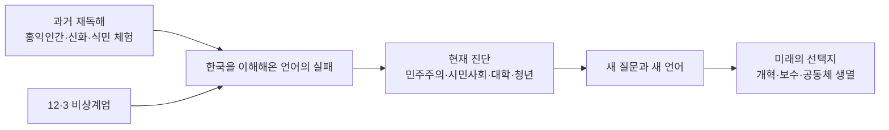

# 김영민과 《한국이란 무엇인가》 읽기 전 사전 리서치

이 책은 소설이 아니라, 2024년 12월 3일 비상계엄 시도 이후의 한국을 과거·현재·미래의 층위로 재해석하는 인문·사회 비평서에 가깝다. 따라서 읽기 전 가장 중요한 준비는 저자를 단순한 칼럼니스트가 아니라, 동아시아 정치사상과 한국정치사상을 연구해 온 학자이자 고전·역사·문화 텍스트를 정치사상으로 다시 읽는 해석자로 파악하는 일이다. 책의 중심 문제의식은 특정 인물 하나의 실패가 아니라, “한국을 이해해온 방식”과 “그 언어” 자체의 실패에 있다. 그래서 이 책은 답안집보다 질문의 형식을 새로 설계하는 책으로 읽는 편이 정확하다. citeturn11search5turn33search4turn36search5turn45view0turn46view1

## 작품 기본 정보

- 사용자 체크리스트의 “소설” 항목은 이 책의 실제 장르에 맞춰 “책의 주요 배경” 항목으로 전환해 읽는 것이 적절하다. 출판사·서점 소개는 이를 시국평론이나 단순 역사 교양서가 아니라, 한국의 과거·현재·미래를 사유 대상으로 재구성하는 책으로 설명한다. citeturn11search5turn33search4

- 기본 서지 정보는 다음과 같다. 출간일은 2025년 4월 10일, 출판사는 어크로스, 분량은 300쪽, ISBN은 9791167742001이다. 책의 출발점은 2024년 12월 3일 비상계엄 이후 “한국을 다시 생각한다”는 문제의식이다. citeturn9search15turn36search5

- 전체 구성은 **프롤로그–3부–에필로그**이며, 1부는 “한국의 과거”, 2부는 “한국의 현재”, 3부는 “한국의 미래”로 나뉜다. 이 구성은 단순 연대기보다 “시간의 층위”를 빌려 한국 사회를 해부하는 방식이며, 인터뷰에 따르면 책은 신화·정치공동체·군사정권·소원 등 **33개의 키워드**를 통해 한국을 다시 묻는다. citeturn33search4turn34search3turn46view1

- 독서 전에 기억해둘 핵심 문장은 두 개다. 첫째, “한국을 이해할 언어를 새롭게 발명할 때가 왔다.” 둘째, 저자에게 한국은 “무관심해질 수 없는 대상”이라는 점이다. 전자는 책의 인식론적 문제의식이고, 후자는 이 책이 추상적 이론서가 아니라 애증의 정동에서 출발한 작업임을 보여준다. citeturn36search5turn14view0

- 목차만 봐도 이 책의 독법이 드러난다. 1부는 홍익인간·단군신화·삼국시대·노비·식민 체험을 다시 읽고, 2부와 3부는 군사정권·민주주의·시민사회·대학·청년·이민·보수·공동체의 생멸을 다룬다. 특히 장 제목에서 entity["movie","서울의 봄","2023 film"], entity["book","소년이 온다","2014 novel"], entity["movie","그랜 토리노","2008 film"] 같은 문화 텍스트를 호출하는 점은, 저자가 역사·정치·예술을 횡단하는 방식으로 한국을 읽는다는 신호다. citeturn34search3turn35search7

## 저자 소개와 주요 이력

- 김영민은 현재 entity["organization","서울대학교","seoul, south korea"] 정치외교학부 교수이고, 부임 전에는 entity["organization","Bryn Mawr College","pennsylvania, us"]에서 가르쳤다. 공개 프로필은 그의 연구 관심을 한국정치사상·동아시아 정치사상·비교정치사상으로 제시하며, 번역서·에세이·예술비평 활동도 함께 소개한다. citeturn45view0

- 학력은 entity["organization","고려대학교","seoul, south korea"] 철학과, 그리고 entity["organization","하버드대학교","cambridge, massachusetts, us"] 동아시아 사상사 연구 박사로 확인된다. 출생연도와 같은 사적 정보는 우선순위 출처들에서 명시적으로 확인되지 않아 이번 보고서에서는 **미확인**으로 남긴다. citeturn10view0turn19search0

- 그의 대중적 글쓰기 이력은 느닷없이 등장한 것이 아니다. 1997년 유학 중 귀국해 독립영화 작업을 배우던 시기에 일간지 신춘문예 영화평론 부문에 당선했고, 시상식에서 entity["people","박완서","south korean novelist"]의 칭찬을 듣는 경험을 했다. 이는 학자 이전에 문화비평적 감각을 오래 축적해온 인물이라는 점을 보여준다. citeturn18view0

- 널리 알려진 계기는 2018년 칼럼 “추석이란 무엇인가”였다. 이 칼럼은 명절의 관습적 질문을 정체성 질문으로 되받아치는 형식으로 화제가 되었고, 이후 김영민의 “무엇인가”형 질문법은 그를 대표하는 대중적 서명(signature)이 되었다. citeturn47search1turn10view0turn46view1

- 주요 저작의 흐름은 연구서와 에세이가 교차한다. 연구서로는 entity["book","A History of Chinese Political Thought","2017"]와 entity["book","중국정치사상사","2021"]가 있고, 대중 저작으로는 entity["book","아침에는 죽음을 생각하는 것이 좋다","2018"], entity["book","우리가 간신히 희망할 수 있는 것","2019"], entity["book","공부란 무엇인가","2020"], entity["book","인간으로 사는 일은 하나의 문제입니다","2021"], entity["book","인생의 허무를 어떻게 할 것인가","2022"], entity["book","인생의 허무를 보다","2022"], entity["book","가벼운 고백","2024"]가 이어진다. 2021년의 《중국정치사상사》는 KCI 등재지에서 별도 서평이 다뤄질 만큼 학술적으로도 주목되었다. citeturn10view0turn23view0turn31search1

- 이력의 핵심은 “학자”와 “공론장 필자”의 결합이다. 그는 한국정치사상·동아시아정치사상 관련 강의를 직접 개설하고, 동시에 예술비평과 에세이를 써왔다. 그러므로 《한국이란 무엇인가》는 외부에서 잠깐 시국에 반응한 책이 아니라, 오랫동안 축적한 연구·강의·칼럼의 결절점으로 보는 편이 맞다. citeturn45view0turn14view0

## 작품 세계와 영향 지형

- 김영민의 작품 세계는 단정적 처방보다 **아이러니를 견디는 사유**에 가깝다. 그는 스스로 “독자의 편견을 강화하는 글”을 쓰고 싶지 않으며, 삶의 맥락을 단순화하는 대신 아이러니를 함께 생각해보자고 권유하는 글을 쓴다고 말했다. 이 때문에 그의 글은 논점은 선명하지만 결론은 종종 열려 있다. citeturn23view0

- 그의 대표적 방법은 “무엇인가”라고 되묻는 것이다. 이 질문 형식은 익숙한 개념을 낯설게 만들어, 우리가 알고 있다고 믿던 대상이 사실은 잘 알지 못하는 대상이었음을 드러낸다. “추석이란 무엇인가”에서 시작된 이 장치가 “공부란 무엇인가”를 거쳐 “한국이란 무엇인가”로 확장되었다고 보는 것이 자연스럽다. citeturn47search1turn46view1

- 작품 세계의 반복 주제는 죽음·허무·공부·정치·희망·정체성이다. 이 흐름을 따라가면 《한국이란 무엇인가》는 갑자기 국가론으로 튄 책이 아니라, “인간은 어떻게 살아야 하는가”라는 질문이 “우리는 어떤 공동체 위에서 살고 있는가”라는 질문으로 이동한 결과물로 읽힌다. citeturn10view0turn23view0turn14view0

- 방법론적으로 그는 고전과 문화 텍스트를 정치사상으로 읽는 데 능하다. 예컨대 그의 학술 논문은 《춘향전》을 정치사상 텍스트로, 《맹자》의 특정 장을 동아시아 정치사상사의 사례로 읽으며, 또 “근대성과 한국학”을 한국 사상사 차원에서 다룬다. 《한국이란 무엇인가》가 단군신화, 역사서, 불교, 유교, 식민 체험, 영화와 문학을 모두 정치적 질문으로 끌어들이는 이유가 여기에 있다. citeturn32search4turn32search6turn32search0

- **확인 가능한 영향 지형**은 분명하다. 가장 강한 축은 한국정치사상, 동아시아 정치사상, 비교정치사상, 그리고 중국 정치사상사다. 공개 프로필과 저작 이력 모두 이 축을 반복적으로 확인해준다. citeturn45view0turn23view0turn31search5

- **개연적이지만 확증은 약한 영향**도 있다. 그는 독서 인터뷰에서 entity["people","Susan Sontag","essayist"]의 독서 비유에 공감한다고 밝혔지만, 우선순위 출처만으로 이를 “결정적 영향”이라 단정하기는 어렵다. 따라서 서구 현대 작가 영향은 **부분 확인**, 특정 문학 작가를 핵심 원천으로 지목하는 일은 **미확인**으로 남기는 편이 엄밀하다. citeturn25search3turn45view0

## 이 책과 관련한 삶의 배경

- 저자는 한국에 관한 책을 오래전부터 쓰고 싶어 했지만, 실제 출간을 결심한 직접 계기는 2024년 12월 비상계엄 사태였다고 여러 인터뷰에서 밝혔다. 즉 이 책은 오래된 구상과 급박한 현실이 겹치며 나온 책이다. citeturn10view0turn14view0

- 저자에게 한국은 “애증의 대상”이자 “무관심할 수 없는 대상”이다. 그는 한국을 자신이 태어나고 자라 희로애락이 생겨난 장소로 규정했고, 바로 그 감정적 밀도가 이 책의 문제의식을 추상적 국가론이 아니라 실존적 공동체 질문으로 만든다. citeturn10view0turn14view0

- 대학에 몸담은 삶의 배경도 중요하다. 그는 대학이 취업과 실무에 포획되며 길을 잃었다고 보고, 대학이 한국을 이해하는 데 실패했다면 큰 책임이 교수와 대학에 있다고까지 말한다. 이때 대학은 책 속 한 챕터의 소재가 아니라, 그가 매일 마주하는 현실 그 자체다. citeturn10view0

- 청년과 생애주기에 대한 관찰도 이 책의 배경이다. 그는 한국 사회가 속도·효율 중심으로 설계되어, 젊은 시절조차 성과로부터 자유로운 탐색의 시간을 주지 않는다고 진단한다. 《한국이란 무엇인가》의 “대학”, “청년”, “어른” 장은 이 문제의식과 직접 맞닿아 있다. citeturn14view0

- 12월 이후 집회와 이동의 구체적 체험—차가운 길 위에서 누군가가 나눠준 빼빼로, 낯선 이들과 택시를 함께 타고 건넌 서강대교—같은 미시적 기억을 저자가 유난히 강조한 점도 중요하다. 이 책이 숫자·제도·거시사만이 아니라 “사건을 통과한 개인의 결”을 중시하는 이유가 여기 있다. citeturn15view0

- 오마이뉴스 인터뷰에서 그는 한국을 “일종의 가건물”로 생각하게 되었다고 말한다. 빨리 지을 수 있고 빨리 허물 수 있어 공들여 짓지 않는 집이라는 비유인데, 이는 이 책의 정조를 잘 보여준다. 즉 한국은 성공한 국가이면서도 아직 충분히 깊게 지어진 공동체가 아닐 수 있다는 불안이 책 전반에 배어 있다. citeturn46view1

## 시대·사회·문화적 배경과 대표 이슈

- 이 책의 주요 배경은 한 시기나 한 사건에 갇히지 않는다. 전근대의 신화와 고전, 식민지 체험, 군사정권과 민주화, 시민사회와 대학, 청년과 이민, 보수와 공동체의 미래가 한 권 안에서 연결된다. 말하자면 배경은 “대한민국이라는 단일 현장”이면서 동시에 “장기 지속의 한국사”다. citeturn34search3turn35search7

- 출간 시점을 좁혀 보면, 직접 배경은 매우 선명하다. 2024년 12월 3일 entity["politician","윤석열","south korea president"]의 비상계엄 선포 시도가 있었고, 공식 결정으로 2025년 4월 4일 대통령 파면이 이루어졌으며, 정부는 2025년 6월 3일 조기 대선을 실시했다. 책은 바로 이 파면 직후, 조기 대선 직전의 틈에서 출간되었다. citeturn37search3turn40search6turn40search5turn40search14

- 대표적 사회 이슈 하나는 **과로와 압축 근대화**다. 저자는 한국을 “과로에 젖은 사회”라고 부르며, 빠른 해답과 효율을 지나치게 요구하는 사회라고 비판한다. 공식 지표에서도 2024년 기준 한국의 연간 근로시간은 1,859시간으로, 비교 대상 OECD 국가들 중 가장 긴 수준으로 제시된다. citeturn36search6turn43search10

- 또 하나는 **인구 재생산의 위기**다. 그는 인터뷰에서 “아이를 안 낳는 사회”를 한국 사회의 한계가 왔다는 무거운 경고로 읽는다. 실제로 통계청의 2024년 출생 통계에서 합계출산율은 0.75로 전년보다 소폭 반등했지만, 여전히 매우 낮은 수준이며 서울은 0.58에 그쳤다. citeturn14view0turn42search0turn42search4

- 세 번째는 **다문화·이민과 정체성의 재구성**이다. 저자는 “한국은 옛날부터 단일 민족이 아니었다”는 점을 강조하며, 단일민족 신화나 통일 담론이 더 이상 자동으로 사람들을 묶어주지 못한다고 본다. 행정안전부의 2024년 외국인주민 현황 발표에 따르면 국내 거주 외국인주민은 258만여 명으로 전체 인구의 5%에 이르러, 책의 문제의식은 실제 인구구조 변화와 맞물린다. citeturn15view0turn42search5

- 네 번째는 **규범·언어·공론장의 균열**이다. 저자는 자유, 민주주의 같은 단어가 “학대”되어 왔다고 보고, 헌법 자체의 권위와 공통 언어의 기반이 흔들리고 있다고 진단한다. 같은 맥락에서 2025년 Reuters Institute 조사에서 한국의 전체 뉴스 신뢰도는 31%로 제시되어, 공론장에 대한 불신이라는 문화적 배경도 함께 읽을 수 있다. citeturn46view1turn42search3

- 읽는 동안 특별히 추적할 대표 이슈는 다음 여섯 가지다. **정체성 신화의 해체(홍익인간·단군신화)**, **식민 체험과 미시적 독립운동**, **군사정권과 민주주의의 이중 유산**, **시민사회·대학·청년의 소진**, **이민과 다문화의 현실**, **보수와 공동체 생멸의 재정의**. 이 여섯 축을 잡으면 책의 방대한 장면들이 한 흐름 안으로 묶인다. citeturn34search3turn35search7turn46view1

- 독서용 개념도는 다음처럼 그려볼 수 있다. 이 도식은 책의 목차와 저자 인터뷰를 바탕으로 재구성한 것이다. citeturn34search3turn36search5turn46view1

## 해석상의 관점

- **주류적 독해**: 이 책은 12·3 이후 한국 사회를 다시 정의하려는 정치·사회 비평서로 읽는 해석이 가장 설득력 있다. 출판사 소개와 저자 인터뷰가 모두 “언어의 실패”, “한국의 재점검”, “근본적 질문”을 전면에 놓기 때문이다. citeturn36search5turn14view0turn10view0

- **대안적 독해**: 동시에 이 책은 현재 정치에 대한 즉시적 반응만이 아니라, 한국 사상사와 기억의 서사를 다시 짜는 장기지속적 작업으로도 읽을 수 있다. 1부의 비중과 장 제목들을 보면, 비상계엄은 계기일 뿐 책 자체는 훨씬 긴 시간대를 대상으로 한다. citeturn34search3turn33search4

- **전망적 독해**: 한 걸음 더 나가면, 이 책은 ‘단일민족 신화가 약해지고, 저출생과 이민이 동시에 공동체 구조를 바꾸는 시기’에 새로운 시민적 자기서사를 탐색하는 시도로도 읽힌다. 이것은 저자가 명시적으로 “정책 프로그램”을 제시한 것은 아니지만, 다문화·저출생·언어·보수의 재정의를 한 책 안에서 묶고 있다는 점에서 가능한 추론이다. citeturn15view0turn42search5turn42search0

- **장점과 유의점**을 함께 적어두면 좋다. 장점은 진영논리나 제도 고장 하나로 사태를 환원하지 않고 더 깊은 질문으로 독자를 끌고 간다는 점이다. 반면 유의점은, 저자가 스스로 빠른 정답보다 질문과 숙고를 택하기 때문에 일부 독자에게는 처방이 추상적이거나 너무 넓게 느껴질 수 있다는 점이다. 이는 책의 약점이라기보다, 책의 형식적 선택에서 오는 긴장으로 보는 편이 정확하다. citeturn10view1turn14view0turn46view1

## 마무리 판단과 독서 질문

- **GPT의 판단**: 나는 이 책을 “한국의 정체성에 대한 시의적 논평”으로만 읽기보다, **김영민이 오래 해온 정치사상적 독법을 한국 전체에 적용한 책**으로 읽는 해석이 가장 생산적이라고 본다. 특히 독서의 핵심은 주장 하나하나에 즉시 찬반을 매기기보다, 저자가 왜 개념을 낯설게 만들고 질문을 길게 끌어가는지 따라가는 데 있다. **판단 강도는 높음**이다.

- **독서 질문**  
  - 이 책에서 “한국”은 실체인가, 서사인가, 아니면 계속 구성되는 정치적 대상인가?  
  - 저자가 말하는 “새로운 언어”는 단지 말을 바꾸자는 제안인가, 아니면 제도·교육·공론장까지 바꾸는 인식 전환인가?  
  - 단군신화·식민 체험·군사정권·민주주의·이민을 한 권 안에 묶는 방식은 한국 이해를 풍부하게 만드는가, 아니면 지나치게 총론화하는가?

- **검증 및 간단 보완**: 요청된 항목—작가의 생애, 주요 이력, 작품 세계, 영향받은 사조/작가, 이 책과 관련한 삶의 배경, 시대·사회·문화적 배경, 책의 주요 배경, 대표적 역사·사회 이슈—를 모두 포함했다. 다만 우선순위 출처에서 확인되지 않은 출생연도·상세 가족사 같은 개인사는 **미확인**으로 남겼고, 대신 학력·연구·저작·공론장 활동을 중심으로 생애를 재구성했다.

자체 점검: executive summary, 구조화된 체크리스트, 다중 관점, 장단점, GPT 의견, 탐구 질문, 날짜·해시태그를 포함했고, 확인 불충분 정보는 미확인으로 처리했다.

[2026-04-21] #김영민 #한국이란무엇인가 #한국사회 #사전리서치