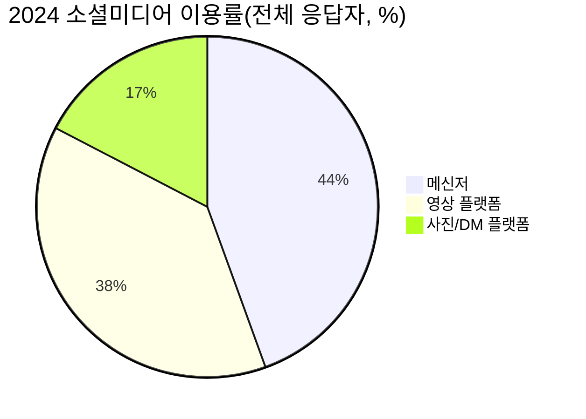
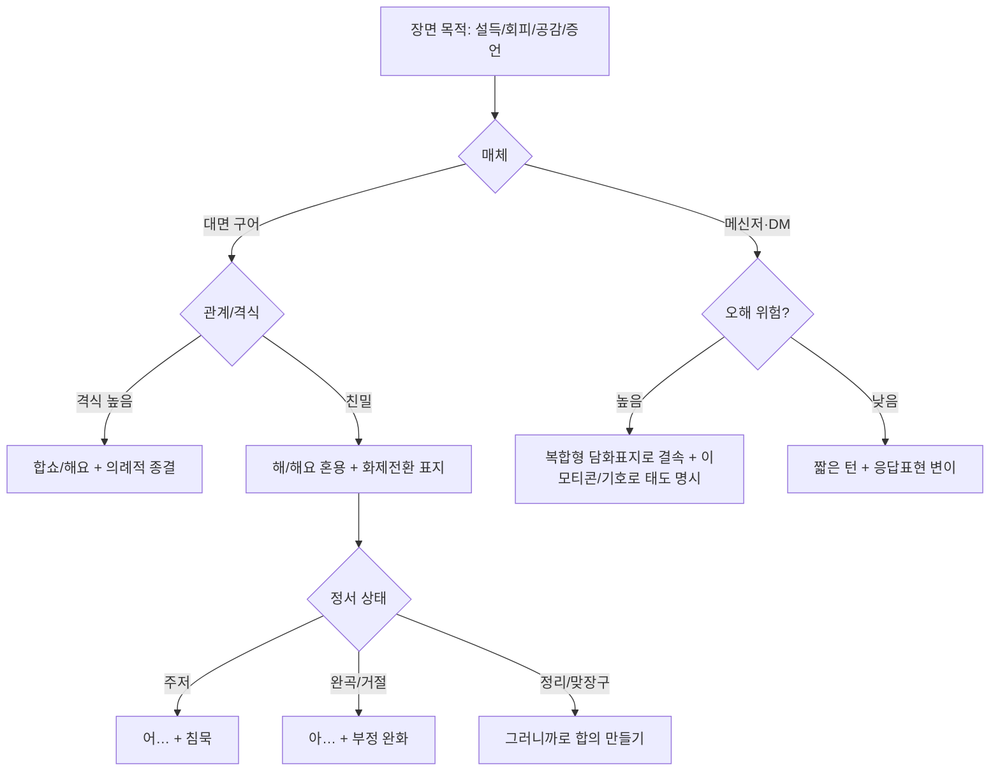

# Do deep research on 20대 후반 한국 여성 말투를 희곡 대사에 리얼하게 적용하기 위한 언어·사회언어학 보고서

20대 후반(25–29세) 한국 여성의 “리얼한 말투”는 한 가지 고정된 스타일이 아니라, **관계(친밀/위계), 장면의 격식도, 매체(구어·메신저·SNS)**에 따라 빠르게 바뀌는 **레지스터(말투 층위) 스위칭**의 결과로 보는 것이 정확합니다. 특히 메신저 환경에서는 비언어 단서가 사라지면서 담화표지·이모티콘·철자 변형 같은 “텍스트로 된 표정/억양”이 전략적으로 쓰인다는 점이 희곡 대사 설계에 바로 도움이 됩니다. citeturn29view0turn15view0turn17view0

아래 보고서는 요청 항목을 다음 순서로 **명확히 나열**해 포함합니다: (1) 정의·범위 (2) 최신 근거자료(우선순위 포함) (3) 말투 특징 분석 (4) 상황별 변이와 예문 (5) 음성·비언어 요소/연기 지침 (6) 연극적 적용 규칙과 대사 샘플 (7) 윤리·출처 원칙 (8) 하위범주 비교표 (9) 시각자료+mermaid (10) 관점 다양화+GPT 의견+질문.  

## 범위와 방법

(1) **정의·범위(제안 포함)**  
- 대상: **한국어를 일상적으로 사용하는 25–29세 한국 여성**(연령은 제안값으로 고정).  
- 지역: **미지정**(표준어 기반으로 기술하되 지역어/억양 변이는 별도). 다만 정부 보고에서 세대·지역별 언어 조사를 별도 수행하고 있어, “지역”은 실제 변인의 가능성이 큽니다. citeturn0search6  
- 교육·직업: **미지정**(사무직/서비스직/프리랜서/취업준비 등 하위범주는 ‘가능한 분류’로만 제시).  
- 온라인 활동: **미지정**. 다만 한국의 소셜미디어 이용 조사에서 메신저·영상·사진 기반 플랫폼 이용이 매우 높고(특히 19–29세에서 3순위 플랫폼 이용률이 매우 높게 보고됨), 25–29세도 높은 확률로 **메신저·SNS 발화 스타일의 영향권**에 있습니다. citeturn0search3turn0search7  

(2) **연구 설계(삼각측량)**  
- 학술(사회언어학·담화·텍스트언어학)에서 **메신저/모바일 텍스트의 변이**를 우선 채택했습니다. citeturn15view0turn12view0turn15view1turn29view0  
- 구어의 “실제 대화 결”은 **일상 대화 말뭉치 기반 인용**(20대 여성 화자 표기 포함)을 보조 근거로 사용했습니다(단, 20대=20–29이므로 25–29로의 정확한 세분은 한계). citeturn1view1  
- 정부·공식 통계는 “언어 그 자체”보다 **매체 이용(어디서 말이 생성되는가)**를 보여주는 자료로 활용했습니다. citeturn1view2turn0search3turn0search7  

## 최신 근거 자료 지도

(2) **최신 근거자료 우선순위(요약)**  
- 학술논문(핵심): 메신저 담화표지/응답표현/존대 종결어미 변이, 모바일 텍스트의 성·연령 차이를 직접 다룬 연구들. citeturn29view0turn12view0turn15view0turn15view1  
- 정부·준공식 데이터(맥락): 소셜미디어 이용 실태(플랫폼 점유/세대 차), 미디어패널(조사 표본·추세). citeturn0search3turn0search7turn1view2  
- 공적 말뭉치/언어기관 자료(구어 결): 일상대화 말뭉치 인용 및 구문 분석 지침(감탄사/담화표지 처리 범주화). citeturn1view1turn20view0  
- 인터뷰·SNS·커뮤니티(사례): 이번 보고서는 **개인 게시글 직접 인용은 최소화**하고, 공개 연구에서 이미 익명화된 대화 인용/분석 결과를 중심으로 구성했습니다(윤리 항목에서 원칙 제시). citeturn1view1turn17view0  

(2) **‘어디서 이 말투가 만들어지는가’(플랫폼 환경)**  
한국의 소셜미디어 이용 조사(2024)에서 메신저 이용률이 매우 높고, 영상 플랫폼·사진 기반 플랫폼이 뒤를 잇는 것으로 보고됩니다. citeturn0search3 또한 같은 조사 보도를 보면 **19–29세의 3순위 플랫폼 이용률이 매우 높다**고 정리되어(25–29도 강하게 겹칠 가능성이 큼) “DM/댓글/짧은 텍스트 상호작용”이 20대 후반 말투에 영향을 주는 조건을 갖춥니다. citeturn0search7

위 수치는 2024년 이용자 조사 보도자료의 핵심 값(상위 서비스 이용률)에서 요약했습니다. citeturn0search3

(참고용 시각자료 — ‘텍스트로 감정/뉘앙스를 보완하는’ 한국 메신저 문화의 시각적 맥락)  
image_group{"layout":"carousel","aspect_ratio":"16:9","query":["카카오톡 이모티콘 대화 예시","한국어 메신저 말풍선 대화 화면","한국어 이모티콘 감정 표현","한국 직장인 메신저 공손 표현 예시"],"num_per_query":1}

## 말투 특징 분석

(3) **문장 마무리(종결)와 존대·반말의 스위칭이 ‘핵심 엔진’**  
20대 화자의 메신저 대화에서도 존대 종결어미(특히 해요체·합쇼체)의 변이가 매우 풍부하게 관찰되며, 구어보다 더 많은 변이형이 보고됩니다(해요체 12종, 합쇼체 6종). citeturn15view0 이 연구는 단체 대화방 8개에서 존대 종결어미 3,087 토큰을 수집해 다변인 분석을 수행했고, **문장 유형·화자 성별·발화의 의례성·상황 격식성**이 변이에 강한 제약으로 작동한다고 보고합니다. citeturn15view0  
→ 희곡 관점에서의 실천 규칙: “20대 후반 여성 말투”를 한 덩어리로 만들기보다, **(A) 관계/격식/의례성**을 먼저 설정하고 거기에 맞춰 종결을 선택해야 리얼해집니다. citeturn15view0  

(3) **담화표지·감탄사(‘그냥/약간/근데/그러니까/아/어/그래’)는 ‘의미’보다 ‘운행’**  
국어 말뭉치 구문 분석 지침에서도 감탄사 범주를 단순 감탄·응답뿐 아니라 **머뭇거림, 발화 시작, 화제 전환 등에 쓰이는 ‘담화 표지’까지 포함**하는 것으로 명시합니다. citeturn20view0 이는 곧 “아/어/음/이제/근데/그러니까” 같은 짧은 형태가 **정보 전달**보다 **대화의 기어 변속(시간 벌기, 전환, 태도 표시)** 역할을 한다는 뜻입니다. citeturn20view0turn19view1  

(5) **‘어’의 기능: 주저·보류·설명요구를 한 음절로 처리**  
구어 자료 기반 연구는 감탄사 ‘어’를 반응(긍정/응답/재발화·설명요구), 태도(강조/놀람·감탄/주저), 발화 진행(관심 유도/발언권 유지/수정)으로 구분하고, 기능에 따라 위치·음높이·길이의 운율 특성이 달라진다고 정리합니다. citeturn19view1  
→ 25–29 여성 인물을 쓸 때 “말을 잘하는데 결정적 문장은 미루는” 장면에서, **‘어…’** 하나가 설득력 있게 시간을 벌어 줍니다. citeturn19view1turn20view0  

(5) **‘아’의 기능: 공손/부정 완화까지 포함하는 ‘문턱’**  
최근 연구는 감탄사 ‘아’가 발화 시작·발언권 유지(시간 벌기/디딤말)·수정뿐 아니라 **공손 기능, 부정 완화 기능**으로도 실현된다고 보고합니다. citeturn19view2  
→ 희곡에서는 “아…”를 **사과의 시작**이 아니라, **거절/회피를 부드럽게 만드는 완충재**로 사용할 수 있습니다. citeturn19view2  

(3) **메신저의 ‘구어체 문어’: 비동시성 + 비언어 단서 부재가 전략을 바꿈**  
메신저 대화는 비동시적 의사소통·구어체 문어라는 매체 특성 때문에 **대화 순서 비규칙성, 시각성·기호화 표현, 즉흥성, 상호작용성**을 보이며, 이 환경이 복합형 담화표지의 전략적 사용(화제 결속 강화, 태도 명시, 청자 주의 환기/기억 활성화)을 낳는다고 분석됩니다. citeturn29view0  
→ “친구랑 톡으로 말은 많은데 자소서는 못 쓰는” 인물을 설계할 때, 대사는 **의미**보다 **화제 결속 장치(아니 근데/근데 말이야/그러니까)**가 리듬을 만든다는 점을 기억하면 좋습니다. citeturn29view0turn18search7  

(3) **짧은 응답(맞장구) 변이: ‘응/어’의 문자화가 성별·기능에 따라 달라짐**  
20대 화자의 메신저 자료(2022.3–2024.11) 분석은 응답표현 ‘응/어’ 변이가 구어보다 더 다양하며, 특정 변이(예: “ㅇㅇ”)는 남성에서 더 높게 나타나는 경향이 있고, 반대로 여성은 변이형을 더 자주 쓰는 양상을 보인다고 요약합니다. 또한 기능별로 ‘응’은 재질문/자기발화 강조에서, ‘어’는 주저/답변 보류에서 더 자주 쓰인다고 정리합니다. citeturn12view0  
→ 25–29 여성 인물의 메신저 말투를 “무조건 ㅋㅋ/ㅠㅠ”로 고정하기보다, **‘어’(보류) / ‘응’(확인) / 뒤따르는 발화의 유무**로 리듬을 설계하는 편이 더 연구 친화적입니다. citeturn12view0turn29view0  

(3) **모바일 텍스트의 성·세대 차이(기본 패턴)**  
SNS 모바일 텍스트 분석 연구는 **비표준 철자·이모티콘·문장부호가 남성보다 여성에서 더 빈번**하고, **젊은 세대일수록 비표준 철자와 자음만으로 된 약어(초성체)가 더 빈번**하다고 보고합니다. citeturn15view1  
→ 25–29는 “젊은 세대 범주” 안에서도 생활권/직장 문화에 따라 조절될 수 있으므로, 희곡에서는 **(무대 위) 말의 선명도**를 해치지 않는 범위에서 표지를 선택적으로 써야 합니다(Pros/Cons에서 다룸). citeturn15view1turn15view0  

(3) **이모티콘은 ‘장식’이 아니라 관계·의도 조절 장치**  
20대 헤비유저 인터뷰 기반 연구는 이모티콘이 (a) 감정을 정확히 해독시키기 위한 텍스트 보완, 혹은 부정 감정 은폐(위장) (b) 상황 설명/분위기 전환/배려 (c) 사회적 실재감에 따라 선별, 자기표현 수단으로 사용되며, 이 요소들이 유기적으로 연결되어 작동한다고 결론 냅니다. citeturn17view0  
→ 희곡에서 메신저 화면을 무대 장치로 쓸 경우, 이모티콘은 “귀엽게”가 아니라 **관계의 실무(배려/회피/완화/새 맥락 생성)**를 드러내는 소품입니다. citeturn17view0turn29view0  

## 상황별 말투 차이와 예문

(4) “리얼함”을 위해서는 상황을 최소 6개로 나누는 편이 안전합니다(혼잣말·친구·가족·상사·공식면담·온라인). 아래 예문은 **연구 결과에서 제시된 기능(주저/보류/태도표시/화제 결속)**을 바탕으로 **창작용으로 재구성**한 것입니다. citeturn19view1turn29view0turn15view0

### 상황별 표현표

| 상황 | 주된 목표 | 추천 종결/리듬 | 담화표지·간투사(기능) | 비고(무대화 포인트) |
|---|---|---|---|---|
| 혼잣말 | 자기 조절·시간 벌기 | 미완결·중간 끊김 | “아…/어…”(발언권 유지·주저) | 숨/침묵을 텍스트처럼 취급 citeturn19view1turn19view2 |
| 친구(동갑) | 결속·공감 | 해/해요 혼용 가능 | “근데/아니 근데”(화제 전환), “그러니까”(맞장구/정리) | 화제 결속이 핵심 citeturn29view0turn18search7 |
| 가족(부모) | 갈등 회피·완곡 | 해요체↑, 완충 많음 | “아…”(부정 완화/공손) | 말의 ‘문턱’이 등장 citeturn19view2 |
| 상사/선배 | 안전·격식 | 해요/합쇼체, 의례성 | 종결 변이(격식·의례성 제약) | 종결어미가 권력의 표면 citeturn15view0 |
| 면접/상담 | 자기서사 정렬 | 합쇼체 중심 | 주저 표지 최소화(그러나 필요시 ‘어’) | 주저를 “관리”하며 쓰기 citeturn19view1turn15view0 |
| 온라인 댓글/DM | 태도 명시·오해 방지 | 단문, 기호화 | 복합형 담화표지로 결속, 이모티콘으로 태도 표기 | 비언어 부재 보완 citeturn29view0turn17view0 |

### 실제 인용 가능한 구어 예시

아래는 “20대 여성 화자”로 표기된 일상 대화 말뭉치 기반 전사 인용(연구 내 제시)으로, 20대 여성 구어에서 **‘막/이제/거든?’ 같은 전형적 구어 연결·태도 표지**가 자연스럽게 붙는 모습을 보여 줍니다. citeturn1view1  

> “나는 솔직히 먼저 막 잘 지내냐 뭐 이렇게 연락하는 스타일이 아니거든?” citeturn1view1  

또 다른 대목은 메신저/구어 모두에서 자주 쓰이는 “있잖아”류가 화제 도입·주의 환기 기능을 수행하는 전형적 장면으로 읽을 수 있습니다. citeturn1view1turn20view0  

> “카톡 보다 보면은 그 기념일 있잖아.” citeturn1view1  

## 음성·비언어적 요소와 연기 지침

(5) **‘말투’는 철자보다 먼저 호흡·속도·침묵으로 드러납니다.** 감탄사/담화표지 연구들은 동일 형태라도 기능에 따라 **발화 내 위치, 음높이 유형, 길이**가 달라짐을 반복적으로 보여 줍니다. citeturn19view0turn19view1turn19view2

- **주저(어…)**: 반응/태도/발화 진행 기능에 따라 운율이 달라질 수 있으며, 특히 “답을 미루는 주저”는 길이·음높이 패턴으로 표시될 수 있습니다. citeturn19view1  
- **완충(아…)**: 공손·부정 완화 기능까지 포함하므로, “미안” 이전에 나오는 한 호흡으로 의도(회피/거절/완곡)를 만들 수 있습니다. citeturn19view2  
- **화제 전환(그래/근데/그러니까)**: ‘그래’는 반응어/진행어로 나뉘며, 기능에 따라 상대적으로 길거나 짧게 실현되고, 경계 성조 패턴도 달라질 수 있다고 정리됩니다. citeturn19view0  
- **무대적 표기 팁(권장)**: 대본에 (숨), (웃음), (멈춤)을 남발하기보다, **담화표지 1개 + 침묵 1개**를 결합해 “생각의 물성”을 만드는 것이 리얼리즘에 유리합니다(‘어’/‘아’가 발언권 유지 기능을 갖는다는 분석과 잘 맞음). citeturn19view1turn19view2  

(9) 말투 선택 플로우(대사 설계용)

메신저 환경의 비동시성/비언어 부재와 담화표지의 전략적 기능, 그리고 감탄사 ‘어/아’의 주저·완충 기능을 종합해 구성한 창작용 플로우입니다. citeturn29view0turn19view1turn19view2turn18search7  

## 연극적 적용 규칙, 대사 샘플, 윤리

(6) **희곡 대사로 옮길 때의 변환 규칙(실전용)**  
1) **‘정보’를 줄이고 ‘결속’을 남긴다**: 메신저 대화는 짧은 말풍선 단위로 흐름이 빠르고, 핵심 화제 간 거리가 벌어지기 쉬워 **화제 결속 장치**가 대사의 뼈대가 됩니다. citeturn29view0  
2) **종결어미를 ‘감정’이 아니라 ‘권력/거리’로 설계**: 격식·의례성·상황의 포멀함이 변이에 강하게 작동합니다. citeturn15view0  
3) **‘어/아’는 감탄이 아니라 장면 기계**: 주저(답 보류)와 완충(부정 완화/공손)을 한 호흡으로 구현. citeturn19view1turn19view2  
4) **메신저 장면은 ‘대화 순서 비규칙성’을 무대 장치로**: 동시에 온 메시지, 끊기는 턴, 뒤늦은 답. 이 “비규칙성”이 불안을 연출합니다. citeturn29view0  
5) **이모티콘은 관계 조정 장치로만 제한 사용**: 부정 감정 은폐/배려/새 맥락 생성처럼 목적을 부여할 때만 투입. citeturn17view0  

(6) **대사 샘플(12개, 캐릭터·상황·톤 표기)**  
아래는 25–29 여성 인물을 가정한 창작 예시이며, 연구에서 확인된 기능(주저/결속/완충/태도표시)을 **대본 리듬**으로 바꾼 것입니다. citeturn29view0turn19view1turn19view2turn15view0  

| 캐릭터/상황 | 대사(한국어) | 연기·리듬 지시 |
|---|---|---|
| 취준 중(27), 혼잣말 | “어… 오늘 뭐부터 하지. (숨) 일단… 메일.” | ‘어’ 길게, 시선 회피 citeturn19view1 |
| 취준 중(27), 친구 톡 | “아니 근데 나 진짜… 지금 뭐가 급한지 모르겠어.” | ‘아니 근데’는 속도↑, 뒤는 속도↓ citeturn29view0 |
| 알바 병행(26), 가족 | “아… 나 쉬는 거 아니고요. 그냥… 지금은 정리 중이에요.” | ‘아’로 부정 완화, ‘그냥’은 작게 citeturn19view2turn20view0 |
| 첫 직장 1년차(28), 상사 | “네, 확인했습니다. 오늘 안으로 정리해서 공유드릴게요.” | 종결 힘 있게, 군더더기 최소 citeturn15view0 |
| 첫 직장 1년차(28), 동기 | “그러니까. 우리 지금 ‘열심히’만 하고 있잖아.” | ‘그러니까’로 합의 만들기 citeturn18search7 |
| DM(모호한 관계) | “음… 그건 좀 애매한데. (이모티콘 대신) 내가 다시 볼게.” | 비언어 부재를 문장으로 보완 citeturn29view0 |
| 면접 전(29), 혼잣말 | “저는… (멈춤) …아, 아니. 오늘은 ‘저’부터가 아니지.” | ‘저는’ 다음 침묵(자기검열) |
| 친구 대면(25), 위로 | “야, 너 잘못한 거 없어. 그냥 너무 오래 버틴 거지.” | 단문 2개로 끊기, 확언 톤 |
| 단톡방(27), 답 늦음 | “아 나 지금 봤어. 미안. 무슨 얘기였지?” | 비동시성 자체가 캐릭터성 citeturn29view0 |
| 단톡방(27), 맞장구 | “응응. 오케이. 그럼 그걸로 하자.” | ‘응’은 짧게 연속(턴 유지) citeturn12view0 |
| 갈등 회피(28), 거절 | “아… 내가 오늘은 좀 어려워. 다음에… 응?” | ‘아’→완충, ‘응?’으로 관계 유지 citeturn19view2turn12view0 |
| 자기합리화(26), 독백 | “나 바쁘게 살거든. 근데… 그 바쁨이 내 편이 아닌 날이 있어.” | ‘거든’에서 시선 고정(설명 모드) citeturn1view1 |

(7) **윤리·출처 원칙(요약)**  
- 개인 SNS/커뮤니티 발화를 직접 인용할 경우: **계정·닉네임·시간·지명·직장 등 식별자 제거**, 검색 가능한 고유 문장(“그대로 복사하면 찾히는 문장”)은 회피 권장(익명화해도 재식별 위험).  
- 말뭉치/연구 인용은: 연구가 이미 익명화한 전사·예문을 우선 사용(이번 보고서의 실제 인용도 그 원칙을 따름). citeturn1view1  
- “신어/유행어 목록” 사용 시: 자료집 수록이 곧 표준/권장을 의미하지 않는다는 공적 경고를 따라, **캐릭터의 계층/관계/장면 목적에 맞을 때만 제한적으로 사용**. citeturn23view0  

### (8) 하위범주별 말투 비교표(제안 모델, 미지정 포함)

아래 표는 “정답”이 아니라, 25–29 여성 인물을 설계할 때 **말투 변이를 발생시키는 조건**을 체크하는 용도입니다(특히 격식성/의례성이 종결 변이에 강하게 작동한다는 근거를 축으로 구성). citeturn15view0turn29view0  

| 하위범주(가능한 분류) | 정의 | 말투 변이 포인트(창작 체크) | 상태 |
|---|---|---|---|
| 회사/조직 중심 | 직장 채팅·보고 경험 많음 | 종결어미를 안정적으로 관리(해요/합쇼), 의례 발화 | 미지정 citeturn15view0 |
| 취업준비/과도기 | 면접 언어 vs 일상 언어 충돌 | “저는” 같은 자기서사 문장 앞에서 주저/수정 | 미지정 citeturn19view1turn19view2 |
| 서비스/현장 중심 | 고객 응대 경험 많음 | 공손 완충(“아…”), 짧은 확답·재확인 루프 | 미지정 citeturn19view2 |
| 온라인 상호작용 활발 | DM/댓글/단톡 빈번 | 화제 결속 표지↑, 태도 명시↑, 이모티콘 전략 사용 | 미지정 citeturn29view0turn17view0 |
| 지역어 영향 | 특정 지역 토박이/가족 언어 | 억양·어휘 변이 가능(별도 조사 영역) | 미지정 citeturn0search6 |

### (논쟁적 주제) “특정 연령·성별 말투를 모델링”의 장단점

| 접근 | 장점 | 단점 |
|---|---|---|
| 말투 템플릿(평균형) | 관객이 즉시 인물의 사회적 위치를 인식, 빠른 캐릭터 구축 | 고정관념 재생산 위험(“여성=이모티콘/완곡” 같은 단순화) citeturn15view1turn17view0 |
| 개인화(특이점 중심) | 인물의 고유성·설득력 상승, 예측 불가능한 리얼 | 지나치면 “의미 불명”이 되고 무대 전달력이 떨어짐(결속 장치 필요) citeturn29view0 |

### 관점 다양화

- **주류(사회언어학) 관점**: 말투는 성별 자체보다 **상황 격식·관계·의례성·매체**가 강하게 만들며, 메신저에서는 그 효과가 더 증폭됩니다. citeturn15view0turn29view0  
- **소수(반본질주의) 관점**: “25–29 여성 말투”는 통계적 경향일 뿐, 실제 인물은 **개인사·직장 문화·친구 집단**에 의해 더 크게 갈린다(따라서 희곡은 ‘범주’보다 ‘그 사람의 규칙’을 발명해야 함). citeturn15view0  
- **실천(연출·배우) 관점**: 리얼한 구어를 그대로 옮기면 산만해질 수 있어, 무대에서는 **담화표지/침묵/종결 변이**만 남기고 나머지는 정제하는 편이 효과적입니다(특히 화제 결속 장치가 관객의 이해를 붙잡음). citeturn29view0turn19view1  
- **추측(가까운 미래) 관점**: 자동완성·음성인식·AI 대화가 일상화될수록, “자기 말투”가 기기/플랫폼의 추천 문장에 의해 더 표준화되거나, 반대로 더 과장된 표지로 차별화될 가능성도 있습니다(희곡에서 ‘기계가 고른 문장’ vs ‘내 말’의 충돌로 확장 가능). citeturn1view2turn29view0  

### GPT 의견

저는 “20대 후반 한국 여성 말투”를 재현하려면 **유행어 목록을 쌓기보다, (1) 종결어미의 거리 설계 (2) ‘어/아’ 같은 한 음절의 주저·완충 장치 (3) 화제 결속 담화표지** 이 3가지만 통제해도 체감 리얼리티가 크게 올라간다고 봅니다. 제 입장은 **강한 편**입니다. citeturn15view0turn19view1turn19view2turn29view0  

### 논의를 깊게 만드는 질문

1) 당신의 주인공은 “말을 못 하는 사람”인가, “자소서의 언어만 못 쓰는 사람”인가—그 차이를 무대에서 어떤 **종결어미/침묵/메신저 장치**로 구분할 수 있을까요? citeturn19view2turn29view0  
2) 관객이 ‘리얼하다’고 느끼는 지점은 실제 구어의 재현일까요, 아니면 메신저적 결속·표지의 재현일까요? citeturn29view0turn15view1  
3) 주인공의 말투는 “관계에 따라 달라지는가” “상태(불안/무기력)에 따라 무너지는가”—둘 중 무엇이 더 비극적(혹은 희극적)으로 보일까요? citeturn19view1turn19view0  

[2026-04-05] #희곡작법 #말투리서치 #사회언어학 #메신저담화 #인물대사

자기점검: 요약(2–3문장), 관점 다양화, 표/mermaid, 대사 샘플(10개 이상), 윤리, 질문, GPT 의견, 날짜·해시태그를 모두 포함했습니다.