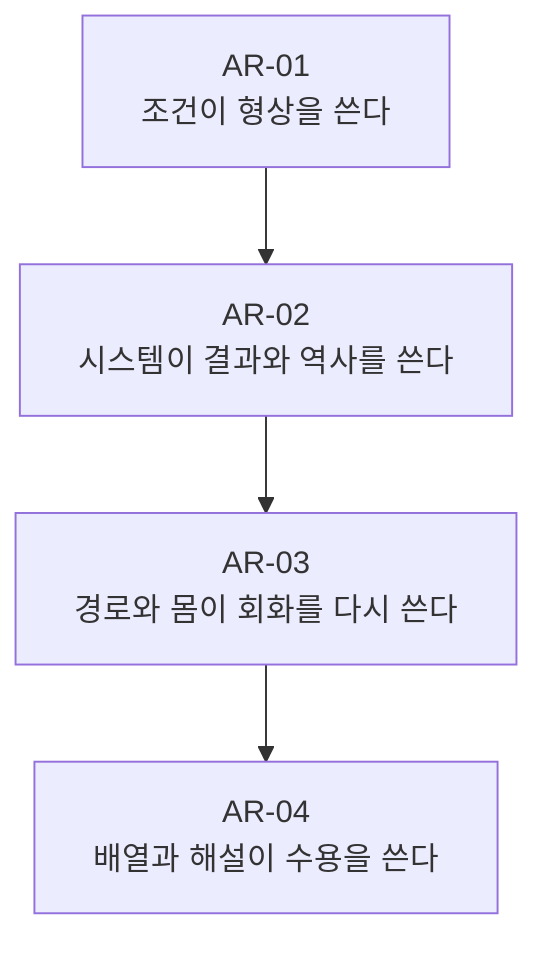

# 《올해의 작가상 2026》 작가별 앵커 강독 종합 v1

- 기준일: 2026-07-25
- 입력: 사전 리서치 Core, 전시 렌즈, 도슨트 전사 비평판, `MEM-R0`, Evidence Ledger v1, AR-01~04 앵커 강독
- 상태: 첫 관람 기억 반영 종합 / 현장 재관람·영상 완주 전

---

## 1. 이번 종합에서 달라진 것

사전 리서치의 중심 가설은 다음이었다.

> **보이는 것은 발견되는 것이 아니라 재료·기술·배치·관찰·해설·제도에 의해 생산된다.**

이 가설은 여전히 유효하다. 그러나 사용자의 비유도적 기억은 더 날카롭고 개인적인 이동을 만들었다.

> **내가 쓴다고 생각한 것은 조건과 시스템에 의해 빗겨 쓰이고, 내가 본다고 생각한 것은 이미지와 해설에 의해 받아들이도록 짜일 수 있다.**

두 문장은 같은 결론이 아니다.

- 첫 문장은 전시를 네 작가의 형식적 공통축으로 묶는다.
- 둘째 문장은 사용자의 기억에서 실제로 발생한 **창작과 수용의 비주권성**을 붙든다.
- 둘째 문장은 특히 AR-02 이정우와 AR-04 홍진훤 사이에서 강하다.
- AR-01 이해민선은 물질 조건이 형상을 쓴다는 방식으로 접속한다.
- AR-03 전현선은 관람자의 경로가 회화를 다시 쓴다는 자료상 가능성이 있지만, 사용자의 자발적 기억에서는 아직 접속하지 못했다.

따라서 둘 중 하나를 전시 전체의 단일 정답으로 선택하지 않고, `전시축`과 `개인 독해축`으로 함께 유지한다.

---

## 2. 네 작가 비교

| 작가 | A/B 앵커 | 사용자에게 자발적으로 남은 것 | 현재 가장 강한 해석 | 가장 큰 위험 |
| --- | --- | --- | --- | --- |
| 이해민선 | `잔설`, `직립식물`, `바깥` | 인화지, 잔설·바깥, 작은 마른 식물, 생존의 노력, 나이브함 | 대상은 스스로 남는 것이 아니라 주변·용기·지지·손상이 남긴 형상으로 나타난다. | 취약성을 `작은 것도 버틴다`는 선한 교훈으로 미학화 |
| 이정우 | `씌여진 영화, 씌여질 역사`, `오르고 또 오르면`, AI 작품군 | 어둠, 드론의 시선, AI 흔적, 《자유만세》의 아이러니, 쓰는 것이 아니라 쓰임 | 기술 오류보다 시선·역사의 저술 권한이 데이터·법·기업·장치에 분산된다. | 서로 다른 책임과 제약을 `기술의 중력`이라는 자연법칙으로 평평하게 만듦 |
| 전현선 | `토끼도 굴을 두 개 판다`, 조각·영상, `보이지 않는 그림` | 또 회화, 아이패드 같은 느낌, 투박한 점·선·도형의 겹침, 낮은 인상도 | 회화를 단일 정면에서 지형·레이어·두께·앞뒤의 사건으로 확장한다. | 복수 경로가 실제 지각 변화보다 하나의 `겹침 스타일`로 다시 평평해짐 |
| 홍진훤 | `암순응/명순응`, `사실 은하수는 유령입니다`, `이미지의 최고 형태는 무장투쟁이다` | 기자 경력, 사진과 사실의 단절, 강한 메시지, 교조성, 수용 설계, 수상 예측 | 이미지의 진위보다 밝기·배열·캡션·기억·해설이 만드는 연결 규칙이 중요하다. | 이미지 불신이 상대주의로, 정치 이미지 비판이 교조적 정답으로 변함 |

---

## 3. 네 구역을 잇는 ‘쓰임’의 단계



이 도식은 네 작가가 동일한 말을 한다는 뜻이 아니다.

### AR-01 — 조건이 대상을 쓴다

- 잔설은 직접 칠한 눈보다 주변을 쌓고 지운 결과로 나타난다.
- 화분이 사라져도 뿌리와 흙은 그 형상을 남긴다.
- 천막의 바깥은 안쪽 보호의 비용을 표면에 기록한다.

여기서 주권이 흔들리는 것은 우선 **대상의 자기 동일성**이다. 남은 것은 원래 모습 그대로의 존재가 아니라 조건이 새긴 흔적이다.

### AR-02 — 시스템이 창작자의 결과를 쓴다

- 드론은 인간이 원하는 높이와 시점을 그대로 수행하지 않는다.
- AI는 데이터 분포·안전정책·상투형에 따라 역사 이미지를 다시 쓴다.
- 삭제된 영화의 공백을 메우는 일은 복원이 아니라 현재 시스템의 재저술이 된다.

여기서 흔들리는 것은 **저자의 명령권**이다. 사용자의 `언어랑 같은 것 아닌가?`라는 질문이 전시를 넘어 창작 일반으로 확장한다.

### AR-03 — 경로와 몸이 회화를 쓴다는 약속

- 위·아래, 앞·뒤, 평면·조각, 수채·디지털 레이어가 한 시점의 완결을 깨뜨린다.
- 관람자가 부분을 이어 붙여야 작품의 관계가 생긴다고 제안한다.

그러나 이 단계는 현재 가장 약하다. 사용자의 기억에는 몸·경로보다 `겹쳐진 점·선·도형`이라는 스타일이 남았다. 따라서 AR-03는 종합 가설의 지지 근거라기보다 **실제 수용에서 실패할 수 있음을 보여주는 반례**다.

### AR-04 — 이미지와 해설이 관람자의 수용을 쓴다

- 암순응·명순응은 직전 빛의 조건이 현재의 보임을 지연시킨다.
- 사진은 사건의 의미를 혼자 말하지 않고 배열·캡션·기억을 요구한다.
- 도슨트는 기자 경력과 밝음/어둠의 코드를 먼저 제공해 관람자의 해석을 조직한다.

여기서 흔들리는 것은 **관람자의 해석 주권**이다. 하지만 사용자는 그 유도를 감지하고 작품의 메시지 전략을 다시 비판했으므로 완전히 수동적이지 않다.

---

## 4. 가장 중요한 두 갈래

### A. 전시가 제안한 것으로 보이는 갈래

> 보이지 않던 것을 다른 재료·기술·경로·이미지 문맥을 통해 다시 보게 한다.

- 장점: 네 작가를 비교 가능한 공통 질문으로 묶는다.
- 한계: 각 작가의 물질적 생존, 기술 책임, 회화 매체, 정치 조직의 차이를 `가시성`이라는 추상어로 봉합할 수 있다.

### B. 관람 기억이 새로 만든 갈래

> 쓰기와 보기는 개인의 의도를 그대로 실현하지 않는다. 조건·언어·기술·이미지·해설·제도가 결과에 참여한다.

- 장점: AR-02의 수동태와 AR-04의 수용 설계를 매우 강하게 연결하고, 사용자의 창작 관심까지 포함한다.
- 한계: AR-01과 AR-03를 억지로 `저자성`의 사례로 만들 위험이 있다.

### 현재 선택

둘 중 하나를 폐기하지 않는다.

| 층위 | 유지할 중심축 |
| --- | --- |
| 전시 전체 형식 | `보임의 생산` |
| 사용자의 개인 해석 | `쓰임과 수용의 분산된 주권` |
| 가장 강한 반례 | AR-03에서 몸·경로가 기억에 남지 않음 |

---

## 5. 동시대성을 둘러싼 사용자 기준

MEM-R0에서 동시대성은 중립적인 질문이 아니라 매체별로 다르게 부과된다.

```text
회화
→ 왜 지금 회화인가를 추가로 증명해야 함

AI·드론·미디어
→ 매체 자체로 우선 동시대성을 인정받음
→ 이후 메시지의 깊이·낡을 속도를 심사받음
```

이 기준은 틀렸다고 단순 교정할 문제가 아니다. 현재 전시와 상 제도가 실제로 촉발한 수용 방식이다.

### 회화 옹호의 주류 관점

동시대성은 매체의 발명 연도가 아니라 현재의 이미지 경험을 어떻게 재구성하는가에 달려 있다. 인화지·화학적 삭제·대규모 기울기·디지털 레이어·캔버스 뒷면은 회화를 고정된 옛 매체로 두지 않는다.

### 사용자의 비판이 유효한 지점

매체 확장 자체도 동시대성의 보증서가 아니다.

- 인화지를 썼다고 자동으로 현재적이지 않다.
- 아이패드·Procreate와 닮았다고 자동으로 새롭지 않다.
- AI를 썼다고 자동으로 문제의식이 깊어지지 않는다.

결국 더 엄격한 기준은 다음이다.

> **그 매체 선택이 다른 매체로는 생기지 않았을 지각·관계·책임의 문제를 실제로 만들었는가?**

---

## 6. 메시지의 전달력과 교조성

홍진훤에 대한 양가 판단은 네 작가 전체를 평가하는 좋은 시험대다.

| 메시지가 명료할 때 얻는 것 | 메시지가 명료할 때 잃을 수 있는 것 |
| --- | --- |
| 작품이 오래 기억된다. | 관객이 이미 정해진 답을 확인하는 학생이 된다. |
| 현실 문제와 연결하기 쉽다. | 사례의 역사적 차이가 하나의 교훈으로 평평해진다. |
| 전시·언론·심사에서 설명 가능성이 높다. | 제도적으로 유통되기 좋은 메시지가 작품의 복잡성을 대신한다. |
| 관객이 자기 경험으로 확장한다. | `너 이건 몰랐지?`라는 폭로자의 우월한 위치를 제공한다. |

중요한 것은 모호함을 자동으로 미덕으로 바꾸지 않는 것이다. 메시지가 약하다고 깊은 것도 아니고, 메시지가 강하다고 반드시 교조적인 것도 아니다.

현재 사용할 판별 기준은 하나다.

> **작품의 형식 안에 자신의 주장을 흔드는 반례와 불확실성이 실제로 살아 있는가?**

---

## 7. 현재의 개인적 중요도와 작품 판단

아래는 예술적 서열이 아니라 현재 관람 기억에서의 작동 강도다.

| 구분 | 현재 순서 | 이유 |
| --- | --- | --- |
| 자발적 기억 강도 | 홍진훤 → 이정우 → 이해민선 → 전현선 | 작품명·핵심 명제·개인 확장의 선명도 |
| 새로운 생각을 낳은 정도 | 이정우 → 홍진훤 → 이해민선 → 전현선 | `쓰여짐=언어`와 `받아들임도 설계됨`이 가장 멀리 확장됨 |
| 가장 큰 내부 충돌 | 홍진훤 | 최고로 인상적이면서 상업적·교조적으로 의심됨 |
| 가장 중요한 재검 필요 | 전현선 | 자료상 몸·경로가 핵심인데 기억에는 거의 남지 않음 |

### 홍진훤 수상 예측의 의미

`마지막 홍씨 작가가 받지 않을까`라는 예측은 단순 취향 이상의 자료다.

- 가장 강한 메시지
- 가장 높은 기억 가능성
- 기자·미디어·정치라는 동시대적 가독성
- 전시의 마지막 위치
- 도슨트가 제공한 강한 해석 프레임

이 요소들이 `수상할 것 같다`는 감각을 함께 만들었을 수 있다. 그러나 이는 작품의 우월성이나 실제 심사 결과를 증명하지 않는다. 오히려 **어떤 작품이 ‘수상작처럼 보이게 되는가’**를 보여주는 H-EX-05의 수용 증거다.

---

## 8. Core 갱신 제안

현재는 Core를 직접 수정하지 않고 다음 제안만 보존한다.

### 유지

- H-EX-01 `가시성의 생산`
- H-EX-04 `도슨트의 두 번째 건축`
- H-EX-05 `대표성의 생산`
- H-EX-06 `밝음/어둠 도식의 효능과 손실`

### 수정

- H-EX-02를 `재료·기술의 공동 저자성`에서 **사회기술적·물질적 공동 저술**로 정밀화한다.
- H-EX-03은 `설치·DOC에서 강함 / MEM에서 약함`으로 층위를 나눈다.
- H-EX-04는 `도슨트가 의미를 고정한다`보다 **임시 운영체제를 설치하고 관람자가 승인·저항·재작성한다**로 수정한다.

### 신규 승격 후보

- H-EX-07 `동시대성의 매체 휴리스틱`
- H-EX-08 `전달력–교조성 역설`
- H-EX-09 `쓰임과 수용의 분산된 주권`

승격은 영상 완주와 현장 재관람 뒤 결정한다.

---

## 9. 다음 관람의 우선 시험

1. **이해민선** — `버틴다`를 보류하고 `오염된다 / 붙잡힌다 / 변질된다 / 형태를 강요받는다` 가운데 실제 물질에 가까운 말을 찾는다.
2. **이정우** — 《씌여진 영화, 씌여질 역사》를 한 루프 보고, `쓰여짐`이 해설 없이도 영상에서 성립하는지 확인한다.
3. **전현선** — 위층·아래층·원통 앞뒤를 도슨트 없이 다시 보고, 경로가 실제로 의미를 바꾸는지 시험한다.
4. **홍진훤** — 《암순응》·《명순응》을 완주한 뒤 도슨트의 명제와 충돌하는 장면을 하나씩 찾는다.

---

## 10. 종합 인계 카드

- **현재 전시축**: 보임은 재료·기술·배치·몸·이미지 문맥에 의해 생산된다.
- **현재 개인 독해축**: 쓰기와 받아들임은 단독 주체의 소유가 아니라 조건 속의 공동 산물이다.
- **가장 강한 증거 경로**: VM-0008 → AR-02 `씌여진 영화, 씌여질 역사` → VM-0015 → AR-04 이미지 수용 설계 → H-EX-09
- **가장 강한 수용 반례**: AR-03의 몸·동선·앞뒤 전환이 MEM-R0에서 사라짐
- **가장 큰 양가성**: 홍진훤의 메시지는 가장 잘 닿았고 가장 교조적으로 의심됨
- **제도적 핵심**: `올해의 작가상`이라는 이름이 매체 비교·대표성 심사·수상 예측을 관람 안에 삽입함
- **Core 갱신 상태**: 제안만 기록 / 미반영
- **다음 단계**: 현장 재관람 또는 영상·캡션 증거 보강 후 Ledger v2

---

## 더 생각해 볼 질문

1. 사용자가 요구하는 `동시대성`은 새 매체, 현재의 사회 문제, 새로운 지각 방식, 제도적 대표성 가운데 무엇에 가장 가까운가?
2. 내가 원하는 대로 쓰지 못하고 원하는 대로 보지도 못한다면, 창작자와 관람자에게 남는 실질적 자유는 무엇인가?
3. 작품이 관객을 설득하는 일과 작품이 관객의 결론을 미리 설계하는 일은 어디에서 갈리는가?

---

## 제 판단

현재 가장 강한 발견은 `네 작가 모두 보이지 않는 것을 본다`가 아니다. 그것은 맞지만 아직 일반적이다. 더 독창적인 축은 다음이다.

> **형상·역사·회화·수용은 누구 한 사람의 의도대로 완성되지 않는다. 중요한 것은 주권이 없다고 탄식하는 것이 아니라, 무엇이 결과를 함께 쓰고 누가 그 규칙을 바꿀 수 있는지 추적하는 일이다.**

이 종합에 대한 판단 강도는 **강, 확신도 0.88**이다. 다만 AR-03가 이 축의 실제 지지자인지는 유보한다. 그 약한 고리를 인정하는 편이 네 작가를 하나의 매끈한 서사로 봉합하는 것보다 정확하다.

[2026-07-25] #올해의작가상2026 #전시강독 #분산된저자성 #이미지정치

자체 점검: 네 작가의 차이·주류·대안·비판·추측 관점, 가설의 유지·수정·신규 제안, 반례, 제 판단과 강도, 탐색 질문을 모두 포함했다.

